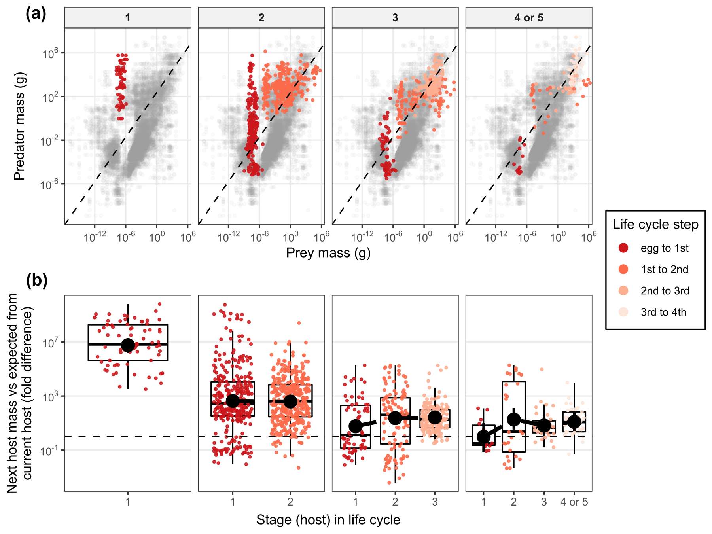
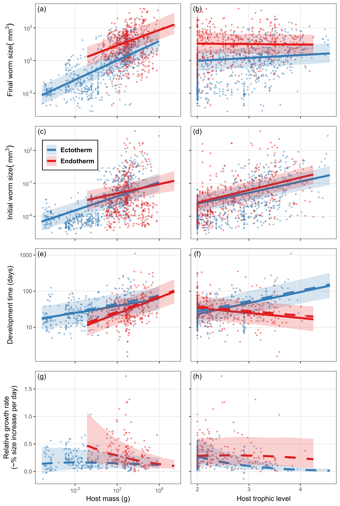

In this repository, I explore the benefits of complex life cycles in parasitic worms.

# Background

Parasitic worms like tapeworms, flukes, nematodes and acanthocephalans usually have complex life cycles where they infect multiple hosts in succession. Each step in the life cycle, when a worm is transmitted from one host to the next host, represents a risk. Some worms will not successfully infect the next host and thus die before completing the life cycle. Given this fundamental risk, what benefits can explain the ubiquity of complex life cycles in parasitic worms? Hosts added at the start of a life cycle (downward incorporation of intermediate hosts) may facilitate transmission to subsequent hosts, whereas hosts added at the end of a life cycle (upward incorporation of definitive hosts) may enable growth to larger, more fecund body sizes. We assessed both these possibilities by combining data on parasite life cycles with host traits.

# Data

The main data source for this study is a [database](https://esajournals.onlinelibrary.wiley.com/doi/full/10.1002/ecy.1680) I published on the life cycles of parasitic worms. To that, I added data on host mass and trophic level from numerous sources (e.g. [here](https://eol.org/), [here](https://esajournals.onlinelibrary.wiley.com/doi/epdf/10.1890/13-1917.1), and [here](https://www.nature.com/articles/s41559-019-0899-x)). Taxonomic information was obtained from [NCBI taxonomy](https://www.ncbi.nlm.nih.gov/taxonomy) and the [Open Tree of Life](https://tree.opentreeoflife.org/).

# Analyses

## The kinds of hosts infected

We first assessed whether worms with longer life cycles infect different kinds of hosts than those with shorter life cycles. We found that worms with longer cycles infected smaller first hosts and required more transmission steps to reach marginally larger end hosts (see full analysis [here](analyses/kinds_of_hosts/host_traits_across_clc_imputed.md)). The small first hosts in long cycles seem more likely to consume parasite propagules, because propagules are the size of normal food items for them. Thus, starting a cycle in a smaller host may increase propagule transmission but also necessitate multiple transmission steps. In long cycles, the next host was an average-sized predator of the current host (or propagule), whereas in short life cycles, the next host was a relatively large predator (see [here](analyses/transmission_pp_ratio/transmission_pp_impute.md)).

The size structure of the feeding interactions exploited by parasites. (a) Predator vs prey (or propagule) mass. Gray points are predator and prey masses from [Brose et al. 2019](https://www.nature.com/articles/s41559-019-0899-x))(n = 87,624). The dashed line is the major axis regression for these data and represents typical predator-prey mass ratios. Trophic links exploited by parasites are overlaid as colored points with current host (or propagule) mass as prey and next host mass as predator. Panels separate parasites by life cycle length. (b) The difference between observed and expected next host mass (i.e. the residuals from (a)) are plotted by life cycle stage. Point ranges represent means and 95% credible intervals estimated from mixed models accounting for parasite taxonomy. 

## In what hosts do parasites grow large and fast?

Parasites grew larger in larger hosts, though they did not clearly grow faster. Host endothermy also favored relatively fast parasite growth to large sizes. By contrast, host trophic level did not have a strong effect - worms grew similarly in herbivores and carnivores. The analysis of how host traits impact parasite growth is [here](analyses/host_traits_determining_worm_LH/host_traits_worm_LH_trivariate_imp.md). Because parasites with longer life cycles had slightly bigger final hosts, they tended to reproduce at larger sizes (see [here](analyses/lcl_adult_worm_traits/species_level_worm_traits_vs_lcl_imputed.md)), which is presumably results in higher fecundity (big worms generally produce more eggs) .

Final parasite size (a, b), initial size (c, d), developmental time (e, f), and relative growth rate (g, h) as a function of three host traits: body mass, trophic level, and endothermy. Lines are the predicted relationships and credible intervals estimated from mixed models accounting for parasite taxonomy. Dashed lines are the model trends after excluding stages that develop less than one week.

# Conclusions

Our results support the proposed benefits of both downward and upward routes of complex life cycle evolution: adding small hosts to the beginning of a life cycle can facilitate transmission while incorporating big hosts at the end of a life cycle favors growth to larger sizes. 

# Reference

Benesh, D.P., Parker, G.A., and Chubb, J.C. 2021. Life-cycle complexity in helminths: what are the benefits? Evolution 75 (8): 1936-1952. [doi: 10.1111/evo.14299](https://onlinelibrary.wiley.com/doi/10.1111/evo.14299)
