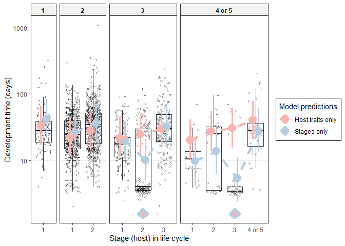

Host traits determining worm LH, multivariate
================

  - [Relative growth rate -
    multivariate](#relative-growth-rate---multivariate)
  - [Panels for Fig 3](#panels-for-fig-3)
  - [Host trait effects driven by intermediate vs definitive host
    distinction?](#host-trait-effects-driven-by-intermediate-vs-definitive-host-distinction)
  - [Overachieving worms?](#overachieving-worms)
      - [Panels of Fig. 4](#panels-of-fig.-4)
  - [Size by age](#size-by-age)
  - [Covariation among the traits determining growth
    rate](#covariation-among-the-traits-determining-growth-rate)

Worm parasites have different life cycles - some infect more hosts in
succession, others fewer. Lengthening the life cycle (more consecutive
hosts) is costly because it increases the chances of not being
transmitted to the next host and it delays reproduction. Do long cycles
have other advantages? In other notebooks, we examined the relationship
between [life cycle length and adult worm life
history](../lcl_adult_worm_traits/adult_worm_traits_vs_lcl.Rmd) and how
[host trais vary across life
cycles](../kinds_of_hosts/host_traits_across_clc.Rmd). In this notebook,
we examine how host traits affect parasite life history traits.

We’ll examine 3 parasite traits: initial size, final size, and
development time. Together, they determine how long and how fast
parasites grow. Fast growth is advantageous, so we are looking for the
host traits that favor large size and short devo time. We’ll examine
each of these simultaneously in a multivariate model.

# Relative growth rate - multivariate

The three parasite traits combine to determine how fast parasites grow.
Let’s put them into a multivariate model to see how growth rate varies
with host traits. This is better than explicitly modeling growth rate,
because it accounts for variability in each variable when calculating
the composite variable growth rate. We fit the multivariate models with
`MCMCglmm`. We also include ‘empty’ data in the model, so that it will
return predictions for parasite traits, holding either host mass or
trophic level constant.

As for model structure, we allow the residuals to be correlated. For
example, if a worm stage has a large final size relative to its host, it
probably started large or developed longer, i.e. positive residual
correlations. Parasite taxonomy is treated as nested random effects. We
fit the same series of models as in univariate analyses: (i) intercept
only, (ii) host trait main effects, (iii) host trait interactions (2nd
order).

To account for missingness in both host and parasite traits, we created
[100 imputed datasets](../make_stage_level_df_randimputedvals.Rmd). We
iterate through these datasets; with each iteration, we fit the models,
sample the posterior distributions, and then move to the next imputed
data. We combine the chains to have results that reflect the variability
due to missingness.

Here is the number of stages and species included in the model:

| n\_stages | n\_spp |
| --------: | -----: |
|      1963 |    967 |

    ## [1] "iteration 1 finished"
    ## [1] "iteration 2 finished"
    ## [1] "iteration 3 finished"
    ## [1] "iteration 4 finished"
    ## [1] "iteration 5 finished"
    ## [1] "iteration 6 finished"
    ## [1] "iteration 7 finished"
    ## [1] "iteration 8 finished"
    ## [1] "iteration 9 finished"
    ## [1] "iteration 10 finished"
    ## [1] "iteration 11 finished"
    ## [1] "iteration 12 finished"
    ## [1] "iteration 13 finished"
    ## [1] "iteration 14 finished"
    ## [1] "iteration 15 finished"
    ## [1] "iteration 16 finished"
    ## [1] "iteration 17 finished"
    ## [1] "iteration 18 finished"
    ## [1] "iteration 19 finished"
    ## [1] "iteration 20 finished"
    ## [1] "iteration 21 finished"
    ## [1] "iteration 22 finished"
    ## [1] "iteration 23 finished"
    ## [1] "iteration 24 finished"
    ## [1] "iteration 25 finished"
    ## [1] "iteration 26 finished"
    ## [1] "iteration 27 finished"
    ## [1] "iteration 28 finished"
    ## [1] "iteration 29 finished"
    ## [1] "iteration 30 finished"
    ## [1] "iteration 31 finished"
    ## [1] "iteration 32 finished"
    ## [1] "iteration 33 finished"
    ## [1] "iteration 34 finished"
    ## [1] "iteration 35 finished"
    ## [1] "iteration 36 finished"
    ## [1] "iteration 37 finished"
    ## [1] "iteration 38 finished"
    ## [1] "iteration 39 finished"
    ## [1] "iteration 40 finished"
    ## [1] "iteration 41 finished"
    ## [1] "iteration 42 finished"
    ## [1] "iteration 43 finished"
    ## [1] "iteration 44 finished"
    ## [1] "iteration 45 finished"
    ## [1] "iteration 46 finished"
    ## [1] "iteration 47 finished"
    ## [1] "iteration 48 finished"
    ## [1] "iteration 49 finished"
    ## [1] "iteration 50 finished"
    ## [1] "iteration 51 finished"
    ## [1] "iteration 52 finished"
    ## [1] "iteration 53 finished"
    ## [1] "iteration 54 finished"
    ## [1] "iteration 55 finished"
    ## [1] "iteration 56 finished"
    ## [1] "iteration 57 finished"
    ## [1] "iteration 58 finished"
    ## [1] "iteration 59 finished"
    ## [1] "iteration 60 finished"
    ## [1] "iteration 61 finished"
    ## [1] "iteration 62 finished"
    ## [1] "iteration 63 finished"
    ## [1] "iteration 64 finished"
    ## [1] "iteration 65 finished"
    ## [1] "iteration 66 finished"
    ## [1] "iteration 67 finished"
    ## [1] "iteration 68 finished"
    ## [1] "iteration 69 finished"
    ## [1] "iteration 70 finished"
    ## [1] "iteration 71 finished"
    ## [1] "iteration 72 finished"
    ## [1] "iteration 73 finished"
    ## [1] "iteration 74 finished"
    ## [1] "iteration 75 finished"
    ## [1] "iteration 76 finished"
    ## [1] "iteration 77 finished"
    ## [1] "iteration 78 finished"
    ## [1] "iteration 79 finished"
    ## [1] "iteration 80 finished"
    ## [1] "iteration 81 finished"
    ## [1] "iteration 82 finished"
    ## [1] "iteration 83 finished"
    ## [1] "iteration 84 finished"
    ## [1] "iteration 85 finished"
    ## [1] "iteration 86 finished"
    ## [1] "iteration 87 finished"
    ## [1] "iteration 88 finished"
    ## [1] "iteration 89 finished"
    ## [1] "iteration 90 finished"
    ## [1] "iteration 91 finished"
    ## [1] "iteration 92 finished"
    ## [1] "iteration 93 finished"
    ## [1] "iteration 94 finished"
    ## [1] "iteration 95 finished"
    ## [1] "iteration 96 finished"
    ## [1] "iteration 97 finished"
    ## [1] "iteration 98 finished"
    ## [1] "iteration 99 finished"
    ## [1] "iteration 100 finished"

We’ll start by comparing model fits. Here is the trace for deviance
(similar to the model likelihood) for the three models. The colored
lines are those including host traits. They are far better than the
intercept-only model, but the difference between the two models with
host traits is not large, suggesting interactions might not be that
important.

<!-- -->

Here are the DIC values of the three models:

    ## Int-only: 26353.63

    ## Host traits (main): 23288.6

    ## Host traits (interactions): 23189.39

The comparison of DIC values also shows that the model with host traits
is a vast improvement over the intercept only model.

    ## Delta DIC, int-only vs host traits main: 3065.033 (higher is better)

The model with host trait interaction is also an improvement.

    ## Delta DIC, host traits main vs host traits interactions: 99.21176 (higher is better)

Now we combine the chains for the fixed parameters and variance
componenets.

Here is the predicted increase in final worm size with host mass. A
doubling of host mass results in a 35% increase in parasite size. This
was was much larger than…

    ## 
    ## Iterations = 1:29971
    ## Thinning interval = 30 
    ## Number of chains = 1 
    ## Sample size per chain = 1000 
    ## 
    ## 1. Empirical mean and standard deviation for each variable,
    ##    plus standard error of the mean:
    ## 
    ##           Mean             SD       Naive SE Time-series SE 
    ##      0.3511449      0.0122624      0.0003878      0.0007097 
    ## 
    ## 2. Quantiles for each variable:
    ## 
    ##   2.5%    25%    50%    75%  97.5% 
    ## 0.3267 0.3433 0.3514 0.3588 0.3757

…the increase in initial worm size with host mass, which was 18%.

    ## 
    ## Iterations = 1:29971
    ## Thinning interval = 30 
    ## Number of chains = 1 
    ## Sample size per chain = 1000 
    ## 
    ## 1. Empirical mean and standard deviation for each variable,
    ##    plus standard error of the mean:
    ## 
    ##           Mean             SD       Naive SE Time-series SE 
    ##      0.1773846      0.0131284      0.0004152      0.0006710 
    ## 
    ## 2. Quantiles for each variable:
    ## 
    ##   2.5%    25%    50%    75%  97.5% 
    ## 0.1510 0.1685 0.1775 0.1859 0.2025

Development time increased with host mass as well. This slope is not
comparable to the parasite size slopes, since devo time had a more
limited range than size. Devo time increased 2% with a 100% increase in
host mass.

    ## 
    ## Iterations = 1:29971
    ## Thinning interval = 30 
    ## Number of chains = 1 
    ## Sample size per chain = 1000 
    ## 
    ## 1. Empirical mean and standard deviation for each variable,
    ##    plus standard error of the mean:
    ## 
    ##           Mean             SD       Naive SE Time-series SE 
    ##      0.0239872      0.0047268      0.0001495      0.0004270 
    ## 
    ## 2. Quantiles for each variable:
    ## 
    ##    2.5%     25%     50%     75%   97.5% 
    ## 0.01518 0.02086 0.02391 0.02701 0.03346

Initial worm size increased more than 10-fold with each unit increase in
host trophic level.

    ## 
    ## Iterations = 1:29971
    ## Thinning interval = 30 
    ## Number of chains = 1 
    ## Sample size per chain = 1000 
    ## 
    ## 1. Empirical mean and standard deviation for each variable,
    ##    plus standard error of the mean:
    ## 
    ##           Mean             SD       Naive SE Time-series SE 
    ##       15.14771        2.25272        0.07124        0.12370 
    ## 
    ## 2. Quantiles for each variable:
    ## 
    ##  2.5%   25%   50%   75% 97.5% 
    ## 11.53 13.47 14.94 16.44 20.25

Here is the effect of endothermy on worm final size. Final size was \~18
fold higher in an endotherm. To properly interpret this, though, host
mass and trophic level would need to be standardized.

    ## 
    ## Iterations = 1:29971
    ## Thinning interval = 30 
    ## Number of chains = 1 
    ## Sample size per chain = 1000 
    ## 
    ## 1. Empirical mean and standard deviation for each variable,
    ##    plus standard error of the mean:
    ## 
    ##           Mean             SD       Naive SE Time-series SE 
    ##        18.1691         3.2582         0.1030         0.1647 
    ## 
    ## 2. Quantiles for each variable:
    ## 
    ##  2.5%   25%   50%   75% 97.5% 
    ## 12.57 15.83 17.93 20.32 25.41

Here are the parameters for the host traits model with just main
effects.

| param                          |          lwr |          fit |          upr | sig |
| :----------------------------- | -----------: | -----------: | -----------: | :-- |
| traitlog\_dt                   |    2.7443946 |    3.5309413 |    4.2662464 | sig |
| traitlog\_dt:endo\_ectoendo    |  \-0.2324178 |  \-0.0452252 |    0.1260588 | ns  |
| traitlog\_dt:host\_bm          |    0.0217329 |    0.0340901 |    0.0474883 | sig |
| traitlog\_dt:host\_tl          |  \-0.2207263 |  \-0.1199277 |  \-0.0051582 | sig |
| traitlog\_end                  |  \-4.3595255 |  \-2.0607304 |    0.2675429 | ns  |
| traitlog\_end:endo\_ectoendo   |    2.5314505 |    2.8866561 |    3.2349818 | sig |
| traitlog\_end:host\_bm         |    0.4078220 |    0.4344731 |    0.4601558 | sig |
| traitlog\_end:host\_tl         |  \-0.1951825 |    0.0646463 |    0.2986420 | ns  |
| traitlog\_start                | \-16.6441825 | \-14.8459146 | \-13.0970518 | sig |
| traitlog\_start:endo\_ectoendo |    0.9238451 |    1.3103744 |    1.7475253 | sig |
| traitlog\_start:host\_bm       |    0.2028364 |    0.2357438 |    0.2660038 | sig |
| traitlog\_start:host\_tl       |    2.4453773 |    2.7037349 |    3.0080735 | sig |

Here are the parameters for the host traits interaction model.

| param                                   |          lwr |          fit |          upr | sig |
| :-------------------------------------- | -----------: | -----------: | -----------: | :-- |
| traitlog\_dt                            |    2.5908651 |    3.4248320 |    4.1777823 | sig |
| traitlog\_dt:endo\_ectoendo             |  \-0.6118411 |    0.1174499 |    0.8846189 | ns  |
| traitlog\_dt:host\_bm                   |  \-0.1138367 |  \-0.0501707 |    0.0109396 | ns  |
| traitlog\_dt:host\_bm:endo\_ectoendo    |    0.0461791 |    0.0795275 |    0.1145808 | sig |
| traitlog\_dt:host\_bm:host\_tl          |    0.0062618 |    0.0259057 |    0.0466451 | sig |
| traitlog\_dt:host\_tl                   |  \-0.2341363 |  \-0.0932473 |    0.0499746 | ns  |
| traitlog\_dt:host\_tl:endo\_ectoendo    |  \-0.4685082 |  \-0.2033441 |    0.0396364 | ns  |
| traitlog\_end                           |  \-4.4208309 |  \-2.1295591 |    0.4137408 | ns  |
| traitlog\_end:endo\_ectoendo            |    3.7971743 |    5.4992823 |    7.2531585 | sig |
| traitlog\_end:host\_bm                  |    0.1097340 |    0.2548816 |    0.4021271 | sig |
| traitlog\_end:host\_bm:endo\_ectoendo   |  \-0.1742063 |  \-0.0899780 |  \-0.0051608 | sig |
| traitlog\_end:host\_bm:host\_tl         |    0.0151540 |    0.0641870 |    0.1140799 | sig |
| traitlog\_end:host\_tl                  |  \-0.3039111 |    0.0183165 |    0.3432546 | ns  |
| traitlog\_end:host\_tl:endo\_ectoendo   |  \-1.2830091 |  \-0.6775782 |  \-0.1019752 | sig |
| traitlog\_start                         | \-15.3719749 | \-13.6707735 | \-11.9324267 | sig |
| traitlog\_start:endo\_ectoendo          |  \-1.1995560 |    0.7824154 |    2.6237704 | ns  |
| traitlog\_start:host\_bm                |  \-0.1169619 |    0.0421451 |    0.2071596 | ns  |
| traitlog\_start:host\_bm:endo\_ectoendo |  \-0.1335288 |  \-0.0411084 |    0.0577962 | ns  |
| traitlog\_start:host\_bm:host\_tl       |    0.0201473 |    0.0758068 |    0.1287400 | sig |
| traitlog\_start:host\_tl                |    1.7987362 |    2.2076371 |    2.6005350 | sig |
| traitlog\_start:host\_tl:endo\_ectoendo |  \-0.3231992 |    0.3376945 |    0.9954199 | ns  |

Here are the parameters for the host traits interaction model, but
excluding stages with devo times less than a week.

| param                                   |          lwr |          fit |          upr | sig |
| :-------------------------------------- | -----------: | -----------: | -----------: | :-- |
| traitlog\_dt                            |    2.4821259 |    3.2815597 |    3.9728157 | sig |
| traitlog\_dt:endo\_ectoendo             |    0.2254336 |    0.8327529 |    1.5421124 | sig |
| traitlog\_dt:host\_bm                   |  \-0.0778443 |  \-0.0186591 |    0.0354787 | ns  |
| traitlog\_dt:host\_bm:endo\_ectoendo    |  \-0.0236841 |    0.0070784 |    0.0357817 | ns  |
| traitlog\_dt:host\_bm:host\_tl          |    0.0030328 |    0.0205609 |    0.0418935 | sig |
| traitlog\_dt:host\_tl                   |  \-0.0586895 |    0.0775881 |    0.2088929 | ns  |
| traitlog\_dt:host\_tl:endo\_ectoendo    |  \-0.6998462 |  \-0.4381220 |  \-0.2150183 | sig |
| traitlog\_end                           |  \-3.7595504 |  \-1.5044686 |    0.6394343 | ns  |
| traitlog\_end:endo\_ectoendo            |    3.7275957 |    5.4229172 |    7.1532112 | sig |
| traitlog\_end:host\_bm                  |    0.1533964 |    0.3019271 |    0.4407869 | sig |
| traitlog\_end:host\_bm:endo\_ectoendo   |  \-0.2856911 |  \-0.1993196 |  \-0.1265374 | sig |
| traitlog\_end:host\_bm:host\_tl         |    0.0133666 |    0.0610208 |    0.1094863 | sig |
| traitlog\_end:host\_tl                  |  \-0.4600375 |  \-0.1277498 |    0.2040447 | ns  |
| traitlog\_end:host\_tl:endo\_ectoendo   |  \-1.0668658 |  \-0.4840131 |    0.1039088 | ns  |
| traitlog\_start                         | \-15.8532718 | \-14.1440367 | \-12.2219371 | sig |
| traitlog\_start:endo\_ectoendo          |  \-0.9007137 |    1.1319763 |    3.0618683 | ns  |
| traitlog\_start:host\_bm                |  \-0.1345489 |    0.0227298 |    0.2012222 | ns  |
| traitlog\_start:host\_bm:endo\_ectoendo |  \-0.1278946 |  \-0.0300963 |    0.0726710 | ns  |
| traitlog\_start:host\_bm:host\_tl       |    0.0181251 |    0.0779309 |    0.1309293 | sig |
| traitlog\_start:host\_tl                |    1.8875446 |    2.3034937 |    2.7062920 | sig |
| traitlog\_start:host\_tl:endo\_ectoendo |  \-0.3718391 |    0.3033113 |    0.9971362 | ns  |

Perhaps the best way to gauge model fit is by looking at the
R2 table.

The addition of host trait interactions only explain a few additional
percentage points of the variation in worm traits, indicating that the
main effects are more important. Host traits accounted for \~50% of the
variation in final size and \~30% in starting size. But host traits only
explained a few percent of the variation in worm development time. This
differed from analyses of unimputed data, where host traits accounted
for about 20% of the variation in development time. The likely reason
for this was the imputation of development times in paratenic hosts. In
similar hosts, parasites can have very different development times
depending on whether they treat the host as paratenic or not.

| model                                  | trait       | r2m                   | r2c                   |
| :------------------------------------- | :---------- | :-------------------- | :-------------------- |
| int-only                               | dt          | 0 \[0-0\]             | 0.385 \[0.271-0.634\] |
| host traits, main effects              | dt          | 0.031 \[0.013-0.054\] | 0.413 \[0.302-0.712\] |
| host traits, second-order interactions | dt          | 0.053 \[0.028-0.082\] | 0.443 \[0.338-0.675\] |
| int-only                               | end\_size   | 0 \[0-0\]             | 0.153 \[0.105-0.28\]  |
| host traits, main effects              | end\_size   | 0.573 \[0.369-0.636\] | 0.801 \[0.772-0.87\]  |
| host traits, second-order interactions | end\_size   | 0.572 \[0.376-0.634\] | 0.804 \[0.775-0.869\] |
| int-only                               | start\_size | 0 \[0-0\]             | 0.14 \[0.085-0.287\]  |
| host traits, main effects              | start\_size | 0.419 \[0.329-0.469\] | 0.627 \[0.583-0.714\] |
| host traits, second-order interactions | start\_size | 0.426 \[0.345-0.473\] | 0.634 \[0.588-0.7\]   |

We can see this by fitting a model with a fixed effect paratenic term.
The marginal R2 value goes way up, because ‘paratenic’ vs ‘not
paratenic’ explains a lot of the differences in development time.

    ##        R2m   R2c
    ## [1,] 0.081 0.288

    ##        R2m   R2c
    ## [1,] 0.444 0.654

For all traits, there was substantial taxonomic variation. Let’s look at
the breakdown of taxonomic effects, after accounting for host traits.
Here is the plot for initial size…

<!-- -->

…final size…

<!-- -->

…and development time.

<!-- -->

For size variables, there is both a phyla effect (nematodes are smaller)
and a order/family effect. Devo time seems to differ more among higher
taxonomic groups.

# Panels for Fig 3

Let’s now make some plots using the predictions and credible intervals
from the model including host trait interactions.

The points in each plot are observed values and the ‘best’ estimate for
imputed values. One could also plot just the observed data. First final
size…

<!-- -->

<!-- -->

…then initial size.

<!-- -->

<!-- -->

Instead of plotting final and initial size separately, we could plot
relative growth, i.e. the difference between final and initial size. It
increases with host mass.

<!-- -->

and decreases with trophic level.

<!-- -->

Here’s how relative growth changed with host size. This is relative
growth in a 1 mg host…

|  rg\_1mg | rg\_1mg\_upr | rg\_1mg\_lwr | fold\_change | fold\_change\_lwr | fold\_change\_upr |
| -------: | -----------: | -----------: | -----------: | ----------------: | ----------------: |
| 4.433628 |     6.922302 |     1.764207 |     84.23644 |           5.83694 |          1014.653 |

…a 1 g host…

|   rg\_1g | rg\_1g\_upr | rg\_1g\_lwr | fold\_change | fold\_change\_lwr | fold\_change\_upr |
| -------: | ----------: | ----------: | -----------: | ----------------: | ----------------: |
| 5.654077 |     8.20465 |    3.027329 |     285.4527 |          20.64202 |          3657.918 |

…and a 10 kg host.

| rg\_10kg | rg\_10kg\_upr | rg\_10kg\_lwr | fold\_change | fold\_change\_lwr | fold\_change\_upr |
| -------: | ------------: | ------------: | -----------: | ----------------: | ----------------: |
| 7.263822 |      9.920488 |      4.505165 |     1427.702 |           90.4833 |          20342.91 |

And here is the relative growth difference between an average sized (10
g) endotherm and ectotherm.

| endo\_ecto |  rg\_10g | rg\_10g\_lwr | rg\_10g\_upr | fold\_change | fold\_change\_lwr | fold\_change\_upr |
| :--------- | -------: | -----------: | -----------: | -----------: | ----------------: | ----------------: |
| ecto       | 6.044483 |     3.409282 |     8.580482 |     421.7795 |          30.24352 |          5326.673 |
| endo       | 8.096927 |     5.434105 |    10.712367 |    3284.3607 |         229.08764 |         44907.808 |

Moving onto development time, the solid and dashed lines represent
trends including or excluding short devo times (\< 1 week).

<!-- -->

<!-- -->

Growth rate is only plotted for species that spent at least 1 week
developing.

<!-- -->

Growth varies little with trophic level.

<!-- -->

Worms grow slightly faster in endotherms than ectotherms. Here is the
difference for an average sized host (10 g).

| endo\_ecto |  rgr\_10g | rgr\_10g\_upr | rgr\_10g\_lwr |
| :--------- | --------: | ------------: | ------------: |
| ecto       | 0.1835972 |     0.4194771 |     0.0820758 |
| endo       | 0.3177317 |     0.7117028 |     0.1571973 |

We combined these plots into a single figure.

# Host trait effects driven by intermediate vs definitive host distinction?

Since definitive hosts are mostly endotherms and intermediate hosts are
mostly ectotherms, it is possible that growth differences are
exaggerated by limited growth in some intermediate hosts, e.g. in
paratenic hosts. To check this, we re-fit the model with the distinction
between intermediate vs definitive host, as well as its interactions
with the other host traits.

    ## [1] "iteration 1 finished"
    ## [1] "iteration 2 finished"
    ## [1] "iteration 3 finished"
    ## [1] "iteration 4 finished"
    ## [1] "iteration 5 finished"
    ## [1] "iteration 6 finished"
    ## [1] "iteration 7 finished"
    ## [1] "iteration 8 finished"
    ## [1] "iteration 9 finished"
    ## [1] "iteration 10 finished"
    ## [1] "iteration 11 finished"
    ## [1] "iteration 12 finished"
    ## [1] "iteration 13 finished"
    ## [1] "iteration 14 finished"
    ## [1] "iteration 15 finished"
    ## [1] "iteration 16 finished"
    ## [1] "iteration 17 finished"
    ## [1] "iteration 18 finished"
    ## [1] "iteration 19 finished"
    ## [1] "iteration 20 finished"
    ## [1] "iteration 21 finished"
    ## [1] "iteration 22 finished"
    ## [1] "iteration 23 finished"
    ## [1] "iteration 24 finished"
    ## [1] "iteration 25 finished"
    ## [1] "iteration 26 finished"
    ## [1] "iteration 27 finished"
    ## [1] "iteration 28 finished"
    ## [1] "iteration 29 finished"
    ## [1] "iteration 30 finished"
    ## [1] "iteration 31 finished"
    ## [1] "iteration 32 finished"
    ## [1] "iteration 33 finished"
    ## [1] "iteration 34 finished"
    ## [1] "iteration 35 finished"
    ## [1] "iteration 36 finished"
    ## [1] "iteration 37 finished"
    ## [1] "iteration 38 finished"
    ## [1] "iteration 39 finished"
    ## [1] "iteration 40 finished"
    ## [1] "iteration 41 finished"
    ## [1] "iteration 42 finished"
    ## [1] "iteration 43 finished"
    ## [1] "iteration 44 finished"
    ## [1] "iteration 45 finished"
    ## [1] "iteration 46 finished"
    ## [1] "iteration 47 finished"
    ## [1] "iteration 48 finished"
    ## [1] "iteration 49 finished"
    ## [1] "iteration 50 finished"
    ## [1] "iteration 51 finished"
    ## [1] "iteration 52 finished"
    ## [1] "iteration 53 finished"
    ## [1] "iteration 54 finished"
    ## [1] "iteration 55 finished"
    ## [1] "iteration 56 finished"
    ## [1] "iteration 57 finished"
    ## [1] "iteration 58 finished"
    ## [1] "iteration 59 finished"
    ## [1] "iteration 60 finished"
    ## [1] "iteration 61 finished"
    ## [1] "iteration 62 finished"
    ## [1] "iteration 63 finished"
    ## [1] "iteration 64 finished"
    ## [1] "iteration 65 finished"
    ## [1] "iteration 66 finished"
    ## [1] "iteration 67 finished"
    ## [1] "iteration 68 finished"
    ## [1] "iteration 69 finished"
    ## [1] "iteration 70 finished"
    ## [1] "iteration 71 finished"
    ## [1] "iteration 72 finished"
    ## [1] "iteration 73 finished"
    ## [1] "iteration 74 finished"
    ## [1] "iteration 75 finished"
    ## [1] "iteration 76 finished"
    ## [1] "iteration 77 finished"
    ## [1] "iteration 78 finished"
    ## [1] "iteration 79 finished"
    ## [1] "iteration 80 finished"
    ## [1] "iteration 81 finished"
    ## [1] "iteration 82 finished"
    ## [1] "iteration 83 finished"
    ## [1] "iteration 84 finished"
    ## [1] "iteration 85 finished"
    ## [1] "iteration 86 finished"
    ## [1] "iteration 87 finished"
    ## [1] "iteration 88 finished"
    ## [1] "iteration 89 finished"
    ## [1] "iteration 90 finished"
    ## [1] "iteration 91 finished"
    ## [1] "iteration 92 finished"
    ## [1] "iteration 93 finished"
    ## [1] "iteration 94 finished"
    ## [1] "iteration 95 finished"
    ## [1] "iteration 96 finished"
    ## [1] "iteration 97 finished"
    ## [1] "iteration 98 finished"
    ## [1] "iteration 99 finished"
    ## [1] "iteration 100 finished"

The resulting model did not explain much more variation in final size,
but it did account for some additional variation in start size and devo
time. It clearly accounted for variation in devo time due to
paratenesis.

| model                                  | trait       | r2m                   | r2c                   |
| :------------------------------------- | :---------- | :-------------------- | :-------------------- |
| host traits, second-order interactions | dt          | 0.053 \[0.028-0.082\] | 0.443 \[0.338-0.675\] |
| host traits + def vs int interactions  | dt          | 0.185 \[0.095-0.256\] | 0.554 \[0.459-0.758\] |
| host traits, second-order interactions | end\_size   | 0.572 \[0.376-0.634\] | 0.804 \[0.775-0.869\] |
| host traits + def vs int interactions  | end\_size   | 0.566 \[0.337-0.636\] | 0.846 \[0.821-0.909\] |
| host traits, second-order interactions | start\_size | 0.426 \[0.345-0.473\] | 0.634 \[0.588-0.7\]   |
| host traits + def vs int interactions  | start\_size | 0.462 \[0.37-0.513\]  | 0.711 \[0.672-0.768\] |

What about the predictions for growth in definitive hosts?

Here is the predicted growth in endo vs ectotherm for an average sized
definitive host. It is higher for endotherms, but the CIs are wide and
nearly overlapping.

| endo\_ecto | host\_bm | host\_tl | Def.int |  rg\_avg | rg\_avg\_lwr | rg\_avg\_upr | fold\_change | fold\_change\_lwr | fold\_change\_upr |
| :--------- | -------: | -------: | :------ | -------: | -----------: | -----------: | -----------: | ----------------: | ----------------: |
| ecto       | 6.585318 |      2.7 | def     | 5.411261 |     2.501039 |     8.206548 |     223.9137 |          12.19516 |          3664.871 |
| endo       | 6.599207 |      2.7 | def     | 8.761247 |     5.858662 |    11.458292 |    6382.0639 |         350.25517 |         94683.236 |

Here is the predicted relative growth in 10g intermediate host. We chose
10g because this is whether endotherm and ectotherm body sizes overlap;
the average endotherm intermediate host is much bigger than the average
ectotherm intermediate host. The CI for endotherms is very wide, because
there were few endotherm intermediate hosts. Consequently, the CIs
overlap and it is not clear that endothermy affects total growth in
intermediate hosts.

| endo\_ecto | host\_bm | host\_tl | Def.int |  rg\_avg | rg\_avg\_lwr | rg\_avg\_upr | fold\_change | fold\_change\_lwr | fold\_change\_upr |
| :--------- | -------: | -------: | :------ | -------: | -----------: | -----------: | -----------: | ----------------: | ----------------: |
| ecto       | 2.182495 |      2.7 | int     | 6.125030 |     3.281271 |     8.733536 |     457.1583 |          26.60957 |          6207.636 |
| endo       | 2.368620 |      2.7 | int     | 5.961853 |     2.826656 |     8.888958 |     388.3289 |          16.88889 |          7251.457 |

Here is growth in an average-sized ectotherm intermediate host. The
predicted growth was than in an average-sized ectotherm definitive host,
though not significantly so.

|   host\_bm | host\_tl | Def.int |  rg\_avg | rg\_avg\_lwr | rg\_avg\_upr | fold\_change | fold\_change\_lwr | fold\_change\_upr |
| ---------: | -------: | :------ | -------: | -----------: | -----------: | -----------: | ----------------: | ----------------: |
| \-3.096202 |      2.7 | int     | 5.042299 |     2.227887 |     7.654682 |     154.8255 |          9.280238 |          2110.505 |

Growth *rates* are faster in endotherm definitive hosts.

| endo\_ecto | host\_bm | host\_tl | Def.int |  rgr\_avg | rgr\_avg\_lwr | rgr\_avg\_upr |
| :--------- | -------: | -------: | :------ | --------: | ------------: | ------------: |
| ecto       | 6.585318 |      2.7 | def     | 0.1182712 |     0.0408704 |     0.2756114 |
| endo       | 6.599207 |      2.7 | def     | 0.2953732 |     0.1251419 |     0.6130198 |

We can’t make the same comparison in intermediate hosts, given the lack
of data.

| endo\_ecto | host\_bm | host\_tl | Def.int |  rgr\_avg | rgr\_avg\_lwr | rgr\_avg\_upr |
| :--------- | -------: | -------: | :------ | --------: | ------------: | ------------: |
| ecto       | 2.182495 |      2.7 | int     | 0.2319424 |     0.0902736 |      0.495742 |
| endo       | 2.368620 |      2.7 | int     | 0.4489159 |     0.1606295 |      1.127625 |

Let’s plot the model output. Intermediate vs definitive hosts are
distinguished by dotted and solid lines, respectively.

End size tends to be a bit larger in definitive hosts than comparable
intermediate hosts, especially if they are endotherms.

<!-- -->
Starting size is a little bit lower for endotherms than for ectotherms,
but the difference is small.

<!-- -->
The combination of smaller initial sizes and larger final sizes
indicates more growth in endothermic definitive hosts.

<!-- -->
However, although they growth more in endotherm definitive hosts, the
average prepatent period is shorter. The large CI for endotherm
intermediate hosts reflects little data.

<!-- -->
In endothermic definitive hosts, worms grow more in a shorter period,
resulting in faster growth.

<!-- -->

Overall, adding a definitive vs intermediate host distinction does not
change the results much. Worms still grow more in endotherm than
ectotherm hosts. However, when we restrict the data to just definitive
hosts and refit the model, then the estimated difference is much smaller
(and marginally significant).

    ## Fold change, ecto vs endo def host: 286 678

I think this is caused by larger taxonomic effects. When restricted to a
single stage (def host), the model considers more of the differences to
be taxonomic. That is, a taxon may not grow consistently more (or less)
than expected from host size across the full life cycle. But when
restricted to just one stage, more variation is considered taxonomic.

The differences between definitive and intermediate hosts are also part
of the next modeling step: adding life stage to the model.

# Overachieving worms?

Now that we have estimated the relationship between host and parasite
traits, we can ask whether certain parasite life stages grow faster or
larger than expected. In particular, we are interested in the
possibility that parasites with long cycles overperform at particular
stages as a way to compensate. A quick way to test this is to add
parasite stage into models with the host traits. Does stage account for
additional variation beyond that accounted for by host traits? Let’s do
a few quick likelihood ratio tests with our “best” imputed datasets.

Stage explains additional variation in final size…

|          | npar |      AIC |      BIC |     logLik | deviance |    Chisq | Df | Pr(\>Chisq) |
| :------- | ---: | -------: | -------: | ---------: | -------: | -------: | -: | ----------: |
| modfs1.1 |   14 | 8854.648 | 8932.799 | \-4413.324 | 8826.648 |       NA | NA |          NA |
| modfs3.1 |   23 | 8412.948 | 8541.339 | \-4183.474 | 8366.948 | 459.7001 |  9 |           0 |

and initial size…

|          | npar |      AIC |      BIC |     logLik | deviance |    Chisq | Df | Pr(\>Chisq) |
| :------- | ---: | -------: | -------: | ---------: | -------: | -------: | -: | ----------: |
| modis1.1 |   14 | 9528.854 | 9607.005 | \-4750.427 | 9500.854 |       NA | NA |          NA |
| modis3.1 |   23 | 8746.678 | 8875.070 | \-4350.339 | 8700.678 | 800.1753 |  9 |           0 |

and devo time (different from unimputed analysis, due to paratenics).

|          | npar |      AIC |      BIC |     logLik | deviance |    Chisq | Df | Pr(\>Chisq) |
| :------- | ---: | -------: | -------: | ---------: | -------: | -------: | -: | ----------: |
| moddt1.1 |   14 | 4705.388 | 4783.539 | \-2338.694 | 4677.388 |       NA | NA |          NA |
| moddt3.1 |   23 | 4251.307 | 4379.698 | \-2102.653 | 4205.307 | 472.0812 |  9 |           0 |

So, parasite life stages seem to explain additional variation, even
after accounting for host traits. Now let’s again fit multivariate
models and then we’ll compare stage means predicted from just host
traits or just stages, both adjusted for taxonomic effects. When the
predictions diverge it suggests parasites grow more (or less) in
particular stages than expected from their hosts.

I need to tweek the host-trait model compared to above. I want to get
predicted values for each stage, and stages do not infect either
endotherms or ectotherms. Rather, some proportion of species infect
endotherms or ectotherms. Therefore, I replaced endothermy as a category
with endothermy as a proportion in the model, so that I can predict
stage means for a given level of endothermy. This does not change the
number of model parameters.

I also fit the same models with cumulative development time instead of
stage development time. When we summed mean developmental times across
stages within a life cycle length (e.g. devo time in first host and devo
time in second host), mean cumulative devo times were lower than the
observed values. One reason for this is that we removed species with
partial life cycles (e.g. 2 of 3 hosts known). Several of these species
had imputed values for their paratenic stages, but not earlier ones,
resulting in cumulative development being too low. Additionally, summing
stage means underestimated total development time, because mean
development times are negatively correlated across stages (i.e. if you
grow a lot now, there is less need to grow later).

I fit both models with the same imputation approach as above: loop
through imputed datasets, fit model, sample post dist, repeat with next
imputed dataset.

    ## [1] "iteration 1 finished"
    ## [1] "iteration 2 finished"
    ## [1] "iteration 3 finished"
    ## [1] "iteration 4 finished"
    ## [1] "iteration 5 finished"
    ## [1] "iteration 6 finished"
    ## [1] "iteration 7 finished"
    ## [1] "iteration 8 finished"
    ## [1] "iteration 9 finished"
    ## [1] "iteration 10 finished"
    ## [1] "iteration 11 finished"
    ## [1] "iteration 12 finished"
    ## [1] "iteration 13 finished"
    ## [1] "iteration 14 finished"
    ## [1] "iteration 15 finished"
    ## [1] "iteration 16 finished"
    ## [1] "iteration 17 finished"
    ## [1] "iteration 18 finished"
    ## [1] "iteration 19 finished"
    ## [1] "iteration 20 finished"
    ## [1] "iteration 21 finished"
    ## [1] "iteration 22 finished"
    ## [1] "iteration 23 finished"
    ## [1] "iteration 24 finished"
    ## [1] "iteration 25 finished"
    ## [1] "iteration 26 finished"
    ## [1] "iteration 27 finished"
    ## [1] "iteration 28 finished"
    ## [1] "iteration 29 finished"
    ## [1] "iteration 30 finished"
    ## [1] "iteration 31 finished"
    ## [1] "iteration 32 finished"
    ## [1] "iteration 33 finished"
    ## [1] "iteration 34 finished"
    ## [1] "iteration 35 finished"
    ## [1] "iteration 36 finished"
    ## [1] "iteration 37 finished"
    ## [1] "iteration 38 finished"
    ## [1] "iteration 39 finished"
    ## [1] "iteration 40 finished"
    ## [1] "iteration 41 finished"
    ## [1] "iteration 42 finished"
    ## [1] "iteration 43 finished"
    ## [1] "iteration 44 finished"
    ## [1] "iteration 45 finished"
    ## [1] "iteration 46 finished"
    ## [1] "iteration 47 finished"
    ## [1] "iteration 48 finished"
    ## [1] "iteration 49 finished"
    ## [1] "iteration 50 finished"
    ## [1] "iteration 51 finished"
    ## [1] "iteration 52 finished"
    ## [1] "iteration 53 finished"
    ## [1] "iteration 54 finished"
    ## [1] "iteration 55 finished"
    ## [1] "iteration 56 finished"
    ## [1] "iteration 57 finished"
    ## [1] "iteration 58 finished"
    ## [1] "iteration 59 finished"
    ## [1] "iteration 60 finished"
    ## [1] "iteration 61 finished"
    ## [1] "iteration 62 finished"
    ## [1] "iteration 63 finished"
    ## [1] "iteration 64 finished"
    ## [1] "iteration 65 finished"
    ## [1] "iteration 66 finished"
    ## [1] "iteration 67 finished"
    ## [1] "iteration 68 finished"
    ## [1] "iteration 69 finished"
    ## [1] "iteration 70 finished"
    ## [1] "iteration 71 finished"
    ## [1] "iteration 72 finished"
    ## [1] "iteration 73 finished"
    ## [1] "iteration 74 finished"
    ## [1] "iteration 75 finished"
    ## [1] "iteration 76 finished"
    ## [1] "iteration 77 finished"
    ## [1] "iteration 78 finished"
    ## [1] "iteration 79 finished"
    ## [1] "iteration 80 finished"
    ## [1] "iteration 81 finished"
    ## [1] "iteration 82 finished"
    ## [1] "iteration 83 finished"
    ## [1] "iteration 84 finished"
    ## [1] "iteration 85 finished"
    ## [1] "iteration 86 finished"
    ## [1] "iteration 87 finished"
    ## [1] "iteration 88 finished"
    ## [1] "iteration 89 finished"
    ## [1] "iteration 90 finished"
    ## [1] "iteration 91 finished"
    ## [1] "iteration 92 finished"
    ## [1] "iteration 93 finished"
    ## [1] "iteration 94 finished"
    ## [1] "iteration 95 finished"
    ## [1] "iteration 96 finished"
    ## [1] "iteration 97 finished"
    ## [1] "iteration 98 finished"
    ## [1] "iteration 99 finished"
    ## [1] "iteration 100 finished"

The deviance is lower for the life-stage model (red) compared to the
host-traits model (black). Deviance goes down even further with both
host traits and parasite stages in the model (green)

<!-- -->

Here are the DIC values of the three models:

    ## Host traits only: 23181.42

    ## Stages only: 22065.55

    ## Host traits and stages: 21445.05

The stage model is clearly better than the host traits model.

    ## Delta DIC, host traits only vs life stage only: 1115.869 (higher is better)

Both together is an even better model, suggesting that host traits
explain variation within stages (e.g. worm size may covary with host
size at a given stage).

    ## Delta DIC, stage only vs stage and host traits: 620.5019 (higher is better)

Here are the model parameters and credible intervals for the stage-only
model:

| param                             |          lwr |         fit |         upr | sig |
| :-------------------------------- | -----------: | ----------: | ----------: | :-- |
| traitlog\_dt                      |    3.0699710 |   3.7189475 |   4.4288402 | sig |
| traitlog\_dt:stage\_lcllc2\_1     |  \-0.7290007 | \-0.4533466 | \-0.1454422 | sig |
| traitlog\_dt:stage\_lcllc2\_2     |  \-0.3943857 | \-0.1250150 |   0.1899880 | ns  |
| traitlog\_dt:stage\_lcllc3\_1     |  \-1.0854776 | \-0.7421338 | \-0.4192578 | sig |
| traitlog\_dt:stage\_lcllc3\_2     |  \-1.7970208 | \-1.4193378 | \-1.0131758 | sig |
| traitlog\_dt:stage\_lcllc3\_3     |  \-0.5515719 | \-0.2294774 |   0.1027714 | ns  |
| traitlog\_dt:stage\_lcllc3+\_1    |  \-2.0612853 | \-1.4648586 | \-0.8752858 | sig |
| traitlog\_dt:stage\_lcllc3+\_2    |  \-1.6910905 | \-1.1127131 | \-0.4480503 | sig |
| traitlog\_dt:stage\_lcllc3+\_3    |  \-2.5859617 | \-2.0617659 | \-1.5501768 | sig |
| traitlog\_dt:stage\_lcllc3+\_4    |  \-0.9397333 | \-0.3965704 |   0.1773447 | ns  |
| traitlog\_end                     |    0.4129846 |   2.4184579 |   4.3146048 | sig |
| traitlog\_end:stage\_lcllc2\_1    |  \-7.3078462 | \-6.4212565 | \-5.5224416 | sig |
| traitlog\_end:stage\_lcllc2\_2    |  \-0.2410538 |   0.5528341 |   1.4873057 | ns  |
| traitlog\_end:stage\_lcllc3\_1    |  \-8.2975046 | \-7.3669429 | \-6.2794861 | sig |
| traitlog\_end:stage\_lcllc3\_2    |  \-5.5435640 | \-4.4877191 | \-3.4802388 | sig |
| traitlog\_end:stage\_lcllc3\_3    |    0.0725691 |   1.0218234 |   2.0020595 | sig |
| traitlog\_end:stage\_lcllc3+\_1   | \-10.1569946 | \-8.8162398 | \-7.3205252 | sig |
| traitlog\_end:stage\_lcllc3+\_2   |  \-3.1870340 | \-1.8738135 | \-0.5002474 | sig |
| traitlog\_end:stage\_lcllc3+\_3   |  \-3.2741884 | \-1.7256827 | \-0.0756524 | sig |
| traitlog\_end:stage\_lcllc3+\_4   |    0.9992047 |   2.3008364 |   3.6906269 | sig |
| traitlog\_start                   |  \-8.7306925 | \-7.3996722 | \-6.0241759 | sig |
| traitlog\_start:stage\_lcllc2\_1  |  \-3.2999766 | \-2.5556331 | \-1.6760141 | sig |
| traitlog\_start:stage\_lcllc2\_2  |    2.3824113 |   3.1665913 |   4.0219719 | sig |
| traitlog\_start:stage\_lcllc3\_1  |  \-3.2205120 | \-2.3173170 | \-1.3152516 | sig |
| traitlog\_start:stage\_lcllc3\_2  |    0.3387630 |   1.1653291 |   2.0506508 | sig |
| traitlog\_start:stage\_lcllc3\_3  |    4.0202814 |   4.9106699 |   5.8646101 | sig |
| traitlog\_start:stage\_lcllc3+\_1 |  \-4.7046097 | \-3.2671594 | \-1.7474375 | sig |
| traitlog\_start:stage\_lcllc3+\_2 |  \-1.9043915 | \-0.5166288 |   0.8358701 | ns  |
| traitlog\_start:stage\_lcllc3+\_3 |    5.9486751 |   7.2000594 |   8.5596005 | sig |
| traitlog\_start:stage\_lcllc3+\_4 |    6.8247324 |   8.3651202 |   9.9091711 | sig |

Here is a comparison of final worm size in the definitive host…

| lcl | final\_ws\_avg | untransformed\_mass | ord\_mag\_change | fold\_change | perc\_increase |
| --: | -------------: | ------------------: | ---------------: | -----------: | -------------: |
|   1 |       2.418458 |            11.22853 |               NA |           NA |             NA |
|   2 |       2.971292 |            19.51712 |        0.5528341 |     1.738172 |       73.81722 |
|   3 |       3.440281 |            31.19573 |        0.4689893 |     1.598378 |       59.83779 |
|   4 |       4.719294 |           112.08912 |        1.2790130 |     3.593091 |      259.30915 |

…it does not increase as much as initial size in definitive host:

| lcl | initial\_ws\_avg | untransformed\_mass | ord\_mag\_change | fold\_change | perc\_increase |
| --: | ---------------: | ------------------: | ---------------: | -----------: | -------------: |
|   1 |       \-7.399672 |           0.0006115 |               NA |           NA |             NA |
|   2 |       \-4.233081 |           0.0145076 |         3.166591 |    23.726469 |      2272.6469 |
|   3 |       \-2.489002 |           0.0829927 |         1.744079 |     5.720628 |       472.0628 |
|   4 |         0.965448 |           2.6259638 |         3.454450 |    31.640892 |      3064.0892 |

And here are the parameters for the stage and host traits model:

| param                               |         lwr |         fit |         upr | sig |
| :---------------------------------- | ----------: | ----------: | ----------: | :-- |
| traitlog\_dt                        |   3.2744584 |   4.1054323 |   4.8725689 | sig |
| traitlog\_dt:host\_bm               | \-0.0771576 | \-0.0190067 |   0.0430016 | ns  |
| traitlog\_dt:host\_bm:host\_tl      | \-0.0087468 |   0.0109305 |   0.0298692 | ns  |
| traitlog\_dt:host\_bm:prop\_endo    |   0.0215654 |   0.0531216 |   0.0843797 | sig |
| traitlog\_dt:host\_tl               | \-0.2646535 | \-0.1315414 |   0.0039261 | ns  |
| traitlog\_dt:host\_tl:prop\_endo    | \-0.4830667 | \-0.2145121 |   0.0372340 | ns  |
| traitlog\_dt:prop\_endo             | \-0.9447783 | \-0.2221471 |   0.5482434 | ns  |
| traitlog\_dt:stage\_lcllc2\_1       | \-0.8655398 | \-0.4968596 | \-0.1254748 | sig |
| traitlog\_dt:stage\_lcllc2\_2       | \-0.2211396 |   0.0622843 |   0.3418554 | ns  |
| traitlog\_dt:stage\_lcllc3\_1       | \-1.1429416 | \-0.7583044 | \-0.3506429 | sig |
| traitlog\_dt:stage\_lcllc3\_2       | \-1.8343120 | \-1.4284776 | \-1.0213318 | sig |
| traitlog\_dt:stage\_lcllc3\_3       | \-0.4073701 | \-0.0437634 |   0.2891881 | ns  |
| traitlog\_dt:stage\_lcllc3+\_1      | \-2.0651482 | \-1.4482332 | \-0.8250851 | sig |
| traitlog\_dt:stage\_lcllc3+\_2      | \-1.6965364 | \-1.1537905 | \-0.5508534 | sig |
| traitlog\_dt:stage\_lcllc3+\_3      | \-2.6205235 | \-2.0971780 | \-1.5409761 | sig |
| traitlog\_dt:stage\_lcllc3+\_4      | \-0.6813062 | \-0.1552232 |   0.3599152 | ns  |
| traitlog\_end                       |   0.6008343 |   3.0656060 |   5.3817693 | sig |
| traitlog\_end:host\_bm              |   0.0743394 |   0.2088207 |   0.3321116 | sig |
| traitlog\_end:host\_bm:host\_tl     | \-0.0285282 |   0.0130866 |   0.0551429 | ns  |
| traitlog\_end:host\_bm:prop\_endo   | \-0.1395350 | \-0.0592792 |   0.0179828 | ns  |
| traitlog\_end:host\_tl              | \-1.2654714 | \-0.9521551 | \-0.6126259 | sig |
| traitlog\_end:host\_tl:prop\_endo   | \-0.8141341 | \-0.2461518 |   0.2959672 | ns  |
| traitlog\_end:prop\_endo            |   0.3964684 |   2.1128231 |   3.8274632 | sig |
| traitlog\_end:stage\_lcllc2\_1      | \-4.6336093 | \-3.8165819 | \-2.9886722 | sig |
| traitlog\_end:stage\_lcllc2\_2      | \-0.1046275 |   0.6267887 |   1.4030452 | ns  |
| traitlog\_end:stage\_lcllc3\_1      | \-5.0888197 | \-4.1090081 | \-3.1986785 | sig |
| traitlog\_end:stage\_lcllc3\_2      | \-4.3152893 | \-3.3791441 | \-2.4738021 | sig |
| traitlog\_end:stage\_lcllc3\_3      |   0.1613249 |   1.0319556 |   1.9553669 | sig |
| traitlog\_end:stage\_lcllc3+\_1     | \-6.3910452 | \-4.8837386 | \-3.5429506 | sig |
| traitlog\_end:stage\_lcllc3+\_2     | \-1.9433090 | \-0.6047316 |   0.6183461 | ns  |
| traitlog\_end:stage\_lcllc3+\_3     | \-2.3676273 | \-0.9233695 |   0.5183589 | ns  |
| traitlog\_end:stage\_lcllc3+\_4     |   0.4026894 |   1.8202597 |   2.9926405 | sig |
| traitlog\_start                     | \-9.1640312 | \-7.5465700 | \-5.7305219 | sig |
| traitlog\_start:host\_bm            | \-0.2384118 | \-0.0906607 |   0.0427666 | ns  |
| traitlog\_start:host\_bm:host\_tl   | \-0.0512719 | \-0.0063996 |   0.0419234 | ns  |
| traitlog\_start:host\_bm:prop\_endo |   0.0020364 |   0.0847798 |   0.1672477 | sig |
| traitlog\_start:host\_tl            |   0.3029361 |   0.6403743 |   0.9980077 | sig |
| traitlog\_start:host\_tl:prop\_endo |   0.1968512 |   0.7541984 |   1.2775533 | sig |
| traitlog\_start:prop\_endo          | \-5.5707033 | \-4.0491630 | \-2.3695800 | sig |
| traitlog\_start:stage\_lcllc2\_1    | \-5.3767420 | \-4.3268622 | \-3.4273072 | sig |
| traitlog\_start:stage\_lcllc2\_2    |   1.9980292 |   2.9479351 |   3.8329753 | sig |
| traitlog\_start:stage\_lcllc3\_1    | \-5.4784836 | \-4.3779480 | \-3.3741702 | sig |
| traitlog\_start:stage\_lcllc3\_2    | \-0.9325099 |   0.1415929 |   1.0843570 | ns  |
| traitlog\_start:stage\_lcllc3\_3    |   3.3158186 |   4.4143830 |   5.4411460 | sig |
| traitlog\_start:stage\_lcllc3+\_1   | \-7.2478805 | \-5.6909436 | \-4.0697133 | sig |
| traitlog\_start:stage\_lcllc3+\_2   | \-3.1238542 | \-1.7754937 | \-0.3590960 | sig |
| traitlog\_start:stage\_lcllc3+\_3   |   4.6985387 |   6.0805666 |   7.5626136 | sig |
| traitlog\_start:stage\_lcllc3+\_4   |   6.4544997 |   8.0551312 |   9.6221563 | sig |

In the R2 table, the stages model explains more variation for
initial size and devo time, but not end size. The joint stage and host
traits model does not explain that much more variation in life history
than stages alone.

| model                         | trait       | r2m                   | r2c                   |
| :---------------------------- | :---------- | :-------------------- | :-------------------- |
| host traits                   | dt          | 0.05 \[0.024-0.075\]  | 0.438 \[0.333-0.689\] |
| parasite stages               | dt          | 0.149 \[0.081-0.209\] | 0.53 \[0.426-0.718\]  |
| host traits & parasite stages | dt          | 0.182 \[0.098-0.248\] | 0.557 \[0.466-0.759\] |
| host traits                   | end\_size   | 0.58 \[0.379-0.64\]   | 0.806 \[0.778-0.875\] |
| parasite stages               | end\_size   | 0.538 \[0.388-0.59\]  | 0.804 \[0.779-0.86\]  |
| host traits & parasite stages | end\_size   | 0.595 \[0.404-0.654\] | 0.843 \[0.819-0.894\] |
| host traits                   | start\_size | 0.435 \[0.353-0.482\] | 0.635 \[0.59-0.707\]  |
| parasite stages               | start\_size | 0.531 \[0.447-0.581\] | 0.716 \[0.685-0.764\] |
| host traits & parasite stages | start\_size | 0.572 \[0.495-0.616\] | 0.767 \[0.737-0.8\]   |

Now let’s extract the predicted marginal means and credible intervals
for each parasite life stage from these two models.

## Panels of Fig. 4

After calculating predicted stage means and their CI from the posterior
distribution, we plot them over boxplots of the observed data, starting
with final size.

<!-- -->

Relative to host traits, parasites tend to grow to a smaller final size
in the second host of three-host cycles. Direct cycle worms are also
smaller than expected. The opposite is observed in definitive hosts in
complex life cycles; they grow a bit more than expected from their host
traits. Here are the differences in a table. The skew towards negative
values suggests that the host trait model generally predicts larger
worms than the stage model.

| lcl\_max\_fac | Host\_no\_fac | diff\_btw\_predictions | fold\_change | sig     |
| :------------ | :------------ | ---------------------: | -----------: | :------ |
| 3             | 2             |                \-1.592 |          4.9 | not sig |
| 1             | 1             |                \-1.520 |          4.6 | not sig |
| 3+            | 3             |                \-1.071 |          2.9 | not sig |
| 2             | 1             |                \-0.982 |          2.7 | not sig |
| 3+            | 1             |                \-0.523 |          1.7 | not sig |
| 3+            | 4             |                  0.052 |          1.1 | not sig |
| 3             | 1             |                  0.142 |          1.2 | not sig |
| 2             | 2             |                  0.330 |          1.4 | not sig |
| 3+            | 2             |                  0.428 |          1.5 | not sig |
| 3             | 3             |                  0.505 |          1.7 | not sig |

Here is the same plot restricted to adult stages. It suggests adult worm
sizes are predicted well by host traits, except in direct life cycles.

<!-- -->

Here are the differences in adult worm size for different life cycle
lengths.

| Host\_no\_fac | lcl\_max\_fac | log\_end\_p.fit | log\_size\_diff | fold\_change |
| :------------ | :------------ | --------------: | --------------: | -----------: |
| 1             | 1             |        2.418458 |              NA |           NA |
| 2             | 2             |        3.011463 |       0.5930051 |     1.809418 |
| 3             | 3             |        3.457409 |       0.4459461 |     1.561967 |
| 4             | 3+            |        4.775754 |       1.3183448 |     3.737230 |

We can also look at how life cycle truncation would impact reproductive
sizes. Here is what would happen if a four-host cycle parasite
reproduced in the third host.

| Host\_no\_fac | lcl\_max\_fac | log\_end\_p.fit | log\_size\_diff | fold\_change | perc\_decrease |
| :------------ | :------------ | --------------: | --------------: | -----------: | -------------: |
| 3             | 3             |        3.457409 |              NA |           NA |             NA |
| 3             | 3+            |        0.683131 |        2.774278 |     16.02705 |       80.24153 |

Here is what would happen if a three-host cycle parasite reproduced in
the second host.

| Host\_no\_fac | lcl\_max\_fac | log\_end\_p.fit | log\_size\_diff | fold\_change | perc\_decrease |
| :------------ | :------------ | --------------: | --------------: | -----------: | -------------: |
| 2             | 2             |        3.011463 |              NA |           NA |             NA |
| 2             | 3             |      \-2.072398 |        5.083861 |     161.3961 |        168.817 |

Here is what would happen if a two-host cycle parasite reproduced in the
first host.

| Host\_no\_fac | lcl\_max\_fac | log\_end\_p.fit | log\_size\_diff | fold\_change | perc\_decrease |
| :------------ | :------------ | --------------: | --------------: | -----------: | -------------: |
| 1             | 1             |        2.418458 |              NA |           NA |             NA |
| 1             | 2             |      \-3.977971 |        6.396429 |     599.6998 |       264.4838 |

Moving onto starting size, direct cycle parasites enter the host at
smaller sizes than we would expect. Worms with the longest life cycles
stay small initially and then enter their final hosts at a larger size
than we would expect.

<!-- -->

Here’s the table. Unlike for final size, stage means for initial size
are sometimes overestimated and sometimes underestimated by host traits
alone.

| lcl\_max\_fac | Host\_no\_fac | diff\_btw\_predictions | fold\_change | sig     |
| :------------ | :------------ | ---------------------: | -----------: | :------ |
| 3+            | 2             |                \-3.162 |         23.6 | sig     |
| 1             | 1             |                \-1.407 |          4.1 | not sig |
| 2             | 1             |                \-0.842 |          2.3 | not sig |
| 3+            | 1             |                \-0.650 |          1.9 | not sig |
| 3             | 2             |                  0.003 |          1.0 | not sig |
| 3             | 1             |                  0.141 |          1.2 | not sig |
| 2             | 2             |                  0.466 |          1.6 | not sig |
| 3             | 3             |                  0.532 |          1.7 | not sig |
| 3+            | 4             |                  2.308 |         10.1 | sig     |
| 3+            | 3             |                  2.590 |         13.3 | sig     |

Here is initial size in definitive hosts.

<!-- -->

We can also look at relative growth, the difference between initial and
final worm size.

<!-- -->

Relative growth was lower than expected in third and fourth hosts of
4-host cycles and higher in the second hosts of 4-host cycles.

| lcl\_max\_fac | Host\_no\_fac | diff\_btw\_predictions | fold\_change | sig     |
| :------------ | :------------ | ---------------------: | -----------: | :------ |
| 3+            | 3             |                \-3.683 |         39.8 | sig     |
| 3+            | 4             |                \-2.284 |          9.8 | not sig |
| 3             | 2             |                \-1.524 |          4.6 | not sig |
| 2             | 2             |                \-0.073 |          1.1 | not sig |
| 2             | 1             |                \-0.037 |          1.0 | not sig |
| 1             | 1             |                \-0.020 |          1.0 | not sig |
| 3             | 3             |                  0.046 |          1.0 | not sig |
| 3             | 1             |                  0.056 |          1.1 | not sig |
| 3+            | 1             |                  0.129 |          1.1 | not sig |
| 3+            | 2             |                  3.573 |         35.6 | sig     |

Relative growth as adults decreased with life cycle length, as worms
entered definitive hosts at larger initial sizes with longer life
cycles.

<!-- -->

Next we look at developmental time.

<!-- -->

Here’s the table. Worms rarely developed longer than expected, perhaps
in the definitive host of 2-host cycles. Rather, in “middle” life stages
like second and third intermediate hosts, parasites developed less than
expected (paratenesis).

| lcl\_max\_fac | Host\_no\_fac | diff\_btw\_predictions | fold\_change | sig     |
| :------------ | :------------ | ---------------------: | -----------: | :------ |
| 3+            | 3             |                \-1.746 |          5.7 | sig     |
| 3             | 2             |                \-0.899 |          2.5 | sig     |
| 3+            | 1             |                \-0.728 |          2.1 | not sig |
| 3+            | 2             |                \-0.686 |          2.0 | not sig |
| 3+            | 4             |                \-0.361 |          1.4 | not sig |
| 3             | 1             |                \-0.115 |          1.1 | not sig |
| 3             | 3             |                  0.074 |          1.1 | not sig |
| 2             | 1             |                  0.172 |          1.2 | not sig |
| 1             | 1             |                  0.204 |          1.2 | not sig |
| 2             | 2             |                  0.267 |          1.3 | not sig |

Here is prepatent period for adults. It was quite constant.

<!-- -->

Instead of stage-level devo time, we can also plot cumulative
development time across stages.

<!-- -->

Again, stages tend to spend less time developing than expected, not
more, especially in longer life cycles.

| lcl\_max\_fac | Host\_no\_fac | diff\_btw\_predictions | fold\_change | sig     |
| :------------ | :------------ | ---------------------: | -----------: | :------ |
| 3+            | 1             |                \-0.635 |         1.89 | not sig |
| 3+            | 3             |                \-0.617 |         1.85 | not sig |
| 3+            | 2             |                \-0.510 |         1.67 | not sig |
| 3             | 2             |                \-0.239 |         1.27 | not sig |
| 1             | 1             |                \-0.141 |         1.15 | not sig |
| 2             | 1             |                \-0.102 |         1.11 | not sig |
| 3             | 1             |                \-0.079 |         1.08 | not sig |
| 3+            | 4             |                  0.020 |         1.02 | not sig |
| 3             | 3             |                  0.080 |         1.08 | not sig |
| 2             | 2             |                  0.133 |         1.14 | not sig |

Here is total developmental time to sexual maturity. It increases with
life cycle length.

<!-- -->

Here are the predicted differences in total developmental time.

| Host\_no\_fac | lcl\_max\_fac | cum\_dt.fit | cum\_dt.upr | cum\_dt.lwr |
| :------------ | :------------ | ----------: | ----------: | ----------: |
| 1             | 1             |    54.98112 |    117.1135 |    25.96483 |
| 2             | 2             |    71.98168 |    144.3141 |    35.79107 |
| 3             | 3             |    86.28744 |    175.0972 |    41.49971 |
| 4             | 3+            |   108.61690 |    238.4984 |    46.40924 |

How much will temperature impact this? We can look at the time worms
spend in endotherms vs ectotherms. Here is the proportion of their life
spent in endotherms or ectotherms. Species with complex life cycles
spend over 50% of their lives on average in ectotherms.

<!-- -->

Here are the median values from the plot above.

| lcl\_max\_fac |   n | prop\_ecto | prop\_endo |
| :------------ | --: | ---------: | ---------: |
| 1             | 113 |  0.0000000 |  1.0000000 |
| 2             | 597 |  0.6113657 |  0.3886343 |
| 3             | 125 |  0.7829155 |  0.2170845 |
| 3+            |  20 |  0.5387261 |  0.4612739 |

And here is the same stat, but split by simple vs complex life cycle.

| lcl\_max\_fac \!= “1” |   n | prop\_ecto | prop\_endo |
| :-------------------- | --: | ---------: | ---------: |
| FALSE                 | 113 |  0.0000000 |  1.0000000 |
| TRUE                  | 742 |  0.6335394 |  0.3664606 |

Putting growth and development time together, we can look at growth
rates.

<!-- -->

Growth rates are relatively consistent among stages. Here’s the table.
Growth was slower than expected in the definitive hosts in four-host
cycles. It was faster in the initial stages of long cycles.

| lcl\_max\_fac | Host\_no\_fac | diff\_btw\_predictions | fold\_change | sig     |
| :------------ | :------------ | ---------------------: | -----------: | :------ |
| 3+            | 4             |                \-0.066 |         0.48 | not sig |
| 2             | 2             |                \-0.045 |         0.22 | not sig |
| 3             | 2             |                \-0.036 |         0.23 | not sig |
| 1             | 1             |                \-0.032 |         0.12 | not sig |
| 2             | 1             |                \-0.031 |         0.14 | not sig |
| 3             | 3             |                \-0.012 |         0.07 | not sig |
| 3             | 1             |                  0.021 |         0.10 | not sig |
| 3+            | 3             |                  0.052 |         0.42 | not sig |
| 3+            | 2             |                  0.082 |         0.51 | not sig |
| 3+            | 1             |                  0.138 |         0.58 | not sig |

And here are the differences in growth rates among stages. It varies
3-fold but the CIs are wide. Early life stages tend to have faster
growth than later life stages.

| Host\_no\_fac | lcl\_max\_fac | model | rgr.fit | rgr.upr | rgr.lwr |
| :------------ | :------------ | :---- | ------: | ------: | ------: |
| 4             | 3+            | stage |    0.11 |    0.29 |    0.02 |
| 2             | 3             | stage |    0.14 |    0.36 |    0.06 |
| 3             | 3+            | stage |    0.15 |    0.53 |    0.04 |
| 3             | 3             | stage |    0.16 |    0.35 |    0.07 |
| 2             | 2             | stage |    0.19 |    0.37 |    0.08 |
| 1             | 2             | stage |    0.20 |    0.42 |    0.09 |
| 2             | 3+            | stage |    0.21 |    0.55 |    0.07 |
| 1             | 3             | stage |    0.22 |    0.46 |    0.09 |
| 1             | 1             | stage |    0.25 |    0.51 |    0.11 |
| 1             | 3+            | stage |    0.31 |    0.83 |    0.07 |

Adult growth rates were lower in longer life cycles.

<!-- -->

Here are those adult growth rates above in a table.

| Host\_no\_fac | lcl\_max\_fac |   rgr.fit |   rgr.upr |   rgr.lwr |
| :------------ | :------------ | --------: | --------: | --------: |
| 1             | 1             | 0.2506785 | 0.5090848 | 0.1123311 |
| 2             | 2             | 0.1864957 | 0.3731604 | 0.0824001 |
| 3             | 3             | 0.1604682 | 0.3464969 | 0.0703581 |
| 4             | 3+            | 0.1064337 | 0.2869006 | 0.0217975 |

We combined these figures for export…

# Size by age

Another way to look at these model predictions are with growth curves.
Let’s plot the model predictions from host traits vs stages as growth
curves, i.e. size vs time. We take propagule size as size at t = 0.

This plot shows the predicted increase in parasite size with each host
as a function of time. The colors represent different life cycle lengths
and the predictions from host traits vs stages are separated.
Differences between the models are a little hard to see here.

<!-- -->

Maybe these differences are easier to see if we compare the models
within each life cycle length. For one-host life cycles, parasites
infect hosts at a smaller size and grow less than expected from their
hosts.

<!-- -->

Two-host cycles are the most common in the dataset, so they have an
outsized affect on the parameters of the host trait model. That may
explain why expectations and observation align well. If anything,
parasites grow slower than expected in both hosts.

<!-- -->

Parasites with three host cycles grow less than expected in second
hosts, but then a bit longer in the 3rd hosts.

<!-- -->

Parasites with the longest life cycles from faster at the beginning of
their cycles and then slower at the end. In particular, they forgo
growth in the third host.

<!-- -->

Here’s another attempt to visualize these model comps. Arrows show how
the stage-only means deviate from expectations based on the host traits
only model. Arrows towards the left (shorter devo) or up (more growth)
imply parasite are overachieving relative to host-trait expectations.
Parasites growing faster than expected appears rare, though worms with
long cycles seem to shorten developmental time, relative to
expectations.

<!-- -->

Model predictions are “adjusted” for taxonomy, but for some groups this
might be misleading. For example, direct life cycle worms are all
related, so when we account for taxonomy, their expected adult size is
shifted up towards the overall mean. Let’s also make the above plot
using observed data. However, when we use observed data, we cannot put
errors around the means, given that they ignore variability due to
missingness.

Here is the median cumulative development time for direct vs complex
life cycles…

| lcl\_max\_fac == 1 | n\_imp | med\_cum\_dt | sd\_cum\_dt | n\_noimp | med\_cum\_dt\_ni |
| :----------------- | -----: | -----------: | ----------: | -------: | ---------------: |
| FALSE              |    742 |     64.57479 |    57.46534 |      191 |         66.84375 |
| TRUE               |    113 |     28.00000 |    43.51497 |       87 |         25.65000 |

…and among life cycle lengths.

| lcl\_max\_fac | Host\_no\_fac | n\_imp | med\_cum\_dt | sd\_cum\_dt | n\_noimp | med\_cum\_dt\_ni |
| :------------ | :------------ | -----: | -----------: | ----------: | -------: | ---------------: |
| 1             | 1             |    113 |     28.00000 |    43.51497 |       87 |         25.65000 |
| 2             | 2             |    597 |     61.98177 |    60.30734 |      149 |         65.25000 |
| 3             | 3             |    125 |     69.71234 |    38.82764 |       35 |         72.57373 |
| 3+            | 4             |     20 |    114.73041 |    54.09137 |        7 |         93.25425 |

Here is how the stage medians differ from host-derived expectations.
Overall, the pattern is similar, but the reduction in growth for 1-host
cycles is more conspicuous.

<!-- -->

Given that observed and model means differed, it is probably worth
plotting them over the actual data.

<!-- -->

Obviously, the observed means match the data best, especially for
one-host cycles. It might be easier to compare the models with an
“average” growth curve. Therefore, I fit non-linear asymptotic and
Weibull growth models to the full dataset. In neither case do I account
for phylogeny, i.e. curve parameters do not vary among taxa.

The Weibull regression has an extra parameter compared to the asymptotic
model. A likelihood ratio test suggests this model is not better.

| Res.Df | Res.Sum Sq | Df |   Sum Sq |  F value |   Pr(\>F) |
| -----: | ---------: | -: | -------: | -------: | --------: |
|   2615 |   20441.90 | NA |       NA |       NA |        NA |
|   2614 |   20437.96 |  1 | 3.939796 | 0.503897 | 0.4778561 |

The curve is also a better fit than a line, as the residual standard
errors are much lower than for a line. The residual plot also looks much
better for the curve than for the line (not shown).

| line\_res\_se | curve\_res\_se |
| ------------: | -------------: |
|      4.296282 |        2.79592 |

Here are the parameters of the curve:

    ## 
    ## Formula: log_end ~ Asym - (Asym - R0) * exp(-lrc * cum_dt)
    ## 
    ## Parameters:
    ##      Estimate Std. Error t value Pr(>|t|)    
    ## Asym  3.80306    0.19401   19.60   <2e-16 ***
    ## lrc   0.03091    0.00110   28.11   <2e-16 ***
    ## R0   -9.90442    0.09189 -107.79   <2e-16 ***
    ## ---
    ## Signif. codes:  0 '***' 0.001 '**' 0.01 '*' 0.05 '.' 0.1 ' ' 1
    ## 
    ## Residual standard error: 2.796 on 2615 degrees of freedom
    ## 
    ## Number of iterations to convergence: 4 
    ## Achieved convergence tolerance: 9.889e-08

Let’s add this curve to the above plot. The median values for different
life stages follow the curve rather well.

<!-- -->

We can also focus on just the observed means and not the model
predictions.

<!-- -->

How far are the observed medians from the curve? The first host in
2-host cycles was furthest below the curve while the second host in
4-host cycles was the furthest above the curve.

| lcl\_max\_fac | Host\_no\_fac |    residual |
| :------------ | :------------ | ----------: |
| 2             | 1             | \-2.1417616 |
| 3             | 1             | \-1.6417725 |
| 3             | 2             | \-1.0996218 |
| 3+            | 1             | \-0.7083843 |
| 2             | 0             | \-0.6955570 |
| 3+            | 0             | \-0.6771022 |
| 3             | 0             | \-0.4553573 |
| 3+            | 3             |   0.8010173 |
| 2             | 2             |   0.8276202 |
| 3             | 3             |   1.0238294 |
| 1             | 0             |   1.0320508 |
| 3+            | 4             |   1.2619626 |
| 1             | 1             |   1.4491335 |
| 3+            | 2             |   1.5773004 |

Here is the sum of squares for the stage medians (for comparing to the
degree day curve).

|  sum\_se |
| -------: |
| 19.76351 |

We could also make the plot above, but connecting the points for each
species with a line. This is too hectic.

<!-- -->

Maybe it is easier to compare life cycle lengths when they are on the
same plot. I think it is better separate.

<!-- -->

We can also make this plot for just species with devo time at all
available stages. The pattern is similar, except for different growth
trajectories in the longest life cycles.

<!-- -->

# Covariation among the traits determining growth rate

The multivariate model allows us to examine the covariance among traits
and whether this is affected by the model predictors. First, let’s look
at the residual covariance, the covariance among parasite traits after
accounting for fixed predictors and parasite taxonomy.

Regardless of fixed effects, residual covariance is positive between
final size and devo time. Worm stages that reach a large size relative
to their host or their stage have longer development. There is a
negative correlation between initial size and devo time after accounting
for host traits or stages. That is, worm stages that enter a host at a
large size often have shorter development times, at least after
accounting for host or stage. Interestingly, the residual correlation
between initial and final size went different directions. If we do not
account for host traits or parasite stages, it is positive, but if we
account for parasite stages it is negative. This makes sense, an adult
worm has a big initial and final size compared to larval worms, but once
we correct for stage, we might see that adult worms that start large
reproduce earlier and have smaller final sizes.

<!-- -->

We can also explore taxonomic correlations among stages. We’ll refit the
model, but allowing an unstructured covariance structure for two of the
taxonomic random effects: family and order. There was significant
variance at these taxonomic levels, and there is enough replication
within them to estimate covariances. To understand these covariances, we
fit three models, each with host traits and worm stages: model 1) no
taxonomic effects, 2) with taxonomic effects (fam by stage), 3) with
taxonomic covariance. We also tweaked the random effect structure
slightly. We swapped family and order for the combinations of
family-stage and order-stage. This is easier to interpret. For example
positive family-stage covariance between devo time and end size,
suggests that when families are larger than expected at a given stage,
they also develop longer.

    ## [1] "iteration 1 finished"
    ## [1] "iteration 2 finished"
    ## [1] "iteration 3 finished"
    ## [1] "iteration 4 finished"
    ## [1] "iteration 5 finished"
    ## [1] "iteration 6 finished"
    ## [1] "iteration 7 finished"
    ## [1] "iteration 8 finished"
    ## [1] "iteration 9 finished"
    ## [1] "iteration 10 finished"
    ## [1] "iteration 11 finished"
    ## [1] "iteration 12 finished"
    ## [1] "iteration 13 finished"
    ## [1] "iteration 14 finished"
    ## [1] "iteration 15 finished"
    ## [1] "iteration 16 finished"
    ## [1] "iteration 17 finished"
    ## [1] "iteration 18 finished"
    ## [1] "iteration 19 finished"
    ## [1] "iteration 20 finished"
    ## [1] "iteration 21 finished"
    ## [1] "iteration 22 finished"
    ## [1] "iteration 23 finished"
    ## [1] "iteration 24 finished"
    ## [1] "iteration 25 finished"
    ## [1] "iteration 26 finished"
    ## [1] "iteration 27 finished"
    ## [1] "iteration 28 finished"
    ## [1] "iteration 29 finished"
    ## [1] "iteration 30 finished"
    ## [1] "iteration 31 finished"
    ## [1] "iteration 32 finished"
    ## [1] "iteration 33 finished"
    ## [1] "iteration 34 finished"
    ## [1] "iteration 35 finished"
    ## [1] "iteration 36 finished"
    ## [1] "iteration 37 finished"
    ## [1] "iteration 38 finished"
    ## [1] "iteration 39 finished"
    ## [1] "iteration 40 finished"
    ## [1] "iteration 41 finished"
    ## [1] "iteration 42 finished"
    ## [1] "iteration 43 finished"
    ## [1] "iteration 44 finished"
    ## [1] "iteration 45 finished"
    ## [1] "iteration 46 finished"
    ## [1] "iteration 47 finished"
    ## [1] "iteration 48 finished"
    ## [1] "iteration 49 finished"
    ## [1] "iteration 50 finished"
    ## [1] "iteration 51 finished"
    ## [1] "iteration 52 finished"
    ## [1] "iteration 53 finished"
    ## [1] "iteration 54 finished"
    ## [1] "iteration 55 finished"
    ## [1] "iteration 56 finished"
    ## [1] "iteration 57 finished"
    ## [1] "iteration 58 finished"
    ## [1] "iteration 59 finished"
    ## [1] "iteration 60 finished"
    ## [1] "iteration 61 finished"
    ## [1] "iteration 62 finished"
    ## [1] "iteration 63 finished"
    ## [1] "iteration 64 finished"
    ## [1] "iteration 65 finished"
    ## [1] "iteration 66 finished"
    ## [1] "iteration 67 finished"
    ## [1] "iteration 68 finished"
    ## [1] "iteration 69 finished"
    ## [1] "iteration 70 finished"
    ## [1] "iteration 71 finished"
    ## [1] "iteration 72 finished"
    ## [1] "iteration 73 finished"
    ## [1] "iteration 74 finished"
    ## [1] "iteration 75 finished"
    ## [1] "iteration 76 finished"
    ## [1] "iteration 77 finished"
    ## [1] "iteration 78 finished"
    ## [1] "iteration 79 finished"
    ## [1] "iteration 80 finished"
    ## [1] "iteration 81 finished"
    ## [1] "iteration 82 finished"
    ## [1] "iteration 83 finished"
    ## [1] "iteration 84 finished"
    ## [1] "iteration 85 finished"
    ## [1] "iteration 86 finished"
    ## [1] "iteration 87 finished"
    ## [1] "iteration 88 finished"
    ## [1] "iteration 89 finished"
    ## [1] "iteration 90 finished"
    ## [1] "iteration 91 finished"
    ## [1] "iteration 92 finished"
    ## [1] "iteration 93 finished"
    ## [1] "iteration 94 finished"
    ## [1] "iteration 95 finished"
    ## [1] "iteration 96 finished"
    ## [1] "iteration 97 finished"
    ## [1] "iteration 98 finished"
    ## [1] "iteration 99 finished"
    ## [1] "iteration 100 finished"

Here is variance explained in the previous model…

| trait       | r2m                   | r2c                   |
| :---------- | :-------------------- | :-------------------- |
| start\_size | 0.572 \[0.495-0.616\] | 0.767 \[0.737-0.8\]   |
| end\_size   | 0.595 \[0.404-0.654\] | 0.843 \[0.819-0.894\] |
| dt          | 0.182 \[0.098-0.248\] | 0.557 \[0.466-0.759\] |

…and here is how much it goes up by letting family effects differ for
each life stage.

| trait       | r2m                   | r2c                   |
| :---------- | :-------------------- | :-------------------- |
| start\_size | 0.546 \[0.463-0.608\] | 0.903 \[0.888-0.921\] |
| end\_size   | 0.564 \[0.405-0.626\] | 0.913 \[0.898-0.939\] |
| dt          | 0.16 \[0.091-0.228\]  | 0.805 \[0.753-0.879\] |

Since the family x stage effect is important, let’s check which families
grow more (or less) than expected at a given stage.

Here are the 15 combinations of family and stage that grow the most…

| fam\_stage              |   re\_lwr |       re |   re\_upr |
| :---------------------- | --------: | -------: | --------: |
| Phyllobothriidaelc3+\_3 | 3.9945756 | 7.920841 | 12.108884 |
| Philometridaelc2\_2     | 5.4551821 | 7.134508 |  8.975471 |
| Cystoopsidaelc2\_2      | 3.2673255 | 6.711600 | 10.140787 |
| Dracunculidaelc3\_3     | 4.2965563 | 6.652541 |  8.968188 |
| Anguillicolidaelc3\_3   | 3.5182622 | 5.853298 |  8.694203 |
| Otobothriidaelc3+\_3    | 1.9963358 | 5.822109 |  9.651093 |
| Taeniidaelc2\_1         | 3.9107793 | 5.785686 |  7.587736 |
| Syngamidaelc2\_2        | 2.3226162 | 5.206292 |  8.109731 |
| Rhinebothriidaelc2\_1   | 2.0297997 | 5.087371 |  9.193397 |
| Pseudaliidaelc2\_2      | 1.9217704 | 4.929605 |  8.480042 |
| Illiosentidaelc2\_1     | 2.3469849 | 4.904210 |  7.650083 |
| Dracunculidaelc2\_2     | 2.2964813 | 4.734091 |  7.393667 |
| Strongylidaelc2\_2      | 0.3607972 | 4.731000 |  9.701785 |
| Soboliphymatidaelc2\_2  | 1.5303764 | 4.706390 |  7.652357 |
| Acrobothriidaelc2\_1    | 1.7952091 | 4.571422 |  7.801232 |

…and the least.

| fam\_stage               |    re\_lwr |         re |     re\_upr |
| :----------------------- | ---------: | ---------: | ----------: |
| Rhinebothriidaelc2\_2    | \-9.793328 | \-5.835602 | \-2.2454794 |
| Acrobothriidaelc2\_2     | \-8.318577 | \-5.403810 | \-2.2769106 |
| Phyllobothriidaelc3+\_4  | \-8.880870 | \-5.123478 | \-1.5952136 |
| Illiosentidaelc2\_2      | \-7.705979 | \-5.018592 | \-2.3315736 |
| Taeniidaelc2\_2          | \-6.683326 | \-4.913470 | \-3.2059892 |
| Physalopteridaelc3\_2    | \-8.216870 | \-4.715095 | \-1.4957167 |
| Eutetrarhynchidaelc3\_3  | \-7.751522 | \-4.521184 | \-1.5338855 |
| Polymorphidaelc3\_3      | \-6.887752 | \-4.510631 | \-2.0688369 |
| Philometridaelc2\_1      | \-6.390924 | \-4.445037 | \-2.6932811 |
| Ascarididaelc2\_1        | \-6.290140 | \-4.130851 | \-2.0445260 |
| Rhadinorhynchidaelc3\_2  | \-8.171043 | \-4.032287 |   0.1165218 |
| Raphidascarididaelc3+\_3 | \-8.455910 | \-4.009009 |   0.4247434 |
| Lacistorhynchidaelc3+\_3 | \-7.973804 | \-4.005840 | \-0.1799998 |
| Dracunculidaelc2\_1      | \-6.190149 | \-3.958072 | \-1.2108552 |
| Polymorphidaelc2\_2      | \-5.896411 | \-3.877090 | \-2.0005366 |

We make the same two tables for devo time. Here are the families that
spend more time in the host than expected.

| fam\_stage               |     re\_lwr |        re |  re\_upr |
| :----------------------- | ----------: | --------: | -------: |
| Ophidascaridaelc3\_2     |   1.1071634 | 1.7267761 | 2.407157 |
| Diphyllobothriidaelc3\_2 |   1.0054743 | 1.6524405 | 2.387845 |
| Raphidascarididaelc3+\_3 |   0.5024341 | 1.5273362 | 2.559790 |
| Strongylidaelc2\_2       |   0.3506433 | 1.2853376 | 2.163355 |
| Dipylidiidaelc3\_2       |   0.1170420 | 1.2720779 | 2.363272 |
| Gnathostomatidaelc3+\_4  |   0.4983943 | 1.2495241 | 2.072887 |
| Lacistorhynchidaelc3\_2  |   0.3610957 | 1.2338109 | 2.121181 |
| Dilepididaelc3\_2        |   0.2103445 | 1.2035335 | 2.534503 |
| Gryporhynchidaelc3\_2    |   0.2363932 | 1.1869589 | 2.318007 |
| Trichosomoididaelc2\_2   |   0.1820387 | 1.1334371 | 2.129834 |
| Philometridaelc2\_2      |   0.3295447 | 1.0734095 | 1.786097 |
| Anisakidaelc3\_2         |   0.1009716 | 1.0589397 | 2.009509 |
| Dioctophymidaelc3+\_2    |   0.0760281 | 1.0567181 | 2.016983 |
| Onchobothriidaelc3\_2    | \-0.0851129 | 1.0178871 | 2.146971 |
| Taeniidaelc2\_1          |   0.5306607 | 0.9747284 | 1.494046 |

…and those that spend less time than expected. In general, the devo time
random effects are more likely to overlap zero.

| fam\_stage                  |    re\_lwr |          re |     re\_upr |
| :-------------------------- | ---------: | ----------: | ----------: |
| Diphyllobothriidaelc3\_3    | \-2.342842 | \-1.7173232 | \-0.9811658 |
| Ophidascaridaelc3\_1        | \-2.171495 | \-1.2403499 | \-0.3491888 |
| Heterakidaelc2\_1           | \-2.253221 | \-1.2212252 | \-0.2523828 |
| Syngamidaelc2\_1            | \-2.170849 | \-1.1380737 | \-0.3411324 |
| Capillariidaelc3\_1         | \-2.420560 | \-1.0950626 |   0.0964402 |
| Polymorphidaelc3\_2         | \-1.795113 | \-1.0773626 | \-0.4425587 |
| Oligacanthorhynchidaelc3\_2 | \-1.881310 | \-1.0673655 | \-0.2002537 |
| Gnathostomatidaelc3+\_3     | \-1.870910 | \-1.0525829 | \-0.1947501 |
| Dracunculidaelc2\_1         | \-1.622111 | \-1.0201848 | \-0.3382451 |
| Hymenolepididaelc3\_3       | \-1.539631 | \-1.0151767 | \-0.4832851 |
| Amabiliidaelc2\_2           | \-2.080528 | \-1.0062784 |   0.1464612 |
| Trichosomoididaelc2\_1      | \-1.929555 | \-1.0024976 | \-0.0839130 |
| Dioctophymidaelc3+\_3       | \-2.070134 | \-0.9865934 | \-0.0729597 |
| Raphidascarididaelc2\_1     | \-1.943858 | \-0.9820424 | \-0.0160791 |
| Hymenolepididaelc2\_2       | \-1.351811 | \-0.9812917 | \-0.5724534 |

Our models estimate covariance among parasite starting size, ending
size, and devo time at different levels (e.g. with and without taxonomy,
among families, etc.). We calculate those correlations.

Since covariances were estimated in the models after accounting for host
traits and stage identities, we extracted residuals from the models.
Moreover, residual covariances were estimated with taxonomic effects
(when taxonomy was not included in the model) or without them (when
taxonomic random effects were included).

To visualize covariances, we calculate confidence ellipses. The width of
the ellipses represent variance, whereas the tilt represents covariance.

We plot the covariances for each of the three trait correlations. And we
plot four covariances: without taxonomic effects (marginal residuals),
with taxonomic effects (conditional residuals), and at the order and
family levels.

We start with the starting and end size correlation. Overall, worms that
enter a host relatively large grow to be relatively large (a positive
covariance). This is at least partially driven by order-level
differences and therefore reflect differences in body plans between
parasites. Interestingly, once we exclude taxonomy, we get negative
covariance (conditional residuals). This suggests that worms that enter
the host big, tend to grow less than we would expect given their host
size, their own taxonomy, etc.

<!-- -->
Next, find the expected negative covariance between starting size and
developmental time. This also seems to be driven by deep (order-level)
phylogenetic differences.

<!-- -->
Finally, there is a positive correlation between final size and devo
time, as expected. This may be driven more by lower-level stages.

<!-- -->
