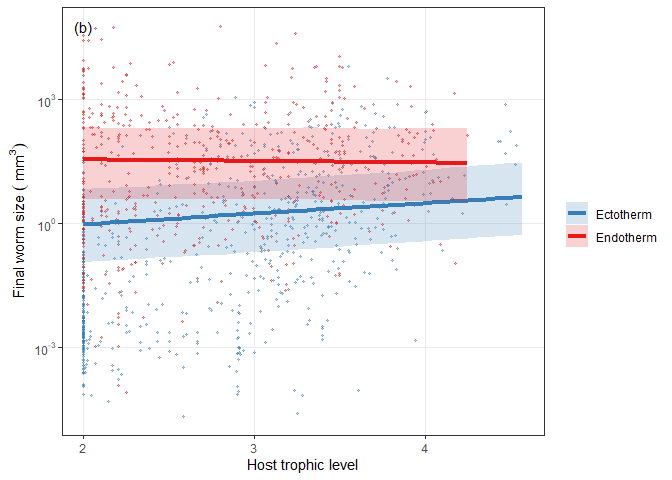
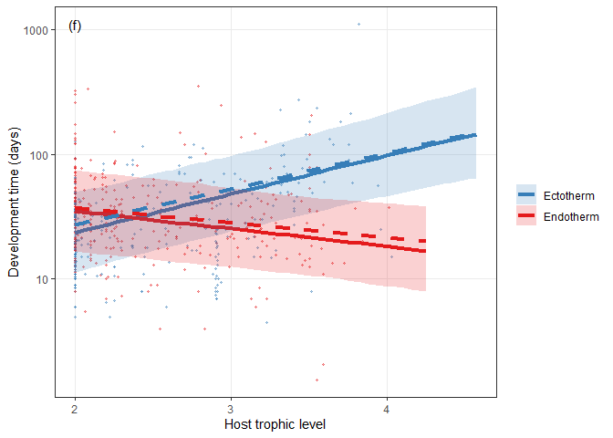
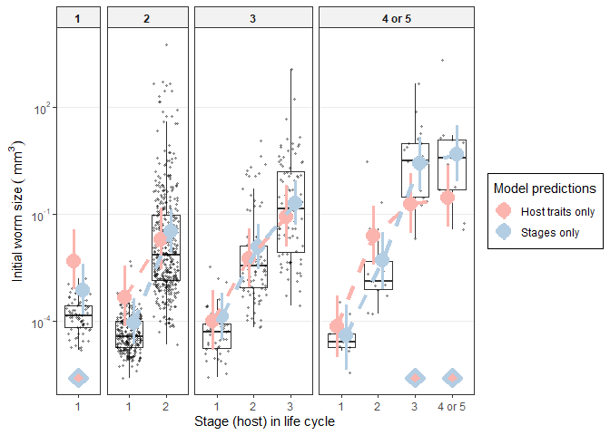

Host traits determining worm LH, multivariate
================

  - [Relative growth rate -
    multivariate](#relative-growth-rate---multivariate)
      - [Multivariate vs univariate model
        predictions](#multivariate-vs-univariate-model-predictions)
  - [Panels for Fig 3](#panels-for-fig-3)
  - [Host trait effects driven by intermediate vs definitive host
    distinction?](#host-trait-effects-driven-by-intermediate-vs-definitive-host-distinction)
  - [Overachieving worms?](#overachieving-worms)
      - [Panels of Fig. 4](#panels-of-fig.-4)
  - [Size by age](#size-by-age)
  - [Covariation among the traits determining growth
    rate](#covariation-among-the-traits-determining-growth-rate)

Worm parasites have different life cycles - some infect more hosts in
succession, others fewer. Lengthening the life cycle (more consecutive
hosts) is costly because it increases the chances of not being
transmitted to the next host and it delays reproduction. Do long cycles
have other advantages? In other notebooks, we examined the relationship
between [life cycle length and adult worm life
history](../lcl_adult_worm_traits/adult_worm_traits_vs_lcl.Rmd) and how
[host trais vary across life
cycles](../kinds_of_hosts/host_traits_across_clc.Rmd). In this notebook,
we examine how host traits affect parasite life history traits.

We’ll examine 3 parasite traits: initial size, final size, and
development time. Together, they determine how long and how fast
parasites grow. Fast growth is advantageous, so we are looking for the
host traits that favor large size and short devo time. We’ll examine
each of these simultaneously in a multivariate model.

# Relative growth rate - multivariate

The three parasite traits combine to determine how fast parasites grow.
Let’s put them into a multivariate model to see how growth rate varies
with host traits. This is better than explicitly modeling growth rate,
because it accounts for variability in each variable when calculating
the composite variable growth rate. We fit the multivariate models with
`MCMCglmm`. We also include ‘empty’ data in the model, so that it will
return predictions for parasite traits, holding either host mass or
trophic level constant.

As for model structure, we allow the residuals to be correlated. For
example, if a worm stage has a large final size relative to its host, it
probably started large or developed longer, i.e. positive residual
correlations. Parasite taxonomy is treated as nested random effects. We
fit the same series of models as in univariate analyses: (i) intercept
only, (ii) host trait main effects, (iii) host trait interactions (2nd
order).

Here are the sample sizes for each trait included in the model.

| n\_dt | n\_end\_size | n\_ini\_size |
| ----: | -----------: | -----------: |
|   574 |         1150 |         1043 |

It is worth noting that a good portion of those missing devo times are
paratenic stages. Here are paratenic stages with and without devo times.

| devo\_missing |   n |
| :------------ | --: |
| FALSE         |   5 |
| TRUE          | 189 |

Here is a comparison of the three models. Adding host traits (red) is
better than an intercept-only model (black). Adding host trait
interactions (green) is slight further improvement.

<!-- -->

Here are the DIC values for the models.

    ## DIC, int-only: 12962.76

    ## DIC, host traits (main); 11300.8

    ## DIC, host traits (int); 11281.51

Here is the delta DIC for adding the host traits…

    ## Delta DIC, int-only vs host traits: 1661.966 (higher is better)

…and the host trait interactions, an improvement.

    ## Delta DIC, host trait main vs host trait interactions: 19.28885 (higher is better)

Here is the predicted increase in final worm size with host mass. A
doubling of host mass results in a 36% increase in parasite size. This
was was much larger than…

    ## 
    ## Iterations = 501:30471
    ## Thinning interval = 30 
    ## Number of chains = 1 
    ## Sample size per chain = 1000 
    ## 
    ## 1. Empirical mean and standard deviation for each variable,
    ##    plus standard error of the mean:
    ## 
    ##           Mean             SD       Naive SE Time-series SE 
    ##      0.3575742      0.0183286      0.0005796      0.0006267 
    ## 
    ## 2. Quantiles for each variable:
    ## 
    ##   2.5%    25%    50%    75%  97.5% 
    ## 0.3215 0.3451 0.3578 0.3702 0.3943

…the increase in initial worm size with host mass, which was 20%.

    ## 
    ## Iterations = 501:30471
    ## Thinning interval = 30 
    ## Number of chains = 1 
    ## Sample size per chain = 1000 
    ## 
    ## 1. Empirical mean and standard deviation for each variable,
    ##    plus standard error of the mean:
    ## 
    ##           Mean             SD       Naive SE Time-series SE 
    ##      0.1994950      0.0163612      0.0005174      0.0005174 
    ## 
    ## 2. Quantiles for each variable:
    ## 
    ##   2.5%    25%    50%    75%  97.5% 
    ## 0.1681 0.1884 0.1991 0.2107 0.2302

Development time increased with host mass as well. This slope is not
comparable to the parasite size slopes, since devo time had a more
limited range than size. Devo time increased 5% with a 100% increase in
host mass.

    ## 
    ## Iterations = 501:30471
    ## Thinning interval = 30 
    ## Number of chains = 1 
    ## Sample size per chain = 1000 
    ## 
    ## 1. Empirical mean and standard deviation for each variable,
    ##    plus standard error of the mean:
    ## 
    ##           Mean             SD       Naive SE Time-series SE 
    ##      0.0467984      0.0054267      0.0001716      0.0002454 
    ## 
    ## 2. Quantiles for each variable:
    ## 
    ##    2.5%     25%     50%     75%   97.5% 
    ## 0.03565 0.04328 0.04676 0.05072 0.05670

Initial worm size increased more than 10-fold with each unit increase in
host trophic level.

    ## 
    ## Iterations = 501:30471
    ## Thinning interval = 30 
    ## Number of chains = 1 
    ## Sample size per chain = 1000 
    ## 
    ## 1. Empirical mean and standard deviation for each variable,
    ##    plus standard error of the mean:
    ## 
    ##           Mean             SD       Naive SE Time-series SE 
    ##       12.34749        2.20835        0.06983        0.06983 
    ## 
    ## 2. Quantiles for each variable:
    ## 
    ##   2.5%    25%    50%    75%  97.5% 
    ##  8.573 10.746 12.065 13.716 17.016

Here is the effect of endothermy on worm final size. Final size was \~19
fold higher in an endotherm. To properly interpret this, though, host
mass and trophic level would need to be standardized.

    ## 
    ## Iterations = 501:30471
    ## Thinning interval = 30 
    ## Number of chains = 1 
    ## Sample size per chain = 1000 
    ## 
    ## 1. Empirical mean and standard deviation for each variable,
    ##    plus standard error of the mean:
    ## 
    ##           Mean             SD       Naive SE Time-series SE 
    ##        18.6803         4.1311         0.1306         0.1306 
    ## 
    ## 2. Quantiles for each variable:
    ## 
    ##  2.5%   25%   50%   75% 97.5% 
    ## 11.93 15.91 18.11 20.98 28.24

Here are the model parameters and credible intervals for host trait main
effx model…

| param                          |          lwr |          fit |         upr | sig |
| :----------------------------- | -----------: | -----------: | ----------: | :-- |
| traitlog\_dt                   |    2.9874040 |    3.2937334 |   3.6404370 | sig |
| traitlog\_dt:endo\_ectoendo    |  \-0.6494908 |  \-0.4789566 | \-0.2959391 | sig |
| traitlog\_dt:host\_bm          |    0.0505350 |    0.0659325 |   0.0795615 | sig |
| traitlog\_dt:host\_tl          |  \-0.0626416 |    0.0568965 |   0.1676198 | ns  |
| traitlog\_end                  |  \-7.8641072 |  \-2.5513125 |   2.0835840 | ns  |
| traitlog\_end:endo\_ectoendo   |    2.4787095 |    2.8964651 |   3.3408240 | sig |
| traitlog\_end:host\_bm         |    0.4022241 |    0.4412638 |   0.4795717 | sig |
| traitlog\_end:host\_tl         |  \-0.0077926 |    0.2566411 |   0.5604957 | ns  |
| traitlog\_start                | \-17.1672287 | \-13.2198836 | \-9.5383920 | sig |
| traitlog\_start:endo\_ectoendo |    0.0008443 |    0.4422555 |   0.9397472 | sig |
| traitlog\_start:host\_bm       |    0.2241316 |    0.2619624 |   0.2988607 | sig |
| traitlog\_start:host\_tl       |    2.1486403 |    2.4903098 |   2.8341490 | sig |

…and the model including host trait interactions…

| param                                   |          lwr |          fit |         upr | sig |
| :-------------------------------------- | -----------: | -----------: | ----------: | :-- |
| traitlog\_dt                            |    1.5664160 |    2.3909502 |   3.2146890 | sig |
| traitlog\_dt:endo\_ectoendo             |    1.2384271 |    2.1330368 |   2.9711688 | sig |
| traitlog\_dt:host\_bm                   |  \-0.1990260 |  \-0.1176734 | \-0.0434906 | sig |
| traitlog\_dt:host\_bm:endo\_ectoendo    |    0.0263169 |    0.0617011 |   0.0992513 | sig |
| traitlog\_dt:host\_bm:host\_tl          |    0.0317002 |    0.0594782 |   0.0876219 | sig |
| traitlog\_dt:host\_tl                   |    0.2097013 |    0.3877722 |   0.5667327 | sig |
| traitlog\_dt:host\_tl:endo\_ectoendo    |  \-1.3395636 |  \-1.0432135 | \-0.7232107 | sig |
| traitlog\_end                           |  \-5.5157742 |  \-3.0424477 | \-0.7654092 | sig |
| traitlog\_end:endo\_ectoendo            |    3.7076678 |    5.5462612 |   7.4341268 | sig |
| traitlog\_end:host\_bm                  |    0.1524918 |    0.3136193 |   0.4832438 | sig |
| traitlog\_end:host\_bm:endo\_ectoendo   |  \-0.1847961 |  \-0.0815834 |   0.0158911 | ns  |
| traitlog\_end:host\_bm:host\_tl         |  \-0.0124547 |    0.0469977 |   0.1042712 | ns  |
| traitlog\_end:host\_tl                  |  \-0.0779368 |    0.3490014 |   0.8327230 | ns  |
| traitlog\_end:host\_tl:endo\_ectoendo   |  \-1.4142205 |  \-0.7088147 | \-0.0641034 | sig |
| traitlog\_start                         | \-13.8490120 | \-11.6360618 | \-9.2343337 | sig |
| traitlog\_start:endo\_ectoendo          |  \-1.7375584 |    0.3120080 |   2.3355224 | ns  |
| traitlog\_start:host\_bm                |  \-0.1227140 |    0.0714249 |   0.2746872 | ns  |
| traitlog\_start:host\_bm:endo\_ectoendo |  \-0.2219290 |  \-0.1077729 |   0.0002388 | ns  |
| traitlog\_start:host\_bm:host\_tl       |    0.0175773 |    0.0890747 |   0.1570735 | sig |
| traitlog\_start:host\_tl                |    1.3063634 |    1.8324519 |   2.3502013 | sig |
| traitlog\_start:host\_tl:endo\_ectoendo |  \-0.4673934 |    0.2840912 |   1.0103234 | ns  |

Here are the parameters for the host traits interaction model, but
excluding stages with devo times less than a week.

| param                                   |          lwr |          fit |          upr | sig |
| :-------------------------------------- | -----------: | -----------: | -----------: | :-- |
| traitlog\_dt                            |    1.7723703 |    2.5984805 |    3.4153878 | sig |
| traitlog\_dt:endo\_ectoendo             |    1.0854510 |    1.9507023 |    2.7795612 | sig |
| traitlog\_dt:host\_bm                   |  \-0.1961933 |  \-0.1189999 |  \-0.0474524 | sig |
| traitlog\_dt:host\_bm:endo\_ectoendo    |    0.0162137 |    0.0503000 |    0.0865778 | sig |
| traitlog\_dt:host\_bm:host\_tl          |    0.0377179 |    0.0631809 |    0.0903263 | sig |
| traitlog\_dt:host\_tl                   |    0.1453173 |    0.3252190 |    0.4954765 | sig |
| traitlog\_dt:host\_tl:endo\_ectoendo    |  \-1.2572663 |  \-0.9481332 |  \-0.6346028 | sig |
| traitlog\_end                           |  \-6.5657074 |  \-3.4162411 |  \-0.3138038 | sig |
| traitlog\_end:endo\_ectoendo            |    4.6447380 |    7.8956510 |   11.0348418 | sig |
| traitlog\_end:host\_bm                  |  \-0.1634284 |    0.1286702 |    0.4042177 | ns  |
| traitlog\_end:host\_bm:endo\_ectoendo   |  \-0.2726312 |  \-0.1228560 |    0.0188944 | ns  |
| traitlog\_end:host\_bm:host\_tl         |    0.0308792 |    0.1322884 |    0.2338800 | sig |
| traitlog\_end:host\_tl                  |    0.0463862 |    0.6608528 |    1.3708416 | sig |
| traitlog\_end:host\_tl:endo\_ectoendo   |  \-2.7620887 |  \-1.6371725 |  \-0.3410510 | sig |
| traitlog\_start                         | \-15.8765364 | \-13.1975179 | \-10.7038950 | sig |
| traitlog\_start:endo\_ectoendo          |  \-2.5629573 |    1.1532267 |    5.0298614 | ns  |
| traitlog\_start:host\_bm                |  \-0.2833859 |    0.0379340 |    0.3708277 | ns  |
| traitlog\_start:host\_bm:endo\_ectoendo |  \-0.2272071 |  \-0.0796543 |    0.0558956 | ns  |
| traitlog\_start:host\_bm:host\_tl       |  \-0.0369388 |    0.0767418 |    0.1896207 | ns  |
| traitlog\_start:host\_tl                |    1.4560734 |    2.1426569 |    2.8754561 | sig |
| traitlog\_start:host\_tl:endo\_ectoendo |  \-1.2060550 |    0.2875261 |    1.6290701 | ns  |

Here’s the R2 for these models.

The addition of host trait interactions only explain a few additional
percentage points of the variation in worm sizes. It appears more
important for parasite development.

| model                                  | trait       | r2m                   | r2c                   |
| :------------------------------------- | :---------- | :-------------------- | :-------------------- |
| int-only                               | dt          | 0 \[0-0\]             | 0.33 \[0.233-0.494\]  |
| host traits, main effects              | dt          | 0.169 \[0.11-0.237\]  | 0.456 \[0.363-0.555\] |
| host traits, second-order interactions | dt          | 0.242 \[0.125-0.342\] | 0.724 \[0.644-0.85\]  |
| int-only                               | end\_size   | 0 \[0-0\]             | 0.236 \[0.129-0.837\] |
| host traits, main effects              | end\_size   | 0.459 \[0.064-0.563\] | 0.805 \[0.755-0.972\] |
| host traits, second-order interactions | end\_size   | 0.518 \[0.338-0.581\] | 0.779 \[0.743-0.857\] |
| int-only                               | start\_size | 0 \[0-0\]             | 0.423 \[0.254-0.911\] |
| host traits, main effects              | start\_size | 0.332 \[0.076-0.41\]  | 0.67 \[0.588-0.925\]  |
| host traits, second-order interactions | start\_size | 0.385 \[0.267-0.454\] | 0.645 \[0.586-0.765\] |

The residual covariances in the multivariate model are non-zero. Here is
the correlation matrix for the residuals:

    ##        [,1]  [,2]   [,3]
    ## [1,]  1.000 0.067 -0.171
    ## [2,]  0.067 1.000  0.332
    ## [3,] -0.171 0.332  1.000

    ## 
    ## Iterations = 1:1000
    ## Thinning interval = 1 
    ## Number of chains = 1 
    ## Sample size per chain = 1000 
    ## 
    ## 1. Empirical mean and standard deviation for each variable,
    ##    plus standard error of the mean:
    ## 
    ##           Mean      SD Naive SE Time-series SE
    ##  [1,]  1.00000 0.00000 0.000000       0.000000
    ##  [2,]  0.05975 0.03979 0.001258       0.001258
    ##  [3,] -0.16970 0.05539 0.001751       0.002151
    ##  [4,]  0.05975 0.03979 0.001258       0.001258
    ##  [5,]  1.00000 0.00000 0.000000       0.000000
    ##  [6,]  0.30236 0.04990 0.001578       0.001909
    ##  [7,] -0.16970 0.05539 0.001751       0.002151
    ##  [8,]  0.30236 0.04990 0.001578       0.001909
    ##  [9,]  1.00000 0.00000 0.000000       0.000000
    ## 
    ## 2. Quantiles for each variable:
    ## 
    ##          2.5%      25%      50%      75%    97.5%
    ## var1  1.00000  1.00000  1.00000  1.00000  1.00000
    ## var2 -0.01739  0.03177  0.05923  0.08694  0.13801
    ## var3 -0.27378 -0.20875 -0.17060 -0.13197 -0.05841
    ## var4 -0.01739  0.03177  0.05923  0.08694  0.13801
    ## var5  1.00000  1.00000  1.00000  1.00000  1.00000
    ## var6  0.20023  0.26982  0.30553  0.33514  0.39319
    ## var7 -0.27378 -0.20875 -0.17060 -0.13197 -0.05841
    ## var8  0.20023  0.26982  0.30553  0.33514  0.39319
    ## var9  1.00000  1.00000  1.00000  1.00000  1.00000

Start and end size are positively correlated as are devo time and end
size. Start size and devo time are negatively correlated. These
correlations are consistent with classic LH tradeoffs. Growing to a
large size requires time, but entering hosts as a large larvae reduces
the time needed to develop.

For all traits, there was substantial taxonomic variation. Let’s look at
the breakdown of taxonomic effects, after accounting for host traits.
Here is the plot for initial size…

<!-- -->

…final size…

<!-- -->

…and development time.

<!-- -->

For size variables, there is both a phyla effect (nematodes are smaller)
and a order/family effect. Devo time seems to differ more among higher
taxonomic groups.

## Multivariate vs univariate model predictions

We also fit the univariate models with `MCMCglmm` for comparison.

I get marginal predicted values from the multivariate and univariate
models.

Let’s compare the predictions for univariate and multivariate models,
starting with final size. The increase with host mass and endothermy is
essentially the same in both models. However, the CI might be a bit
wider for the univariate model.

<!-- -->

For initial size, the CI was again narrower for the multivariate model.

<!-- -->

This was not the case for devo time. Interestingly, the devo time
relationship appears slightly different in the multivariate model. Uni-
and multi-variate models probably diverge most for devo time, because it
was the trait with the most missing data.

<!-- -->

This is even clearer when we look at devo time as a function of host
trophic level.

<!-- -->

An advantage of multivariate models is that we can use the posterior
distribution to calculate composite traits like growth rate. This is
preferable to calculating growth rate from the means of the univariate
models, because it accounts for variation in all parameters
simultaneously.

So let’s look at growth rates. The next plot shows predicted growth
rates calculated two ways, either by using the full posterior
distribution of all parameters or just the means given by the univariate
models. It is clear that the CI is much wider when we account for
variation in all the parameters simultaneously.

<!-- -->

Here’s the same plot, but with growth rate as a function of host trophic
level.

<!-- -->

# Panels for Fig 3

Let’s now make some plots using the predictions and credible intervals
from the model including host trait interactions.

The points in each plot are observed values. First final size…

<!-- -->

<!-- -->

…then initial size.

<!-- -->

<!-- -->

Instead of plotting final and initial size separately, we could plot
relative growth, i.e. the difference between final and initial size. It
increases with host mass.

<!-- -->

and decreases with trophic level.

<!-- -->

Here’s how relative growth changed with host size. This is relative
growth in a 1 mg host…

|  rg\_1mg | rg\_1mg\_upr | rg\_1mg\_lwr | fold\_change | fold\_change\_lwr | fold\_change\_upr |
| -------: | -----------: | -----------: | -----------: | ----------------: | ----------------: |
| 3.526937 |     6.358381 |    0.8560644 |      34.0196 |          2.353879 |          577.3112 |

…a 1 g host…

|  rg\_1g | rg\_1g\_upr | rg\_1g\_lwr | fold\_change | fold\_change\_lwr | fold\_change\_upr |
| ------: | ----------: | ----------: | -----------: | ----------------: | ----------------: |
| 4.36255 |    6.986674 |    1.754065 |     78.45691 |          5.778041 |          1082.116 |

…and a 10 kg host.

| rg\_10kg | rg\_10kg\_upr | rg\_10kg\_lwr | fold\_change | fold\_change\_lwr | fold\_change\_upr |
| -------: | ------------: | ------------: | -----------: | ----------------: | ----------------: |
| 5.513986 |      8.190673 |      2.849989 |     248.1381 |          17.28759 |          3607.149 |

And here is the relative growth difference between an average sized (10
g) endotherm and ectotherm.

| endo\_ecto | host\_bm | host\_tl |  rg\_10g | rg\_10g\_lwr | rg\_10g\_upr | fold\_change | fold\_change\_lwr | fold\_change\_upr |
| :--------- | -------: | -------: | -------: | -----------: | -----------: | -----------: | ----------------: | ----------------: |
| ecto       | 2.228583 | 2.804482 | 4.637572 |     2.004506 |     7.202836 |     103.2932 |          7.422427 |          1343.235 |
| endo       | 2.298840 | 2.804482 | 7.142007 |     4.380489 |     9.855019 |    1263.9622 |         79.877074 |         19053.750 |

Moving onto development time, the solid and dashed lines represent
trends including or excluding short devo times (\< 1 week).

<!-- -->

<!-- -->

Growth rate is only plotted for species that spent at least 1 week
developing.

<!-- -->

Growth varies little with trophic level.

<!-- -->

Worms grow slightly faster in endotherms than ectotherms. Here is the
difference for an average sized host (10 g).

| endo\_ecto |  rgr\_10g | rgr\_10g\_upr | rgr\_10g\_lwr |
| :--------- | --------: | ------------: | ------------: |
| ecto       | 0.1591192 |     0.3384232 |     0.0583423 |
| endo       | 0.3515449 |     0.7112560 |     0.1421677 |

We combined these plots into a single figure.

# Host trait effects driven by intermediate vs definitive host distinction?

Since definitive hosts are mostly endotherms and intermediate hosts are
mostly ectotherms, it is possible that growth differences are
exaggerated by limited growth in some intermediate hosts, e.g. in
paratenic hosts. To check this, we re-fit the model with the distinction
between intermediate vs definitive host, as well as its interactions
with the other host traits.

The resulting model did not explain much more variation in final size,
but it did account for some additional variation in start size and devo
time. This fits with what we know about stages - i.e. worms grow less in
some stages than we might expect given host size.

| model                                  | trait       | r2m                   | r2c                   |
| :------------------------------------- | :---------- | :-------------------- | :-------------------- |
| host traits, second-order interactions | dt          | 0.242 \[0.125-0.342\] | 0.724 \[0.644-0.85\]  |
| host traits + def vs int interactions  | dt          | 0.264 \[0.147-0.413\] | 0.735 \[0.651-0.85\]  |
| host traits, second-order interactions | end\_size   | 0.518 \[0.338-0.581\] | 0.779 \[0.743-0.857\] |
| host traits + def vs int interactions  | end\_size   | 0.505 \[0.342-0.574\] | 0.845 \[0.815-0.896\] |
| host traits, second-order interactions | start\_size | 0.385 \[0.267-0.454\] | 0.645 \[0.586-0.765\] |
| host traits + def vs int interactions  | start\_size | 0.435 \[0.319-0.508\] | 0.763 \[0.714-0.828\] |

What about the predictions for growth in definitive hosts?

Here is the predicted growth in endo vs ectotherm for an average sized
definitive host. It is higher for endotherms, but the CIs are wide and
nearly overlapping.

| endo\_ecto | host\_bm | host\_tl | Def.int |  rg\_avg | rg\_avg\_lwr | rg\_avg\_upr | fold\_change | fold\_change\_lwr | fold\_change\_upr |
| :--------- | -------: | -------: | :------ | -------: | -----------: | -----------: | -----------: | ----------------: | ----------------: |
| ecto       | 6.697903 | 2.804482 | def     | 4.646972 |     1.920386 |     7.703195 |     104.2688 |          6.823593 |          2215.415 |
| endo       | 6.599207 | 2.804482 | def     | 7.636150 |     5.062186 |    10.422490 |    2071.7511 |        157.935320 |         33607.007 |

Here is the predicted relative growth in 10g intermediate host. We chose
10g because this is whether endotherm and ectotherm body sizes overlap;
the average endotherm intermediate host is much bigger than the average
ectotherm intermediate host. The CI for endotherms is very wide, because
there were few endotherm intermediate hosts. Consequently, the CIs
overlap and it is not clear that endothermy affects total growth in
intermediate hosts.

| endo\_ecto | host\_bm | host\_tl | Def.int |  rg\_avg | rg\_avg\_lwr | rg\_avg\_upr | fold\_change | fold\_change\_lwr | fold\_change\_upr |
| :--------- | -------: | -------: | :------ | -------: | -----------: | -----------: | -----------: | ----------------: | ----------------: |
| ecto       | 2.471915 | 2.804482 | int     | 4.093788 |    1.4633671 |     7.011690 |     59.96662 |         4.3204828 |          1109.528 |
| endo       | 2.368620 | 2.804482 | int     | 2.385794 |  \-0.6392261 |     5.629181 |     10.86769 |         0.5277007 |           278.434 |

Here is growth in an average-sized ectotherm intermediate host. The
predicted growth was than in an average-sized ectotherm definitive host,
though not significantly so.

|   host\_bm | host\_tl | Def.int |  rg\_avg | rg\_avg\_lwr | rg\_avg\_upr | fold\_change | fold\_change\_lwr | fold\_change\_upr |
| ---------: | -------: | :------ | -------: | -----------: | -----------: | -----------: | ----------------: | ----------------: |
| \-1.238507 | 2.804482 | int     | 3.697562 |     1.123381 |      6.64154 |      40.3488 |          3.075233 |          766.2743 |

Growth *rates* are faster in endotherm definitive hosts.

| endo\_ecto | host\_bm | host\_tl | Def.int |  rgr\_avg | rgr\_avg\_lwr | rgr\_avg\_upr |
| :--------- | -------: | -------: | :------ | --------: | ------------: | ------------: |
| ecto       | 6.697903 | 2.804482 | def     | 0.0866828 |     0.0183489 |     0.2217108 |
| endo       | 6.599207 | 2.804482 | def     | 0.2516052 |     0.1130198 |     0.5567874 |

We can’t make the same comparison in intermediate hosts, given the lack
of data.

| endo\_ecto | host\_bm | host\_tl | Def.int |    rgr\_avg | rgr\_avg\_lwr | rgr\_avg\_upr |
| :--------- | -------: | -------: | :------ | ----------: | ------------: | ------------: |
| ecto       | 2.471915 | 2.804482 | int     |   0.1687188 |     0.0663297 |     0.3940908 |
| endo       | 2.368620 | 2.804482 | int     | \-0.0152100 |   \-2.9981349 |     1.0820303 |

Let’s plot the model output. Intermediate vs definitive hosts are
distinguished by dotted and solid lines, respectively.

End size tends to be a bit larger in definitive hosts than comparable
intermediate hosts, especially if they are endotherms.

<!-- -->
Starting size is a little bit lower for endotherms than for ectotherms,
but the difference is small.

<!-- -->
The combination of smaller initial sizes and larger final sizes
indicates more growth in endothermic definitive hosts.

<!-- -->
However, although they growth more in endotherm definitive hosts, the
average prepatent period is shorter. The large CI for endotherm
intermediate hosts reflects little data.

<!-- -->
In endothermic definitive hosts, worms grow more in a shorter period,
resulting in faster growth.

<!-- -->

Overall, adding a definitive vs intermediate host distinction does not
change the results much. Worms still grow more in endotherm than
ectotherm hosts. However, when we restrict the data to just definitive
hosts and refit the model, then the estimated difference is much smaller
(and marginally significant).

    ## Fold change, ecto vs endo def host: 278 944

I think this is caused by larger taxonomic effects. When restricted to a
single stage (def host), the model considers more of the differences to
be taxonomic. That is, a taxon may not grow consistently more (or less)
than expected from host size across the full life cycle. But when
restricted to just one stage, more variation is considered taxonomic.

The differences between definitive and intermediate hosts are also part
of the next modeling step: adding life stage to the model.

# Overachieving worms?

Now that we have estimated the relationship between host and parasite
traits, we can ask whether certain parasite life stages grow faster or
larger than expected. In particular, we are interested in the
possibility that parasites with long cycles overperform at particular
stages as a way to compensate. A quick way to test this is to add
parasite stage into models with the host traits. Does stage account for
additional variation beyond that accounted for by host traits? Let’s do
a few quick likelihood ratio tests with our “best” imputed datasets.

Stage explains additional variation in final size…

|          | npar |      AIC |      BIC |     logLik | deviance |  Chisq | Df | Pr(\>Chisq) |
| :------- | ---: | -------: | -------: | ---------: | -------: | -----: | -: | ----------: |
| modfs1.1 |   14 | 5339.186 | 5409.851 | \-2655.593 | 5311.186 |     NA | NA |          NA |
| modfs3.1 |   23 | 5084.216 | 5200.309 | \-2519.108 | 5038.216 | 272.97 |  9 |           0 |

and initial size…

|          | npar |      AIC |      BIC |     logLik | deviance |    Chisq | Df | Pr(\>Chisq) |
| :------- | ---: | -------: | -------: | ---------: | -------: | -------: | -: | ----------: |
| modis1.1 |   14 | 5050.959 | 5120.257 | \-2511.479 | 5022.959 |       NA | NA |          NA |
| modis3.1 |   23 | 4606.509 | 4720.356 | \-2280.255 | 4560.509 | 462.4495 |  9 |           0 |

and devo time (barely).

|          | npar |      AIC |      BIC |     logLik | deviance |    Chisq | Df | Pr(\>Chisq) |
| :------- | ---: | -------: | -------: | ---------: | -------: | -------: | -: | ----------: |
| moddt1.1 |   14 | 1192.609 | 1253.546 | \-582.3045 | 1164.609 |       NA | NA |          NA |
| moddt3.1 |   23 | 1185.301 | 1285.412 | \-569.6507 | 1139.301 | 25.30771 |  9 |    0.002649 |

So, parasite life stages seem to explain additional variation, even
after accounting for host traits. Now let’s again fit multivariate
models and then we’ll compare stage means predicted from just host
traits or just stages, both adjusted for taxonomic effects. When the
predictions diverge it suggests parasites grow more (or less) in
particular stages than expected from their hosts.

I need to tweek the host-trait model compared to above. I want to get
predicted values for each stage, and stages do not infect either
endotherms or ectotherms. Rather, some proportion of species infect
endotherms or ectotherms. Therefore, I replaced endothermy as a category
with endothermy as a proportion in the model, so that I can predict
stage means for a given level of endothermy. This does not change the
number of model parameters.

I also fit the same models with cumulative development time instead of
stage development time. When we summed mean developmental times across
stages within a life cycle length (e.g. devo time in first host and devo
time in second host), mean cumulative devo times were lower than the
observed values. One reason for this is that we removed species with
partial life cycles (e.g. 2 of 3 hosts known). Several of these species
had imputed values for their paratenic stages, but not earlier ones,
resulting in cumulative development being too low. Additionally, summing
stage means underestimated total development time, because mean
development times are negatively correlated across stages (i.e. if you
grow a lot now, there is less need to grow later).

I fit both models with the same imputation approach as above: loop
through imputed datasets, fit model, sample post dist, repeat with next
imputed dataset.

The deviance is lower for the life-stage model (red) compared to the
host-traits model (black). Deviance goes down even further with both
host traits and parasite stages in the model (green)

<!-- -->

Here are the DIC values of the three models:

    ## Host traits only: 11272.84

    ## Stages only: 10698.42

    ## Host traits and stages: 10358.44

The stage model is clearly better than the host traits model.

    ## Delta DIC, host traits only vs life stage only: 574.4224 (higher is better)

Both together is an even better model, suggesting that host traits
explain variation within stages (e.g. worm size may covary with host
size at a given stage).

    ## Delta DIC, stage only vs stage and host traits: 339.9747 (higher is better)

Here are the model parameters and credible intervals for the stage-only
model:

| param                             |          lwr |         fit |         upr | sig |
| :-------------------------------- | -----------: | ----------: | ----------: | :-- |
| traitlog\_dt                      |    2.9277211 |   3.6009813 |   4.2809692 | sig |
| traitlog\_dt:stage\_lcllc2\_1     |  \-0.6542614 | \-0.3279632 | \-0.0430300 | sig |
| traitlog\_dt:stage\_lcllc2\_2     |  \-0.2603627 |   0.0663597 |   0.3636078 | ns  |
| traitlog\_dt:stage\_lcllc3\_1     |  \-0.8715632 | \-0.5201932 | \-0.1548349 | sig |
| traitlog\_dt:stage\_lcllc3\_2     |  \-0.0237807 |   0.5059884 |   1.0167705 | ns  |
| traitlog\_dt:stage\_lcllc3\_3     |  \-0.3629613 | \-0.0214821 |   0.3238774 | ns  |
| traitlog\_dt:stage\_lcllc3+\_1    |  \-2.0560933 | \-1.3687903 | \-0.6810456 | sig |
| traitlog\_dt:stage\_lcllc3+\_2    |  \-0.5430880 |   0.1197666 |   0.8283622 | ns  |
| traitlog\_dt:stage\_lcllc3+\_3    |  \-0.5810774 |   0.4914390 |   1.5470701 | ns  |
| traitlog\_dt:stage\_lcllc3+\_4    |  \-0.8099637 | \-0.2488885 |   0.2419268 | ns  |
| traitlog\_end                     |    0.6301805 |   2.2970114 |   4.1736289 | sig |
| traitlog\_end:stage\_lcllc2\_1    |  \-7.6526343 | \-6.5671093 | \-5.5677737 | sig |
| traitlog\_end:stage\_lcllc2\_2    |  \-0.5539536 |   0.5104611 |   1.4896084 | ns  |
| traitlog\_end:stage\_lcllc3\_1    |  \-8.1812149 | \-7.0502721 | \-5.9073508 | sig |
| traitlog\_end:stage\_lcllc3\_2    |  \-5.7199844 | \-4.6267363 | \-3.5418414 | sig |
| traitlog\_end:stage\_lcllc3\_3    |  \-0.2272820 |   0.8262563 |   1.8878344 | ns  |
| traitlog\_end:stage\_lcllc3+\_1   | \-11.7571775 | \-9.9372687 | \-8.0624672 | sig |
| traitlog\_end:stage\_lcllc3+\_2   |  \-3.9929049 | \-2.4240107 | \-0.8591371 | sig |
| traitlog\_end:stage\_lcllc3+\_3   |  \-4.0824480 | \-2.2405908 | \-0.5516238 | sig |
| traitlog\_end:stage\_lcllc3+\_4   |    0.1762121 |   1.7242448 |   3.1979587 | sig |
| traitlog\_start                   |  \-8.7936652 | \-7.2166232 | \-5.5736581 | sig |
| traitlog\_start:stage\_lcllc2\_1  |  \-2.9896032 | \-2.1101986 | \-1.2481504 | sig |
| traitlog\_start:stage\_lcllc2\_2  |    2.8270721 |   3.7268026 |   4.6287714 | sig |
| traitlog\_start:stage\_lcllc3\_1  |  \-2.8114714 | \-1.7799418 | \-0.6977482 | sig |
| traitlog\_start:stage\_lcllc3\_2  |    1.7647544 |   2.7403234 |   3.8054868 | sig |
| traitlog\_start:stage\_lcllc3\_3  |    4.5874396 |   5.5771700 |   6.5702631 | sig |
| traitlog\_start:stage\_lcllc3+\_1 |  \-4.8651201 | \-3.0019157 | \-1.1450167 | sig |
| traitlog\_start:stage\_lcllc3+\_2 |    0.1803748 |   1.8845962 |   3.4521283 | sig |
| traitlog\_start:stage\_lcllc3+\_3 |    6.6728446 |   8.1219242 |   9.6491296 | sig |
| traitlog\_start:stage\_lcllc3+\_4 |    7.1243287 |   8.7249920 |  10.3114559 | sig |

Here is a comparison of final worm size in the definitive host…

| lcl | final\_ws\_avg | untransformed\_mass | ord\_mag\_change | fold\_change | perc\_increase |
| --: | -------------: | ------------------: | ---------------: | -----------: | -------------: |
|   1 |       2.297011 |            9.944418 |               NA |           NA |             NA |
|   2 |       2.807472 |           16.567990 |        0.5104611 |     1.666059 |       66.60593 |
|   3 |       3.123268 |           22.720503 |        0.3157952 |     1.371349 |       37.13493 |
|   4 |       4.021256 |           55.771123 |        0.8979885 |     2.454661 |      145.46606 |

…it does not increase as much as initial size in definitive host:

| lcl | initial\_ws\_avg | untransformed\_mass | ord\_mag\_change | fold\_change | perc\_increase |
| --: | ---------------: | ------------------: | ---------------: | -----------: | -------------: |
|   1 |       \-7.216623 |           0.0007343 |               NA |           NA |             NA |
|   2 |       \-3.489821 |           0.0305063 |         3.726803 |    41.546057 |      4054.6057 |
|   3 |       \-1.639453 |           0.1940862 |         1.850367 |     6.362157 |       536.2157 |
|   4 |         1.508369 |           4.5193529 |         3.147822 |    23.285293 |      2228.5293 |

And here are the parameters for the stage and host traits model:

| param                               |         lwr |         fit |         upr | sig |
| :---------------------------------- | ----------: | ----------: | ----------: | :-- |
| traitlog\_dt                        |   1.7877321 |   2.7257084 |   3.6715483 | sig |
| traitlog\_dt:host\_bm               | \-0.2148213 | \-0.1326939 | \-0.0548906 | sig |
| traitlog\_dt:host\_bm:host\_tl      |   0.0270761 |   0.0558162 |   0.0846178 | sig |
| traitlog\_dt:host\_bm:prop\_endo    |   0.0400707 |   0.0778718 |   0.1180809 | sig |
| traitlog\_dt:host\_tl               |   0.1053882 |   0.3171846 |   0.5185024 | sig |
| traitlog\_dt:host\_tl:prop\_endo    | \-1.3444689 | \-1.0105417 | \-0.6513509 | sig |
| traitlog\_dt:prop\_endo             |   0.7671103 |   1.7828333 |   2.6766348 | sig |
| traitlog\_dt:stage\_lcllc2\_1       | \-0.6397540 | \-0.2482516 |   0.1241009 | ns  |
| traitlog\_dt:stage\_lcllc2\_2       | \-0.0860116 |   0.2095246 |   0.4950076 | ns  |
| traitlog\_dt:stage\_lcllc3\_1       | \-0.8202506 | \-0.3891384 |   0.0370281 | ns  |
| traitlog\_dt:stage\_lcllc3\_2       | \-0.1925677 |   0.3858028 |   0.8813800 | ns  |
| traitlog\_dt:stage\_lcllc3\_3       | \-0.2401682 |   0.1155253 |   0.4619032 | ns  |
| traitlog\_dt:stage\_lcllc3+\_1      | \-2.1027456 | \-1.3390799 | \-0.5592861 | sig |
| traitlog\_dt:stage\_lcllc3+\_2      | \-0.9618152 | \-0.2809480 |   0.3847317 | ns  |
| traitlog\_dt:stage\_lcllc3+\_3      | \-0.6186404 |   0.3062459 |   1.3076873 | ns  |
| traitlog\_dt:stage\_lcllc3+\_4      | \-0.7262990 | \-0.1976979 |   0.3205285 | ns  |
| traitlog\_end                       | \-0.4890349 |   1.7428072 |   3.9634706 | ns  |
| traitlog\_end:host\_bm              |   0.0403047 |   0.2052852 |   0.3790847 | sig |
| traitlog\_end:host\_bm:host\_tl     | \-0.0546978 |   0.0007078 |   0.0580749 | ns  |
| traitlog\_end:host\_bm:prop\_endo   | \-0.0862504 |   0.0007198 |   0.0903776 | ns  |
| traitlog\_end:host\_tl              | \-0.9534519 | \-0.5230978 | \-0.1048999 | sig |
| traitlog\_end:host\_tl:prop\_endo   | \-1.1130799 | \-0.5038307 |   0.1600197 | ns  |
| traitlog\_end:prop\_endo            |   0.7269401 |   2.5129508 |   4.3506703 | sig |
| traitlog\_end:stage\_lcllc2\_1      | \-5.1002083 | \-4.0736418 | \-3.0093680 | sig |
| traitlog\_end:stage\_lcllc2\_2      | \-0.1960496 |   0.7622120 |   1.7510503 | ns  |
| traitlog\_end:stage\_lcllc3\_1      | \-5.1945704 | \-3.9016278 | \-2.7171293 | sig |
| traitlog\_end:stage\_lcllc3\_2      | \-4.3980607 | \-3.2682034 | \-2.1664235 | sig |
| traitlog\_end:stage\_lcllc3\_3      | \-0.0413829 |   1.0554146 |   2.0894192 | ns  |
| traitlog\_end:stage\_lcllc3+\_1     | \-7.9374326 | \-5.9483481 | \-4.0547141 | sig |
| traitlog\_end:stage\_lcllc3+\_2     | \-2.5569718 | \-1.0368853 |   0.4302681 | ns  |
| traitlog\_end:stage\_lcllc3+\_3     | \-2.8293152 | \-1.1389403 |   0.4213157 | ns  |
| traitlog\_end:stage\_lcllc3+\_4     |   0.2144344 |   1.6587878 |   3.1778921 | sig |
| traitlog\_start                     | \-9.0104088 | \-6.8767451 | \-4.6828207 | sig |
| traitlog\_start:host\_bm            | \-0.3137948 | \-0.1545769 |   0.0290737 | ns  |
| traitlog\_start:host\_bm:host\_tl   | \-0.0353432 |   0.0258581 |   0.0860268 | ns  |
| traitlog\_start:host\_bm:prop\_endo | \-0.0330783 |   0.0599015 |   0.1522051 | ns  |
| traitlog\_start:host\_tl            |   0.1059050 |   0.5344133 |   0.9771181 | sig |
| traitlog\_start:host\_tl:prop\_endo | \-0.0547808 |   0.5763476 |   1.2241818 | ns  |
| traitlog\_start:prop\_endo          | \-5.4083154 | \-3.5439476 | \-1.8168246 | sig |
| traitlog\_start:stage\_lcllc2\_1    | \-5.0642247 | \-4.0174959 | \-2.9993986 | sig |
| traitlog\_start:stage\_lcllc2\_2    |   2.2227768 |   3.1884760 |   4.0988112 | sig |
| traitlog\_start:stage\_lcllc3\_1    | \-5.3123440 | \-4.0286985 | \-2.7838016 | sig |
| traitlog\_start:stage\_lcllc3\_2    |   0.4769069 |   1.4529994 |   2.5062369 | sig |
| traitlog\_start:stage\_lcllc3\_3    |   3.6774162 |   4.7254174 |   5.7652878 | sig |
| traitlog\_start:stage\_lcllc3+\_1   | \-7.1779318 | \-5.2739375 | \-3.4206205 | sig |
| traitlog\_start:stage\_lcllc3+\_2   | \-1.3560397 |   0.1682953 |   1.8761255 | ns  |
| traitlog\_start:stage\_lcllc3+\_3   |   4.9784747 |   6.3920357 |   7.9489432 | sig |
| traitlog\_start:stage\_lcllc3+\_4   |   6.3733371 |   8.0687386 |   9.8288512 | sig |

In the R2 table, the stages model explains more variation for
initial size, but not end size or devo time. This was one of the main
differences from imputed analysis, where stage had a clear affect on
devo time (via paratenics).

| model                         | trait       | r2m                   | r2c                   |
| :---------------------------- | :---------- | :-------------------- | :-------------------- |
| host traits                   | dt          | 0.219 \[0.119-0.316\] | 0.716 \[0.626-0.848\] |
| parasite stages               | dt          | 0.085 \[0.039-0.159\] | 0.674 \[0.558-0.815\] |
| host traits & parasite stages | dt          | 0.254 \[0.137-0.352\] | 0.749 \[0.675-0.863\] |
| host traits                   | end\_size   | 0.529 \[0.342-0.591\] | 0.785 \[0.751-0.855\] |
| parasite stages               | end\_size   | 0.516 \[0.38-0.569\]  | 0.801 \[0.77-0.854\]  |
| host traits & parasite stages | end\_size   | 0.549 \[0.415-0.613\] | 0.831 \[0.804-0.872\] |
| host traits                   | start\_size | 0.385 \[0.252-0.449\] | 0.644 \[0.582-0.764\] |
| parasite stages               | start\_size | 0.509 \[0.374-0.579\] | 0.763 \[0.725-0.822\] |
| host traits & parasite stages | start\_size | 0.583 \[0.46-0.647\]  | 0.818 \[0.788-0.856\] |

Now let’s extract the predicted marginal means and credible intervals
for each parasite life stage from these two models.

## Panels of Fig. 4

After calculating predicted stage means and their CI from the posterior
distribution, we plot them over boxplots of the observed data, starting
with final size.

<!-- -->

Relative to host traits, parasites tend to grow to a smaller final size
in the second host of three-host cycles and the first host of two-host
cycles. Direct cycle worms are also smaller than expected. Here are the
differences in a table. The skew towards negative values suggests that
the host trait model generally predicts larger worms than the stage
model.

| lcl\_max\_fac | Host\_no\_fac | diff\_btw\_predictions | fold\_change | sig     |
| :------------ | :------------ | ---------------------: | -----------: | :------ |
| 3+            | 3             |                \-2.170 |          8.8 | sig     |
| 3             | 2             |                \-2.130 |          8.4 | sig     |
| 2             | 1             |                \-2.105 |          8.2 | sig     |
| 1             | 1             |                \-1.868 |          6.5 | not sig |
| 3+            | 1             |                \-1.703 |          5.5 | not sig |
| 3+            | 4             |                \-0.637 |          1.9 | not sig |
| 3+            | 2             |                \-0.471 |          1.6 | not sig |
| 3             | 3             |                \-0.014 |          1.0 | not sig |
| 2             | 2             |                  0.092 |          1.1 | not sig |
| 3             | 1             |                  0.126 |          1.1 | not sig |

Here is the same plot restricted to adult stages. It suggests adult worm
sizes are predicted well by host traits, except in direct life cycles.

<!-- -->

Here are the differences in adult worm size for different life cycle
lengths.

| Host\_no\_fac | lcl\_max\_fac | log\_end\_p.fit | log\_size\_diff | fold\_change |
| :------------ | :------------ | --------------: | --------------: | -----------: |
| 1             | 1             |        2.297011 |              NA |           NA |
| 2             | 2             |        2.811761 |       0.5147500 |     1.673220 |
| 3             | 3             |        3.118507 |       0.3067450 |     1.358994 |
| 4             | 3+            |        4.046819 |       0.9283121 |     2.530235 |

We can also look at how life cycle truncation would impact reproductive
sizes. Here is what would happen if a four-host cycle parasite
reproduced in the third host.

| Host\_no\_fac | lcl\_max\_fac | log\_end\_p.fit | log\_size\_diff | fold\_change | perc\_decrease |
| :------------ | :------------ | --------------: | --------------: | -----------: | -------------: |
| 3             | 3             |        3.118507 |              NA |           NA |             NA |
| 3             | 3+            |        0.019551 |        3.098956 |     22.17478 |       99.37307 |

Here is what would happen if a three-host cycle parasite reproduced in
the second host.

| Host\_no\_fac | lcl\_max\_fac | log\_end\_p.fit | log\_size\_diff | fold\_change | perc\_decrease |
| :------------ | :------------ | --------------: | --------------: | -----------: | -------------: |
| 2             | 2             |        2.811761 |              NA |           NA |             NA |
| 2             | 3             |      \-2.336402 |        5.148164 |     172.1152 |       183.0939 |

Here is what would happen if a two-host cycle parasite reproduced in the
first host.

| Host\_no\_fac | lcl\_max\_fac | log\_end\_p.fit | log\_size\_diff | fold\_change | perc\_decrease |
| :------------ | :------------ | --------------: | --------------: | -----------: | -------------: |
| 1             | 2             |      \-4.272372 |              NA |           NA |             NA |
| 2             | 2             |        2.811761 |      \-7.084134 |    0.0008383 |       165.8126 |

Another way to look at what would happen if worms reproduced in
penultimate hosts is to compare worm size in penultimate hosts and final
hosts. Moreover, we can also compare worms in a penultimate host to
worms that reproduce in the same host number (e.g. worms in 1st
intermediate host of 2-host cycle vs worms with 1-host cycle).

Here is that plot for final worm size. In general, worms can grow
substantially larger in their next host (positive fold change, above
dotted line). However, some worms reach sizes in their penultimate hosts
that are comparable to sizes achieved by worms that reproduce in same
host number (points falling below line in right panel). Importantly, the
relative benefits of putting off reproduction decrease with life cycle
length.

<!-- -->

Moving onto starting size, direct cycle parasites enter the host at
smaller sizes than we would expect. Worms with the longest life cycles
stay small initially and then enter their final hosts at a larger size
than we would expect.

<!-- -->

Here’s the table. Unlike for final size, stage means for initial size
are sometimes overestimated and sometimes underestimated by host traits
alone.

| lcl\_max\_fac | Host\_no\_fac | diff\_btw\_predictions | fold\_change | sig     |
| :------------ | :------------ | ---------------------: | -----------: | :------ |
| 1             | 1             |                \-1.872 |          6.5 | sig     |
| 2             | 1             |                \-1.639 |          5.2 | not sig |
| 3+            | 2             |                \-1.577 |          4.8 | not sig |
| 3+            | 1             |                \-0.573 |          1.8 | not sig |
| 3             | 1             |                  0.278 |          1.3 | not sig |
| 2             | 2             |                  0.514 |          1.7 | not sig |
| 3             | 2             |                  0.756 |          2.1 | not sig |
| 3             | 3             |                  0.900 |          2.5 | not sig |
| 3+            | 3             |                  2.662 |         14.3 | sig     |
| 3+            | 4             |                  2.818 |         16.7 | sig     |

Here is initial size in definitive hosts.

<!-- -->

We can also look at relative growth, the difference between initial and
final worm size.

<!-- -->

Relative growth was lower than expected in third and fourth hosts of
4-host cycles and higher in the second hosts of 4-host cycles.

| lcl\_max\_fac | Host\_no\_fac | diff\_btw\_predictions | fold\_change | sig     |
| :------------ | :------------ | ---------------------: | -----------: | :------ |
| 3+            | 3             |                \-4.714 |        111.5 | sig     |
| 3+            | 4             |                \-3.420 |         30.6 | sig     |
| 3             | 2             |                \-2.780 |         16.1 | sig     |
| 3+            | 1             |                \-1.076 |          2.9 | not sig |
| 3             | 3             |                \-0.841 |          2.3 | not sig |
| 2             | 1             |                \-0.391 |          1.5 | not sig |
| 2             | 2             |                \-0.351 |          1.4 | not sig |
| 3             | 1             |                \-0.046 |          1.0 | not sig |
| 1             | 1             |                  0.049 |          1.1 | not sig |
| 3+            | 2             |                  1.161 |          3.2 | not sig |

Relative growth as adults decreased with life cycle length, as worms
entered definitive hosts at larger initial sizes with longer life
cycles.

<!-- -->

Next we look at developmental time.

<!-- -->

Here’s the table. Worms rarely developed longer than expected, perhaps
in the definitive host of 2-host cycles. Rather, in “middle” life stages
like second and third intermediate hosts, parasites developed less than
expected (paratenesis).

| lcl\_max\_fac | Host\_no\_fac | diff\_btw\_predictions | fold\_change | sig     |
| :------------ | :------------ | ---------------------: | -----------: | :------ |
| 3+            | 1             |                \-0.816 |          2.3 | not sig |
| 3+            | 4             |                \-0.528 |          1.7 | not sig |
| 3+            | 3             |                \-0.361 |          1.4 | not sig |
| 3+            | 2             |                \-0.345 |          1.4 | not sig |
| 3             | 3             |                \-0.130 |          1.1 | not sig |
| 3             | 1             |                \-0.071 |          1.1 | not sig |
| 1             | 1             |                \-0.031 |          1.0 | not sig |
| 2             | 1             |                  0.108 |          1.1 | not sig |
| 2             | 2             |                  0.125 |          1.1 | not sig |
| 3             | 2             |                  0.539 |          1.7 | not sig |

Here is prepatent period for adults. It was quite constant.

<!-- -->

Instead of stage-level devo time, we can also plot cumulative
development time across stages. Cumulative development represents the
costs of continued growth.

<!-- -->

Again, stages tend to spend less time developing than expected, not
more, especially in longer life cycles.

| lcl\_max\_fac | Host\_no\_fac | diff\_btw\_predictions | fold\_change | sig     |
| :------------ | :------------ | ---------------------: | -----------: | :------ |
| 3+            | 3             |                \-1.067 |         2.91 | sig     |
| 3+            | 1             |                \-0.998 |         2.71 | sig     |
| 3+            | 2             |                \-0.973 |         2.65 | sig     |
| 3+            | 4             |                \-0.628 |         1.87 | not sig |
| 3             | 2             |                \-0.305 |         1.36 | not sig |
| 1             | 1             |                \-0.199 |         1.22 | not sig |
| 2             | 1             |                \-0.051 |         1.05 | not sig |
| 3             | 3             |                  0.053 |         1.05 | not sig |
| 3             | 1             |                  0.097 |         1.10 | not sig |
| 2             | 2             |                  0.279 |         1.32 | not sig |

Here is total developmental time to sexual maturity. It increases with
life cycle length.

<!-- -->

Here are the predicted differences in total developmental time.

| Host\_no\_fac | lcl\_max\_fac | cum\_dt.fit | cum\_dt.upr | cum\_dt.lwr |
| :------------ | :------------ | ----------: | ----------: | ----------: |
| 1             | 1             |    56.10267 |    121.1768 |    25.81607 |
| 2             | 2             |    82.00674 |    172.2541 |    39.49341 |
| 3             | 3             |    90.76639 |    198.8374 |    42.58103 |
| 4             | 3+            |    73.70384 |    192.2807 |    29.43942 |

How much will temperature impact this? We can look at the time worms
spend in endotherms vs ectotherms. Here is the proportion of their life
spent in endotherms or ectotherms. Species with complex life cycles
spend over 50% of their lives on average in ectotherms.

<!-- -->

Here are the median values from the plot above.

| lcl\_max\_fac |   n | prop\_ecto | prop\_endo |
| :------------ | --: | ---------: | ---------: |
| 1             |  87 |  0.0000000 |  1.0000000 |
| 2             | 149 |  0.4587629 |  0.5412371 |
| 3             |  35 |  0.4413793 |  0.5586207 |
| 3+            |   7 |  0.8254252 |  0.1745748 |

And here is the same stat, but split by simple vs complex life cycle.

| lcl\_max\_fac \!= “1” |   n | prop\_ecto | prop\_endo |
| :-------------------- | --: | ---------: | ---------: |
| FALSE                 |  87 |  0.0000000 |  1.0000000 |
| TRUE                  | 191 |  0.4619696 |  0.5380304 |

We can treat age the same way we treated final size above. In other
words, let’s look at how much age increases by not reproducing in the
penultimate intermediate host. We also compare worms in a penultimate
host to worms that reproduce in the same host number (e.g. worms in 1st
intermediate host of 2-host cycle vs worms with 1-host cycle). This can
be thought of as the relative costs associated with longer growth in an
additional host.

Here is that plot for final worm size. In general, worms spend some time
growing in next host, so there is a cost to infecting next host
(positive change in age, above dotted line). However, some worms reach
ages in their penultimate hosts that are comparable to ages achieved by
worms that reproduce in same host number (points falling below line in
right panel). The relative costs of suppressing reproduction until the
next host are rather consistent or they decrease slightly at the longest
life cycles (they need little time to mature in final host). Since the
relative benefits of suppressing reproduction decrease with life cycle
whereas the relative costs are constant, this suggests that suppressing
reproduction gets less beneficial with each additional host.

<!-- -->

Putting growth and development time together, we can look at growth
rates.

<!-- -->

Growth rates are relatively consistent among stages. Here’s the table.
Growth was slower than expected in the definitive hosts in four-host
cycles. It was faster in the initial stages of long cycles.

| lcl\_max\_fac | Host\_no\_fac | diff\_btw\_predictions | fold\_change | sig     |
| :------------ | :------------ | ---------------------: | -----------: | :------ |
| 2             | 1             |                \-0.060 |         0.29 | not sig |
| 3             | 2             |                \-0.060 |         0.47 | not sig |
| 2             | 2             |                \-0.026 |         0.14 | not sig |
| 3             | 1             |                \-0.003 |         0.01 | not sig |
| 3+            | 1             |                  0.007 |         0.04 | not sig |
| 3             | 3             |                  0.009 |         0.06 | not sig |
| 1             | 1             |                  0.015 |         0.06 | not sig |
| 3+            | 2             |                  0.031 |         0.28 | not sig |
| 3+            | 4             |                  0.049 |         0.33 | not sig |
| 3+            | 3             |                     NA |           NA | NA      |

And here are the differences in growth rates among stages. It varies
3-fold but the CIs are wide. Early life stages tend to have faster
growth than later life stages.

| Host\_no\_fac | lcl\_max\_fac | model | rgr.fit | rgr.upr | rgr.lwr |
| :------------ | :------------ | :---- | ------: | ------: | ------: |
| 2             | 3             | stage |    0.10 |    0.28 |    0.02 |
| 2             | 3+            | stage |    0.13 |    0.35 |    0.04 |
| 3             | 3             | stage |    0.15 |    0.30 |    0.07 |
| 2             | 2             | stage |    0.17 |    0.35 |    0.08 |
| 4             | 3+            | stage |    0.17 |    0.48 |    0.04 |
| 1             | 2             | stage |    0.18 |    0.40 |    0.07 |
| 1             | 3+            | stage |    0.18 |    0.92 |  \-0.45 |
| 1             | 3             | stage |    0.19 |    0.45 |    0.07 |
| 1             | 1             | stage |    0.26 |    0.52 |    0.12 |
| 3             | 3+            | stage |      NA |      NA |      NA |

Adult growth rates were lower in longer life cycles.

<!-- -->

Here are those adult growth rates above in a table.

| Host\_no\_fac | lcl\_max\_fac |   rgr.fit |   rgr.upr |   rgr.lwr |
| :------------ | :------------ | --------: | --------: | --------: |
| 1             | 1             | 0.2569458 | 0.5189184 | 0.1186019 |
| 2             | 2             | 0.1713468 | 0.3527539 | 0.0779841 |
| 3             | 3             | 0.1534578 | 0.3029906 | 0.0659795 |
| 4             | 3+            | 0.1741782 | 0.4849120 | 0.0437143 |

We combined these figures for export…

# Size by age

Another way to look at these model predictions are with growth curves.
Let’s plot the model predictions from host traits vs stages as growth
curves, i.e. size vs time. We take propagule size as size at t = 0.

This plot shows the predicted increase in parasite size with each host
as a function of time. The colors represent different life cycle lengths
and the predictions from host traits vs stages are separated.
Differences between the models are a little hard to see here.

<!-- -->

Maybe these differences are easier to see if we compare the models
within each life cycle length. For one-host life cycles, parasites
infect hosts at a smaller size and grow less than expected from their
hosts.

<!-- -->

Two-host cycles are the most common in the dataset, so they have an
outsized affect on the parameters of the host trait model. That may
explain why expectations and observation align well. If anything,
parasites grow slower than expected in both hosts.

<!-- -->

Parasites with three host cycles grow less than expected in second
hosts, but then a bit longer in the 3rd hosts.

<!-- -->

Parasites with the longest life cycles from faster at the beginning of
their cycles and then slower at the end. In particular, they forgo
growth in the third host.

<!-- -->

Here’s another attempt to visualize these model comps. Arrows show how
the stage-only means deviate from expectations based on the host traits
only model. Arrows towards the left (shorter devo) or up (more growth)
imply parasite are overachieving relative to host-trait expectations.
Parasites growing faster than expected appears rare, though worms with
long cycles seem to shorten developmental time, relative to
expectations.

<!-- -->

Model predictions are “adjusted” for taxonomy, but for some groups this
might be misleading. For example, direct life cycle worms are all
related, so when we account for taxonomy, their expected adult size is
shifted up towards the overall mean. Let’s also make the above plot
using observed data. However, when we use observed data, we cannot put
errors around the means, given that they ignore variability due to
missingness.

Here is the median cumulative development time for direct vs complex
life cycles…

| lcl\_max\_fac == 1 | n\_imp | med\_cum\_dt | sd\_cum\_dt |
| :----------------- | -----: | -----------: | ----------: |
| FALSE              |    200 |     68.72102 |   104.39117 |
| TRUE               |     87 |     25.65000 |    49.18839 |

…and among life cycle lengths.

| lcl\_max\_fac | Host\_no\_fac | n\_imp | med\_cum\_dt | sd\_cum\_dt |
| :------------ | :------------ | -----: | -----------: | ----------: |
| 1             | 1             |     87 |     25.65000 |    49.18839 |
| 2             | 2             |    154 |     65.62500 |   114.63293 |
| 3             | 3             |     39 |     75.08333 |    61.85784 |
| 3+            | 4             |      7 |     93.08333 |    45.76616 |

Here is how the stage medians differ from host-derived expectations.
Overall, the pattern is similar, but the reduction in growth for 1-host
cycles is more conspicuous.

<!-- -->

Given that observed and model means differed, it is probably worth
plotting them over the actual data.

<!-- -->

Obviously, the observed means match the data best, especially for
one-host cycles. It might be easier to compare the models with an
“average” growth curve. Therefore, I fit non-linear asymptotic and
Weibull growth models to the full dataset. In neither case do I account
for phylogeny, i.e. curve parameters do not vary among taxa.

The Weibull regression has an extra parameter compared to the asymptotic
model. A likelihood ratio test suggests this model is a bit better.

| Res.Df | Res.Sum Sq | Df |  Sum Sq |  F value |   Pr(\>F) |
| -----: | ---------: | -: | ------: | -------: | --------: |
|   1137 |   7267.242 | NA |      NA |       NA |        NA |
|   1136 |   7205.143 |  1 | 62.0994 | 9.790912 | 0.0017984 |

The curve is also a better fit than a line, as the residual standard
errors are much lower than for a line. The residual plot also looks much
better for the curve than for the line (not shown).

| line\_res\_se | curve\_res\_se |
| ------------: | -------------: |
|      4.378591 |        2.52816 |

Here are the parameters of the curve:

    ## 
    ## Formula: log_end ~ Asym - (Asym - R0) * exp(-lrc * cum_dt)
    ## 
    ## Parameters:
    ##       Estimate Std. Error t value Pr(>|t|)    
    ## Asym  3.098263   0.274036   11.31   <2e-16 ***
    ## lrc   0.034744   0.001962   17.71   <2e-16 ***
    ## R0   -9.925660   0.094069 -105.52   <2e-16 ***
    ## ---
    ## Signif. codes:  0 '***' 0.001 '**' 0.01 '*' 0.05 '.' 0.1 ' ' 1
    ## 
    ## Residual standard error: 2.528 on 1137 degrees of freedom
    ## 
    ## Number of iterations to convergence: 6 
    ## Achieved convergence tolerance: 1.829e-06
    ##   (1911 observations deleted due to missingness)

Let’s add this curve to the above plot. The median values for different
life stages follow the curve rather well.

<!-- -->

We can also focus on just the observed means and not the model
predictions.

<!-- -->

How far are the observed medians from the curve? The first host in
2-host cycles was furthest below the curve while the second host in
4-host cycles was the furthest above the curve.

| lcl\_max\_fac | Host\_no\_fac |    residual |
| :------------ | :------------ | ----------: |
| 2             | 1             | \-2.5126681 |
| 3             | 1             | \-2.2105198 |
| 3+            | 0             | \-1.1039920 |
| 3+            | 3             | \-0.8896191 |
| 3+            | 1             | \-0.7851367 |
| 2             | 0             | \-0.7713424 |
| 3             | 0             | \-0.3650218 |
| 1             | 0             |   0.6063752 |
| 2             | 2             |   0.9701263 |
| 3             | 2             |   1.0773877 |
| 3             | 3             |   1.2026301 |
| 1             | 1             |   1.5623094 |
| 3+            | 4             |   2.2581189 |
| 3+            | 2             |   2.7667672 |

Here is the sum of squares for the stage medians (for comparing to the
degree day curve).

| sum\_se |
| ------: |
| 33.6656 |

We could also make the plot above, but connecting the points for each
species with a line. This is too hectic.

<!-- -->

Maybe it is easier to compare life cycle lengths when they are on the
same plot. I think it is better separate.

<!-- -->

# Covariation among the traits determining growth rate

The multivariate model allows us to examine the covariance among traits
and whether this is affected by the model predictors. First, let’s look
at the residual covariance, the covariance among parasite traits after
accounting for fixed predictors and parasite taxonomy.

Regardless of fixed effects, residual covariance is positive between
final size and devo time. Worm stages that reach a large size relative
to their host or their stage have longer development. There is a
negative correlation between initial size and devo time after accounting
for host traits or stages. That is, worm stages that enter a host at a
large size often have shorter development times, at least after
accounting for host or stage. Interestingly, the residual correlation
between initial and final size went different directions. If we do not
account for host traits or parasite stages, it is positive, but if we
account for parasite stages it is negative. This makes sense, an adult
worm has a big initial and final size compared to larval worms, but once
we correct for stage, we might see that adult worms that start large
reproduce earlier and have smaller final sizes.

<!-- -->

We can also explore taxonomic correlations among stages. We’ll refit the
model, but allowing unstructured covariance for two of the taxonomic
random effects: family and order. There was significant variance at
these taxonomic levels, and there is enough replication within them to
estimate covariances. To understand these covariances, we fit three
models, each with host traits and worm stages: model 1) no taxonomic
effects, 2) with taxonomic effects (fam by stage), 3) with taxonomic
covariance. We also tweaked the random effect structure slightly. We
swapped family and order for the combinations of family-stage and
order-stage. This is easier to interpret. For example positive
family-stage covariance between devo time and end size, suggests that
when families are larger than expected at a given stage, they also
develop longer.

Here is variance explained in the previous model…

| trait       | r2m                   | r2c                   |
| :---------- | :-------------------- | :-------------------- |
| start\_size | 0.583 \[0.46-0.647\]  | 0.818 \[0.788-0.856\] |
| end\_size   | 0.549 \[0.415-0.613\] | 0.831 \[0.804-0.872\] |
| dt          | 0.254 \[0.137-0.352\] | 0.749 \[0.675-0.863\] |

…and here is how much it goes up by letting family effects differ for
each life stage.

| trait       | r2m                   | r2c                   |
| :---------- | :-------------------- | :-------------------- |
| start\_size | 0.566 \[0.422-0.634\] | 0.935 \[0.921-0.951\] |
| end\_size   | 0.537 \[0.398-0.603\] | 0.904 \[0.884-0.928\] |
| dt          | 0.253 \[0.134-0.351\] | 0.881 \[0.833-0.935\] |

Furthermore, taxon-level covariance among also improves the model, at
least judged simply on DIC. This is not surprising, given their strong
phylogenetic signals.

    ## [1] 8476.189

    ## [1] 8466.684

Since the family x stage effect is important, let’s check which families
grow more (or less) than expected at a given stage.

Here are the 15 combinations of family and stage that grow the most…

| fam\_stage               |   re\_lwr |       re |  re\_upr |
| :----------------------- | --------: | -------: | -------: |
| Taeniidaelc2\_1          | 5.3413177 | 7.302345 | 9.360464 |
| Philometridaelc2\_2      | 4.9709631 | 6.836645 | 8.602357 |
| Diphyllobothriidaelc3\_2 | 2.9237325 | 5.540527 | 8.234208 |
| Anguillicolidaelc3\_3    | 2.0892713 | 5.225132 | 7.998628 |
| Pseudaliidaelc2\_2       | 2.1660114 | 5.156188 | 8.508356 |
| Acrobothriidaelc2\_1     | 1.9440091 | 5.074700 | 8.504459 |
| Syngamidaelc2\_2         | 1.9636977 | 4.952960 | 7.758082 |
| Anoplocephalidaelc2\_2   | 3.1780311 | 4.697498 | 6.207587 |
| Dracunculidaelc2\_2      | 1.2273644 | 4.563837 | 7.650461 |
| Echinorhynchidaelc2\_1   | 2.0644149 | 4.454401 | 6.948500 |
| Illiosentidaelc2\_1      | 1.0179612 | 4.403092 | 7.740065 |
| Hymenolepididaelc3\_3    | 2.1186111 | 3.967989 | 5.732559 |
| Triaenophoridaelc3\_2    | 0.9131959 | 3.904462 | 6.831816 |
| Pomphorhynchidaelc2\_1   | 0.5520546 | 3.845425 | 7.251677 |
| Ascarididaelc1\_1        | 1.0476141 | 3.740365 | 6.592878 |

…and the least.

| fam\_stage                |    re\_lwr |         re |     re\_upr |
| :------------------------ | ---------: | ---------: | ----------: |
| Taeniidaelc2\_2           | \-7.295362 | \-5.320037 | \-3.4249131 |
| Acrobothriidaelc2\_2      | \-7.590416 | \-4.502795 | \-1.2937714 |
| Illiosentidaelc2\_2       | \-6.944828 | \-4.234730 | \-1.3892407 |
| Dracunculidaelc2\_1       | \-7.496658 | \-4.152240 | \-0.9758486 |
| Phyllobothriidaelc3+\_4   | \-7.814444 | \-3.948845 |   0.0547270 |
| Eutetrarhynchidaelc3\_3   | \-6.835932 | \-3.879605 | \-0.9137817 |
| Philometridaelc2\_1       | \-6.673363 | \-3.828289 | \-0.8998132 |
| Schistotaeniidaelc2\_2    | \-5.715977 | \-3.400152 | \-0.9873710 |
| Cystidicolidaelc2\_2      | \-5.141038 | \-3.358420 | \-1.5275021 |
| Proteocephalidaelc2\_1    | \-5.868594 | \-3.332178 | \-0.7711930 |
| Toxocaridaelc2\_1         | \-5.340982 | \-3.289362 | \-1.0146957 |
| Hedruridaelc2\_2          | \-5.882261 | \-3.232973 | \-0.3203758 |
| Polymorphidaelc3\_3       | \-5.571723 | \-3.221070 | \-0.6670395 |
| Hymenolepididaelc3\_2     | \-5.070138 | \-3.173012 | \-1.4274430 |
| Diphyllobothriidaelc3+\_3 | \-6.456093 | \-3.137575 |   0.4951783 |

We make the same two tables for devo time. Here are the families that
spend more time in the host than expected.

| fam\_stage              |     re\_lwr |        re |  re\_upr |
| :---------------------- | ----------: | --------: | -------: |
| Gnathostomatidaelc3+\_4 |   0.5713173 | 1.2564554 | 1.981012 |
| Acrobothriidaelc2\_1    |   0.3561451 | 1.1351989 | 1.890194 |
| Anoplocephalidaelc2\_1  |   0.5797521 | 1.0194528 | 1.458841 |
| Philometridaelc2\_2     |   0.2585771 | 0.9727155 | 1.711097 |
| Strongylidaelc2\_2      |   0.1982972 | 0.9269723 | 1.739978 |
| Trichosomoididaelc2\_2  |   0.0941578 | 0.8822473 | 1.715774 |
| Dracunculidaelc2\_2     |   0.1827055 | 0.8676303 | 1.593675 |
| Thelaziidaelc3\_3       |   0.1411936 | 0.8538769 | 1.593876 |
| Taeniidaelc2\_1         |   0.3268575 | 0.8270374 | 1.365729 |
| Dioctophymidaelc3\_1    |   0.0898560 | 0.7295451 | 1.427538 |
| Diplotriaenidaelc2\_2   | \-0.0703316 | 0.6715014 | 1.355134 |
| Pomphorhynchidaelc3\_1  | \-0.0640737 | 0.6697791 | 1.387973 |
| Dracunculidaelc3\_3     |   0.0355852 | 0.6610877 | 1.320028 |
| Physalopteridaelc2\_2   |   0.0816143 | 0.6517568 | 1.232849 |
| Physalopteridaelc3\_3   | \-0.0081261 | 0.6340941 | 1.241476 |

…and those that spend less time than expected. In general, the devo time
random effects are more likely to overlap zero.

| fam\_stage               |    re\_lwr |          re |     re\_upr |
| :----------------------- | ---------: | ----------: | ----------: |
| Diphyllobothriidaelc3\_3 | \-2.202229 | \-1.5368008 | \-0.8608319 |
| Acrobothriidaelc2\_2     | \-2.059046 | \-1.2828663 | \-0.5458791 |
| Trichosomoididaelc2\_1   | \-1.778144 | \-0.9797498 | \-0.2617772 |
| Hymenolepididaelc3\_3    | \-1.489366 | \-0.9689313 | \-0.3651237 |
| Dracunculidaelc2\_1      | \-1.478351 | \-0.7243314 |   0.0047572 |
| Philometridaelc3\_1      | \-1.366942 | \-0.7229336 | \-0.1138294 |
| Bothriocephalidaelc3\_2  | \-1.515988 | \-0.7144688 |   0.0812487 |
| Thelaziidaelc3\_1        | \-1.370771 | \-0.6761623 |   0.1228635 |
| Capillariidaelc2\_1      | \-1.169396 | \-0.6539357 | \-0.0971376 |
| Heligmosomatidaelc1\_1   | \-1.201031 | \-0.6526766 | \-0.0910019 |
| Cucullanidaelc2\_1       | \-1.400055 | \-0.6467620 |   0.1472039 |
| Rictulariidaelc3\_1      | \-1.287864 | \-0.6195313 |   0.1394592 |
| Dioctophymidaelc2\_2     | \-1.361012 | \-0.5731704 |   0.1837346 |
| Davaineidaelc2\_2        | \-1.188387 | \-0.5668604 |   0.0406841 |
| Rictulariidaelc2\_1      | \-1.131152 | \-0.5658661 | \-0.0629279 |

Our models estimate covariance among parasite starting size, ending
size, and devo time at different levels (e.g. with and without taxonomy,
among families, etc.). We calculate those correlations.

Since covariances were estimated in the models after accounting for host
traits and stage identities, we extracted residuals from the models.
Moreover, residual covariances were estimated with taxonomic effects
(when taxonomy was not included in the model) or without them (when
taxonomic random effects were included).

To visualize covariances, we calculate confidence ellipses. The width of
the ellipses represent variance, whereas the tilt represents covariance.

We plot the covariances for each of the three trait correlations. And we
plot four covariances: without taxonomic effects (marginal residuals),
with taxonomic effects (conditional residuals), and at the order and
family levels.

We start with the starting and end size correlation. Overall, worms that
enter a host relatively large grow to be relatively large (a positive
covariance). This is at least partially driven by order-level
differences and therefore reflect differences in body plans between
parasites. Interestingly, once we exclude taxonomy, we get negative
covariance (conditional residuals). This suggests that worms that enter
the host big, tend to grow less than we would expect given their host
size, their own taxonomy, etc.

<!-- -->
Next, find the expected negative covariance between starting size and
developmental time. This also seems to be driven by deep (order-level)
phylogenetic differences.

<!-- -->
Finally, there is a positive correlation between final size and devo
time, as expected. This may be driven more by lower-level stages.

<!-- -->
