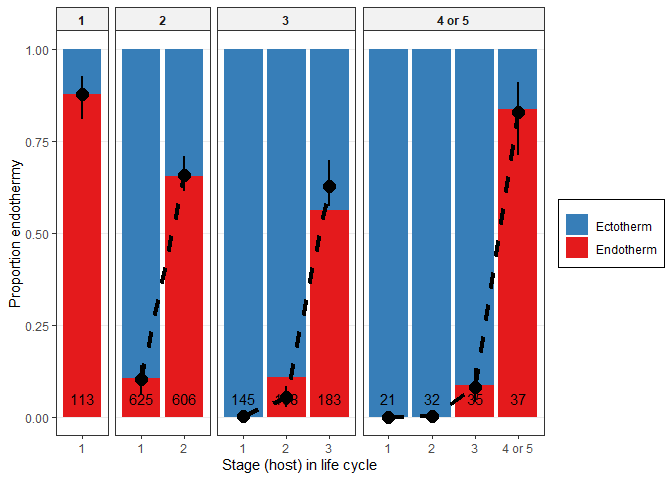

Kinds of hosts across life cycles
================

  - [Host body mass](#host-body-mass)
  - [Trophic level](#trophic-level)
  - [Endothermy](#endothermy)
  - [Summary](#summary)

Worm parasites have different life cycles - some infect more hosts in
succession, others fewer. Lengthening the life cycle (more consecutive
hosts) is costly because it increases the chances of not being
transmitted to the next host and it delays reproduction. Do long cycles
have other advantages? Do they take parasites into particular hosts?
Here we examine the host traits associated with different life stages in
complex life cycle helminths.

First, we import the data table made
[here](../make_stage_level_df_bestimputedvals.Rmd). It is at the level
of parasite stages and includes various host characteristics. It
includes imputed values for host mass and trophic level. An analysis of
unimputed values is [here](host_traits_across_clc.Rmd). We’ll look at
three host traits, starting with host mass.

## Host body mass

Bigger animals tend to occupy higher trophic levels, so we might expect
parasites to move into bigger hosts from one stage to the next. That is
the case.

<!-- -->

Let’s model this. We fit mixed models with host mass as the response and
parasite taxonomy as random effect. We add two fixed factors to the
model: (i) transmission step and (ii) the life cycle length. We expect
host size to increase with more steps in the cycle, but it might not
increase linearly, so we tested whether a non-linear increase was better
than a linear one. Moreover, the change in host mass with each
transmission step might depend on life cycle length, so we tested the
interaction between steps and life cycle length.

We fit the models with `MCMCglmm` as this allowed easy combination of
analyses of multiple imputed datasets. We created [100 imputed
datasets](../make_stage_level_df_randimputedvals.Rmd). We loop through
these, fit the model, sample the distribution for a few iterations, then
refit the model with the next imputed dataset. The chains are then
combined to give results that reflect the uncertainty due to missingness
in host traits.

Here is the number of stages and species in the model.

| n\_stages | n\_spp |
| --------: | -----: |
|      1963 |    967 |

    ## [1] "iteration 1 finished"
    ## [1] "iteration 2 finished"
    ## [1] "iteration 3 finished"
    ## [1] "iteration 4 finished"
    ## [1] "iteration 5 finished"
    ## [1] "iteration 6 finished"
    ## [1] "iteration 7 finished"
    ## [1] "iteration 8 finished"
    ## [1] "iteration 9 finished"
    ## [1] "iteration 10 finished"
    ## [1] "iteration 11 finished"
    ## [1] "iteration 12 finished"
    ## [1] "iteration 13 finished"
    ## [1] "iteration 14 finished"
    ## [1] "iteration 15 finished"
    ## [1] "iteration 16 finished"
    ## [1] "iteration 17 finished"
    ## [1] "iteration 18 finished"
    ## [1] "iteration 19 finished"
    ## [1] "iteration 20 finished"
    ## [1] "iteration 21 finished"
    ## [1] "iteration 22 finished"
    ## [1] "iteration 23 finished"
    ## [1] "iteration 24 finished"
    ## [1] "iteration 25 finished"
    ## [1] "iteration 26 finished"
    ## [1] "iteration 27 finished"
    ## [1] "iteration 28 finished"
    ## [1] "iteration 29 finished"
    ## [1] "iteration 30 finished"
    ## [1] "iteration 31 finished"
    ## [1] "iteration 32 finished"
    ## [1] "iteration 33 finished"
    ## [1] "iteration 34 finished"
    ## [1] "iteration 35 finished"
    ## [1] "iteration 36 finished"
    ## [1] "iteration 37 finished"
    ## [1] "iteration 38 finished"
    ## [1] "iteration 39 finished"
    ## [1] "iteration 40 finished"
    ## [1] "iteration 41 finished"
    ## [1] "iteration 42 finished"
    ## [1] "iteration 43 finished"
    ## [1] "iteration 44 finished"
    ## [1] "iteration 45 finished"
    ## [1] "iteration 46 finished"
    ## [1] "iteration 47 finished"
    ## [1] "iteration 48 finished"
    ## [1] "iteration 49 finished"
    ## [1] "iteration 50 finished"
    ## [1] "iteration 51 finished"
    ## [1] "iteration 52 finished"
    ## [1] "iteration 53 finished"
    ## [1] "iteration 54 finished"
    ## [1] "iteration 55 finished"
    ## [1] "iteration 56 finished"
    ## [1] "iteration 57 finished"
    ## [1] "iteration 58 finished"
    ## [1] "iteration 59 finished"
    ## [1] "iteration 60 finished"
    ## [1] "iteration 61 finished"
    ## [1] "iteration 62 finished"
    ## [1] "iteration 63 finished"
    ## [1] "iteration 64 finished"
    ## [1] "iteration 65 finished"
    ## [1] "iteration 66 finished"
    ## [1] "iteration 67 finished"
    ## [1] "iteration 68 finished"
    ## [1] "iteration 69 finished"
    ## [1] "iteration 70 finished"
    ## [1] "iteration 71 finished"
    ## [1] "iteration 72 finished"
    ## [1] "iteration 73 finished"
    ## [1] "iteration 74 finished"
    ## [1] "iteration 75 finished"
    ## [1] "iteration 76 finished"
    ## [1] "iteration 77 finished"
    ## [1] "iteration 78 finished"
    ## [1] "iteration 79 finished"
    ## [1] "iteration 80 finished"
    ## [1] "iteration 81 finished"
    ## [1] "iteration 82 finished"
    ## [1] "iteration 83 finished"
    ## [1] "iteration 84 finished"
    ## [1] "iteration 85 finished"
    ## [1] "iteration 86 finished"
    ## [1] "iteration 87 finished"
    ## [1] "iteration 88 finished"
    ## [1] "iteration 89 finished"
    ## [1] "iteration 90 finished"
    ## [1] "iteration 91 finished"
    ## [1] "iteration 92 finished"
    ## [1] "iteration 93 finished"
    ## [1] "iteration 94 finished"
    ## [1] "iteration 95 finished"
    ## [1] "iteration 96 finished"
    ## [1] "iteration 97 finished"
    ## [1] "iteration 98 finished"
    ## [1] "iteration 99 finished"
    ## [1] "iteration 100 finished"

We’ll start by comparing model fits. Here is the trace for deviance
(like the model likelihood). Adding host number as a continuous (red) or
factor (green) is a big improvement over intercept-only model (black).
Adding life cycle length (blue) also is an improvement, but the
interaction between life cycle length and host number is not that
important.

<!-- -->

Here are the DIC values for the models.

    ## DIC, int-only: 9441.148

    ## DIC, host number (cont); 7353.846

    ## DIC, host number (cat); 6809.962

    ## DIC, life cycle length (cat); 6534.806

    ## DIC, host number x life cycle length interaction; 6525.501

The comparison of DIC values suggests the host number addition is a big
improvement.

    ## Delta DIC, int-only vs host number (categorical): 2631.186 (higher is better)

The addition of life cycle length as a categorical variable is then a
further improvement.

    ## Delta DIC, host number (categorical) vs +life cycle length (categorical): 275.1561 (higher is better)

The addition of the host number by life cycle length interaction is only
a slight improvement.

    ## Delta DIC, main effects vs +host number x life cycle length interaction: 9.304923 (higher is better)

This plot demonstrates the main effects. Overall, hosts are larger the
more steps in the life cycles. But after the same number of steps, worms
with shorter life cycles tend to be in bigger hosts. This is
particularly clear for the first host stage.

<!-- -->

Now we can combine the chains for the fixed parameters and variance
componenets.

Here are the model parameters and credible intervals for the host number
(cont) model…

| param       |        lwr |        fit |        upr | sig |
| :---------- | ---------: | ---------: | ---------: | :-- |
| (Intercept) | \-6.326187 | \-4.355621 | \-2.317678 | sig |
| Host.no     |   3.047105 |   3.164169 |   3.273706 | sig |

…the model treating host number as a category…

| param          |        lwr |        fit |       upr | sig |
| :------------- | ---------: | ---------: | --------: | :-- |
| (Intercept)    | \-4.336935 | \-1.512539 | 0.7110877 | ns  |
| Host\_no\_fac2 |   4.146136 |   4.298517 | 4.4430639 | sig |
| Host\_no\_fac3 |   5.501207 |   5.756592 | 5.9951056 | sig |
| Host\_no\_fac4 |   6.421088 |   6.909650 | 7.4287598 | sig |

…the model adding life cycle length…

| param           |        lwr |        fit |        upr | sig |
| :-------------- | ---------: | ---------: | ---------: | :-- |
| (Intercept)     |   1.554492 |   2.325614 |   2.985187 | sig |
| Host\_no\_fac2  |   4.267973 |   4.408626 |   4.554828 | sig |
| Host\_no\_fac3  |   6.053742 |   6.303640 |   6.551935 | sig |
| Host\_no\_fac4  |   6.743597 |   7.299848 |   7.817700 | sig |
| lcl\_max\_fac2  | \-4.483612 | \-3.989777 | \-3.498561 | sig |
| lcl\_max\_fac3  | \-5.761737 | \-5.254996 | \-4.741764 | sig |
| lcl\_max\_fac3+ | \-6.175068 | \-5.525577 | \-4.932713 | sig |

…and the most complex model with all stages.

| param             |         lwr |         fit |         upr | sig |
| :---------------- | ----------: | ----------: | ----------: | :-- |
| (Intercept)       |   1.5927283 |   2.3209584 |   2.9383641 | sig |
| stage\_lcllc2\_1  | \-4.4575116 | \-3.9592496 | \-3.4910146 | sig |
| stage\_lcllc2\_2  | \-0.0632448 |   0.4082591 |   0.9094421 | ns  |
| stage\_lcllc3\_1  | \-5.7496890 | \-5.2132498 | \-4.6954007 | sig |
| stage\_lcllc3\_2  | \-1.3928189 | \-0.8858694 | \-0.3454486 | sig |
| stage\_lcllc3\_3  |   0.5970533 |   1.0981616 |   1.6004312 | sig |
| stage\_lcllc3+\_1 | \-6.9940391 | \-6.1993746 | \-5.4126682 | sig |
| stage\_lcllc3+\_2 | \-1.2423331 | \-0.5328780 |   0.2167413 | ns  |
| stage\_lcllc3+\_3 | \-0.0477300 |   0.6584160 |   1.3343781 | ns  |
| stage\_lcllc3+\_4 |   1.0693948 |   1.7852123 |   2.5287134 | sig |

Here is a comparison of where life cycles start, first host mass…

| lcl | first\_host\_mass\_avg | untransformed\_mass | ord\_mag\_change | fold\_change | perc\_decrease |
| --: | ---------------------: | ------------------: | ---------------: | -----------: | -------------: |
|   1 |               2.320958 |         209.3911745 |               NA |           NA |             NA |
|   2 |             \-1.638291 |           0.0229990 |      \-3.9592496 |  9104.364046 |       99.98902 |
|   3 |             \-2.892291 |           0.0012815 |      \-1.2540002 |    17.947345 |       94.42815 |
|   4 |             \-3.878416 |           0.0001323 |      \-0.9861248 |     9.685561 |       89.67535 |

And here is a comparison of where they end (final host mass):

| lcl | final\_host\_mass\_avg | untransformed\_mass | ord\_mag\_change | fold\_change | perc\_increase |
| --: | ---------------------: | ------------------: | ---------------: | -----------: | -------------: |
|   1 |               2.320958 |            209.3912 |               NA |           NA |             NA |
|   2 |               2.729217 |            536.0650 |        0.4082591 |     2.560112 |       156.0113 |
|   3 |               3.419120 |           2624.9439 |        0.6899026 |     4.896690 |       389.6690 |
|   4 |               4.106171 |          12769.4040 |        0.6870506 |     4.864639 |       386.4639 |

The decrease in first host mass with life cycle length is larger than
the increase in final host mass.

Here’s the R2 table for the host mass models. Life cycle step
and life cycle length account for over 60% of the variation in host
mass. Taxonomy still has an effect too - related parasites infect bigger
or smaller hosts than expected given their life cycle.

| model                 | r2m                   | r2c                   |
| :-------------------- | :-------------------- | :-------------------- |
| int-only and taxonomy | 0 \[0-0\]             | 0.176 \[0.11-0.521\]  |
| steps in cycle, cont  | 0.461 \[0.167-0.53\]  | 0.818 \[0.787-0.933\] |
| steps, categorical    | 0.47 \[0.119-0.549\]  | 0.863 \[0.836-0.968\] |
| life cycle length     | 0.667 \[0.573-0.7\]   | 0.817 \[0.799-0.844\] |
| step x lcl            | 0.665 \[0.551-0.699\] | 0.819 \[0.799-0.849\] |

Let’s look at how the taxonomic effect breaks down. Once we account for
stage effects, we see that parasite families and orders tend to infect
consistently bigger (or smaller) hosts.

<!-- -->

But our main interest in life stages, so let’s put the model predictions
onto the boxplot of the observed data. The taxonomic effect is visible
for one-host parasites - since they are related, their expected mean
‘shrinks’ towards the overall mean.

<!-- -->

So with each step in the life cycle parasites reach larger hosts, but in
longer life cycles worms start in smaller hosts. Consequently, they do
not reach substantially larger final hosts than parasites with shorter
cycles.

## Trophic level

The next host trait we examined is trophic level. In a previous
[study](https://royalsocietypublishing.org/doi/full/10.1098/rspb.2014.1462),
we showed that long life cycles bring nematodes into high trophic level
predators. Let’s examine this in two other helminth groups, acanths and
cestodes. And, let’s examine whether certain life cycles are associated
with bigger or smaller trophic steps.

As expected, host trophic level increases with life cycle progression.

<!-- -->

We fit the same models to host trophic level that we did for mass.
Again, we loop over the imputed datasets.

Here is the number of stages and species in the model.

| n\_stages | n\_spp |
| --------: | -----: |
|      1963 |    967 |

    ## [1] "iteration 1 finished"
    ## [1] "iteration 2 finished"
    ## [1] "iteration 3 finished"
    ## [1] "iteration 4 finished"
    ## [1] "iteration 5 finished"
    ## [1] "iteration 6 finished"
    ## [1] "iteration 7 finished"
    ## [1] "iteration 8 finished"
    ## [1] "iteration 9 finished"
    ## [1] "iteration 10 finished"
    ## [1] "iteration 11 finished"
    ## [1] "iteration 12 finished"
    ## [1] "iteration 13 finished"
    ## [1] "iteration 14 finished"
    ## [1] "iteration 15 finished"
    ## [1] "iteration 16 finished"
    ## [1] "iteration 17 finished"
    ## [1] "iteration 18 finished"
    ## [1] "iteration 19 finished"
    ## [1] "iteration 20 finished"
    ## [1] "iteration 21 finished"
    ## [1] "iteration 22 finished"
    ## [1] "iteration 23 finished"
    ## [1] "iteration 24 finished"
    ## [1] "iteration 25 finished"
    ## [1] "iteration 26 finished"
    ## [1] "iteration 27 finished"
    ## [1] "iteration 28 finished"
    ## [1] "iteration 29 finished"
    ## [1] "iteration 30 finished"
    ## [1] "iteration 31 finished"
    ## [1] "iteration 32 finished"
    ## [1] "iteration 33 finished"
    ## [1] "iteration 34 finished"
    ## [1] "iteration 35 finished"
    ## [1] "iteration 36 finished"
    ## [1] "iteration 37 finished"
    ## [1] "iteration 38 finished"
    ## [1] "iteration 39 finished"
    ## [1] "iteration 40 finished"
    ## [1] "iteration 41 finished"
    ## [1] "iteration 42 finished"
    ## [1] "iteration 43 finished"
    ## [1] "iteration 44 finished"
    ## [1] "iteration 45 finished"
    ## [1] "iteration 46 finished"
    ## [1] "iteration 47 finished"
    ## [1] "iteration 48 finished"
    ## [1] "iteration 49 finished"
    ## [1] "iteration 50 finished"
    ## [1] "iteration 51 finished"
    ## [1] "iteration 52 finished"
    ## [1] "iteration 53 finished"
    ## [1] "iteration 54 finished"
    ## [1] "iteration 55 finished"
    ## [1] "iteration 56 finished"
    ## [1] "iteration 57 finished"
    ## [1] "iteration 58 finished"
    ## [1] "iteration 59 finished"
    ## [1] "iteration 60 finished"
    ## [1] "iteration 61 finished"
    ## [1] "iteration 62 finished"
    ## [1] "iteration 63 finished"
    ## [1] "iteration 64 finished"
    ## [1] "iteration 65 finished"
    ## [1] "iteration 66 finished"
    ## [1] "iteration 67 finished"
    ## [1] "iteration 68 finished"
    ## [1] "iteration 69 finished"
    ## [1] "iteration 70 finished"
    ## [1] "iteration 71 finished"
    ## [1] "iteration 72 finished"
    ## [1] "iteration 73 finished"
    ## [1] "iteration 74 finished"
    ## [1] "iteration 75 finished"
    ## [1] "iteration 76 finished"
    ## [1] "iteration 77 finished"
    ## [1] "iteration 78 finished"
    ## [1] "iteration 79 finished"
    ## [1] "iteration 80 finished"
    ## [1] "iteration 81 finished"
    ## [1] "iteration 82 finished"
    ## [1] "iteration 83 finished"
    ## [1] "iteration 84 finished"
    ## [1] "iteration 85 finished"
    ## [1] "iteration 86 finished"
    ## [1] "iteration 87 finished"
    ## [1] "iteration 88 finished"
    ## [1] "iteration 89 finished"
    ## [1] "iteration 90 finished"
    ## [1] "iteration 91 finished"
    ## [1] "iteration 92 finished"
    ## [1] "iteration 93 finished"
    ## [1] "iteration 94 finished"
    ## [1] "iteration 95 finished"
    ## [1] "iteration 96 finished"
    ## [1] "iteration 97 finished"
    ## [1] "iteration 98 finished"
    ## [1] "iteration 99 finished"
    ## [1] "iteration 100 finished"

Let’s look at overall model fits. Here is the trace for deviance (like
the model likelihood). Adding host number as a continuous (red) or
factor (green) is a big improvement over intercept-only model (black).
Adding life cycle length is not a clear improvement (blue).

<!-- -->

Here are the DIC values for the models.

    ## DIC, int-only: 2960.71

    ## DIC, host number (cont); 2172.104

    ## DIC, host number (cat); 2078.442

    ## DIC, life cycle length (cat); 2062.237

    ## DIC, host number x life cycle length interaction; 2064.472

The comparison of DIC values suggests the adding transmission step is a
big improvement.

    ## Delta DIC, int-only vs host number (categorical): 882.2686 (higher is better)

The addition of life cycle length is not much of a further improvement…

    ## Delta DIC, host number (categorical) vs +life cycle length (categorical): 16.20464 (higher is better)

…nor is the addition of the host number by life cycle length
interaction.

    ## Delta DIC, main effects vs +host number x life cycle length interaction: -2.235137 (higher is better)

Now we can combine the chains for the fixed parameters and variance
componenets.

Here are the model parameters and credible intervals for the host number
(cont) model…

| param       |       lwr |       fit |      upr | sig |
| :---------- | --------: | --------: | -------: | :-- |
| (Intercept) | 1.7287153 | 2.0437646 | 2.292089 | sig |
| Host.no     | 0.3982869 | 0.4276757 | 0.458040 | sig |

…the model treating host number as a category…

| param          |       lwr |       fit |       upr | sig |
| :------------- | --------: | --------: | --------: | :-- |
| (Intercept)    | 2.1128872 | 2.4330179 | 2.7156532 | sig |
| Host\_no\_fac2 | 0.4821468 | 0.5247881 | 0.5683464 | sig |
| Host\_no\_fac3 | 0.8183149 | 0.8865384 | 0.9497714 | sig |
| Host\_no\_fac4 | 0.6002513 | 0.7478378 | 0.8976308 | sig |

…the model adding life cycle length…

| param           |         lwr |         fit |       upr | sig |
| :-------------- | ----------: | ----------: | --------: | :-- |
| (Intercept)     |   2.0900396 |   2.4321723 | 2.7663033 | sig |
| Host\_no\_fac2  |   0.4855820 |   0.5255914 | 0.5658662 | sig |
| Host\_no\_fac3  |   0.8492371 |   0.9255512 | 0.9988142 | sig |
| Host\_no\_fac4  |   0.5427436 |   0.7056545 | 0.8532890 | sig |
| lcl\_max\_fac2  | \-0.1109689 |   0.0312634 | 0.1808421 | ns  |
| lcl\_max\_fac3  | \-0.2286949 | \-0.0758174 | 0.0895413 | ns  |
| lcl\_max\_fac3+ | \-0.0859241 |   0.1041465 | 0.3203221 | ns  |

…and the most complex model with all stages.

| param             |         lwr |         fit |       upr | sig |
| :---------------- | ----------: | ----------: | --------: | :-- |
| (Intercept)       |   2.1385915 |   2.4371691 | 2.7905135 | sig |
| stage\_lcllc2\_1  | \-0.1311855 |   0.0232911 | 0.1743420 | ns  |
| stage\_lcllc2\_2  |   0.4110090 |   0.5653461 | 0.7189831 | sig |
| stage\_lcllc3\_1  | \-0.1891985 | \-0.0330739 | 0.1417960 | ns  |
| stage\_lcllc3\_2  |   0.2459862 |   0.4103434 | 0.5753642 | sig |
| stage\_lcllc3\_3  |   0.6825887 |   0.8489789 | 1.0063727 | sig |
| stage\_lcllc3+\_1 | \-0.2067336 |   0.0451330 | 0.3089884 | ns  |
| stage\_lcllc3+\_2 |   0.4305624 |   0.6601235 | 0.8866008 | sig |
| stage\_lcllc3+\_3 |   0.8099307 |   1.0313975 | 1.2583628 | sig |
| stage\_lcllc3+\_4 |   0.5741445 |   0.8073046 | 1.0386874 | sig |

Here is a comparison of whether worms start in trophic web (first
hosts):

| lcl | first\_host\_tl |  tl\_change | perc\_change |
| --: | --------------: | ----------: | -----------: |
|   1 |        2.437169 |          NA |           NA |
|   2 |        2.460460 |   0.0232911 |    0.9556623 |
|   3 |        2.404095 | \-0.0563650 |  \-2.2908326 |
|   4 |        2.482302 |   0.0782070 |    3.2530727 |

And here is a comparison of where they end (final host trophic level):

| lcl | final\_host\_tl |  tl\_change | perc\_change |
| --: | --------------: | ----------: | -----------: |
|   1 |        2.437169 |          NA |           NA |
|   2 |        3.002515 |   0.5653461 |    23.196836 |
|   3 |        3.286148 |   0.2836327 |     9.446504 |
|   4 |        3.244474 | \-0.0416743 |   \-1.268180 |

Here’s the R2 table for the host TL models. Step in the life
cycle accounts for \~26% of the variation, while life cycle length
hardly accounts for anything. Taxonomy has a large effect - related
parasites infect hosts at similar trophic levels more than expected,
given their stage.

| model                 | r2m                   | r2c                   |
| :-------------------- | :-------------------- | :-------------------- |
| int-only and taxonomy | 0 \[0-0\]             | 0.448 \[0.338-0.832\] |
| steps in cycle, cont  | 0.266 \[0.122-0.313\] | 0.574 \[0.52-0.798\]  |
| steps, categorical    | 0.27 \[0.12-0.318\]   | 0.596 \[0.538-0.818\] |
| life cycle length     | 0.27 \[0.09-0.325\]   | 0.605 \[0.544-0.887\] |
| step x lcl            | 0.273 \[0.108-0.327\] | 0.602 \[0.545-0.847\] |

Let’s look at how the taxonomic effect breaks down. Once we account for
stage effects, we see that parasite genera and families tend to infect
consistently higher (or lower) trophic level hosts.

<!-- -->

Now, let’s put the model predictions onto the boxplot. The taxonomic
effect is visible for one-host parasites - since they are related, their
expected mean ‘shrinks’ towards the overall mean.

<!-- -->

The dip in host trophic level for worms with long life cycles is a
little surprising. When we look up the parasites combining late stages
with low-level hosts, we see some parasites infecting humans (*D.
latum*), pigs (*G. hispidum*), and racoons (*G. procyonis*) - all
omnivores.

| Parasite.species              | Stage | Host.no | host\_tl |
| :---------------------------- | :---- | ------: | -------: |
| Diphyllobothrium latum        | adult |       4 |    2.800 |
| Diphyllobothrium nihonkaiense | adult |       4 |    2.175 |
| Gnathostoma doloresi          | adult |       4 |    2.250 |
| Gnathostoma hispidum          | adult |       4 |    2.250 |
| Gnathostoma lamothei          | adult |       4 |    2.700 |
| Gnathostoma procyonis         | adult |       4 |    2.700 |

Even with a taxonomic effect, the pattern is consistent across helminth
groups.

<!-- -->

Therefore, let’s also explicitly examine the trophic vacuum hypothesis
in cestodes and acanths. Specifically, does life cycle length increase
with final host trophic level? It looks like it, though the pattern is
clearer for nematodes.

<!-- -->

Here is a test of that relationship for just cestodes (Poisson GLMM -
lcl as count). It is marginally significant.

|      | npar |      AIC |      BIC |     logLik | deviance |    Chisq | Df | Pr(\>Chisq) |
| :--- | ---: | -------: | -------: | ---------: | -------: | -------: | -: | ----------: |
| mod0 |    5 | 1006.455 | 1025.815 | \-498.2273 | 996.4545 |       NA | NA |          NA |
| mod1 |    6 | 1003.859 | 1027.092 | \-495.9295 | 991.8590 | 4.595535 |  1 |   0.0320553 |

The model estimated cestode life cycle length to increase by 0.14 hosts
for each unit increase in final host trophic level.

Here is a test of the trophic vacuum for just acanths (Poisson GLMM -
lcl as count). It is not significant.

|      | npar |      AIC |      BIC |     logLik | deviance |    Chisq | Df | Pr(\>Chisq) |
| :--- | ---: | -------: | -------: | ---------: | -------: | -------: | -: | ----------: |
| mod0 |    6 | 284.3758 | 299.8240 | \-136.1879 | 272.3758 |       NA | NA |          NA |
| mod1 |    7 | 284.8941 | 302.9171 | \-135.4471 | 270.8941 | 1.481649 |  1 |   0.2235167 |

But the effect size is similar to cestodes. The model estimated acanth
life cycle length to increase by 0.19 hosts for each unit increase in
final host trophic level.

Here’s the proper test using the full dataset.

|      | npar |      AIC |      BIC |     logLik | deviance |    Chisq | Df | Pr(\>Chisq) |
| :--- | ---: | -------: | -------: | ---------: | -------: | -------: | -: | ----------: |
| mod0 |    7 | 2660.655 | 2694.554 | \-1323.328 | 2646.655 |       NA | NA |          NA |
| mod1 |    8 | 2632.590 | 2671.332 | \-1308.295 | 2616.590 | 30.06505 |  1 |           0 |

It is significant, but as concluded in our trophic vacuum paper, the
relationship is weak. With each host trophic level, life cycle length
increases by 0.23 hosts on average (lower but not not too far from the
estimate in the TV paper, 0.35). A more detailed analysis of the trophic
vacuum can be found
[here](../transmission_pp_ratio/trophic_vacuum_imp.html).

So additional life steps take parasites to higher TL hosts, and this
increase is similar for parasites with different life cycle lengths.

## Endothermy

Endotherms have higher metabolism than ectotherms, so they need more
energy. In which stages are worms likely to encounter endotherms? They
are more common in latter life stages.

<!-- -->

Here’s the same plot, but expressed as a proportion. Endotherms are
surprisingly common for simple cycle worms.

<!-- -->

We fit the same models as for host mass and trophic level, with the
exception that they are now GLMMs with binomial errors, i.e. we are
modelling the probability of infecting endotherms at different life
stages. I first fit `lmer` models using the ‘best’ imputed data set,
because this demonstrates a problem with the model fitting.

Endothermy depends on transmission step, and life cycle length, but not
their interaction.

|      | npar |       AIC |       BIC |     logLik |  deviance |       Chisq | Df | Pr(\>Chisq) |
| :--- | ---: | --------: | --------: | ---------: | --------: | ----------: | -: | ----------: |
| mod0 |    7 | 1926.8561 | 1965.9317 | \-956.4281 | 1912.8561 |          NA | NA |          NA |
| mod1 |    8 |  972.6934 | 1017.3512 | \-478.3467 |  956.6934 | 956.1627628 |  1 |   0.0000000 |
| mod2 |   10 |  923.2390 |  979.0612 | \-451.6195 |  903.2390 |  53.4544172 |  2 |   0.0000000 |
| mod3 |   13 |  639.0430 |  711.6119 | \-306.5215 |  613.0430 | 290.1960038 |  3 |   0.0000000 |
| mod4 |   16 |  644.2248 |  733.5405 | \-306.1124 |  612.2248 |   0.8181557 |  3 |   0.8451197 |

Specifically, endothermy increases with each step in the cycle, and this
increase is rather linear. Moreover, the probability to infect
endotherms is lower for longer life cycles. For example, in a two-host
cycle the second host is usually an endotherm, while in a three-host
cycle the second host is usually an ectotherm.

I want to overlay the model predictions on the plot like for the
previous host traits, but when we look at the model parameters, we see
some huge values. This is due to complete separation; some groups only
infect ectotherms (i.e. first host of three-host cycles) or endotherms
(last host of five-host cycles).

    ## Generalized linear mixed model fit by maximum likelihood (Laplace
    ##   Approximation) [glmerMod]
    ##  Family: binomial  ( logit )
    ## Formula: factor(endo_ecto) ~ (1 | Parasite.species) + (1 | parasite_genus) +  
    ##     (1 | parasite_family) + (1 | parasite_order) + (1 | parasite_class) +  
    ##     (1 | parasite_phylum) + stage_lcl
    ##    Data: filter(dxy, !is.na(endo_ecto))
    ## 
    ##      AIC      BIC   logLik deviance df.resid 
    ##    644.2    733.5   -306.1    612.2     1947 
    ## 
    ## Scaled residuals: 
    ##     Min      1Q  Median      3Q     Max 
    ##  -1.859  -0.056  -0.001   0.072 209.335 
    ## 
    ## Random effects:
    ##  Groups           Name        Variance  Std.Dev.
    ##  Parasite.species (Intercept)  0.003910 0.06253 
    ##  parasite_genus   (Intercept)  2.656739 1.62995 
    ##  parasite_family  (Intercept) 23.109277 4.80721 
    ##  parasite_order   (Intercept) 35.234441 5.93586 
    ##  parasite_class   (Intercept) 22.860641 4.78128 
    ##  parasite_phylum  (Intercept)  0.000167 0.01292 
    ## Number of obs: 1963, groups:  
    ## Parasite.species, 967; parasite_genus, 404; parasite_family, 123; parasite_order, 32; parasite_class, 6; parasite_phylum, 3
    ## 
    ## Fixed effects:
    ##                 Estimate Std. Error z value Pr(>|z|)    
    ## (Intercept)      -2.3781     3.1874  -0.746   0.4556    
    ## stage_lcllc2_1   -9.9725     1.4803  -6.737 1.62e-11 ***
    ## stage_lcllc2_2    0.5136     1.2595   0.408   0.6834    
    ## stage_lcllc3_1  -15.6592     7.8572  -1.993   0.0463 *  
    ## stage_lcllc3_2   -6.6604     1.4357  -4.639 3.50e-06 ***
    ## stage_lcllc3_3    0.3956     1.3416   0.295   0.7681    
    ## stage_lcllc3+_1 -87.2361   114.5141  -0.762   0.4462    
    ## stage_lcllc3+_2  -9.4240     8.0903  -1.165   0.2441    
    ## stage_lcllc3+_3  -3.8390     1.7019  -2.256   0.0241 *  
    ## stage_lcllc3+_4   2.9747     1.7461   1.704   0.0885 .  
    ## ---
    ## Signif. codes:  0 '***' 0.001 '**' 0.01 '*' 0.05 '.' 0.1 ' ' 1
    ## 
    ## Correlation of Fixed Effects:
    ##             (Intr) st_2_1 st_2_2 st_3_1 st_3_2 st_3_3 s_3+_1 s_3+_2 s_3+_3
    ## stg_lcll2_1 -0.214                                                        
    ## stg_lcll2_2 -0.319  0.783                                                 
    ## stg_lcll3_1 -0.039  0.175  0.142                                          
    ## stg_lcll3_2 -0.242  0.881  0.826  0.179                                   
    ## stg_lcll3_3 -0.301  0.773  0.904  0.146  0.836                            
    ## stg_lcl3+_1  0.001  0.000 -0.007  0.002 -0.004 -0.006                     
    ## stg_lcl3+_2 -0.045  0.143  0.144  0.024  0.151  0.155 -0.002              
    ## stg_lcl3+_3 -0.223  0.697  0.712  0.136  0.737  0.766 -0.001  0.175       
    ## stg_lcl3+_4 -0.246  0.553  0.692  0.102  0.607  0.723 -0.008  0.135  0.682
    ## convergence code: 0
    ## Model failed to converge with max|grad| = 0.273867 (tol = 0.002, component 1)

There are also huge values for the random effects, suggesting the issue
of complete separation also applies to taxa (and that they explain
**all** the residual variation). For instance, the variance component
for parasite order is huge. Therefore, for every combination of parasite
order and life stage, let’s look at the proportion of endothermic hosts.
The histogram shows that, at a given life stage, parasites from the same
order usually infect either endotherms or ectotherms, but not both
(i.e. complete separation).

<!-- -->

Because of complete separation, particularly among parasite taxa, the
more complex models explain essentially all the variation in endothermy.
Here are the R2 values for the models.

    ##             R2m       R2c
    ## theoretical   0 0.7737960
    ## delta         0 0.7351815

    ##                   R2m       R2c
    ## theoretical 0.1484802 0.9772766
    ## delta       0.1477009 0.9721472

    ##                   R2m       R2c
    ## theoretical 0.1563506 0.9762222
    ## delta       0.1554921 0.9708619

    ##                   R2m       R2c
    ## theoretical 0.3533867 0.9679391
    ## delta       0.3507753 0.9607866

    ##                   R2m       R2c
    ## theoretical 0.5423625 0.9827254
    ## delta       0.5401957 0.9787994

The big jump in marginal R2 for the last case, adding host number x life
cycle length interaction, is because it causes additional complete
separation, resulting in parameter estimates exploding, and thus very
high R2 values.

One way to avoid complete separation, at least in the fixed effects, is
to re-fit the models with continuous instead of categorical variables.
This acknowledges that endothermy scales linearly with the predictors.
We’ll also only include parasite class and phylum as random effects,
because below those levels, complete separation is the rule rather than
the exception. Now, the R2 values seem more realistic. Life
cycle length has the biggest effect.

    ##             R2m       R2c
    ## theoretical   0 0.2561068
    ## delta         0 0.1980271

    ##                    R2m       R2c
    ## theoretical 0.10104450 0.3703315
    ## delta       0.08094849 0.2966789

    ##                   R2m       R2c
    ## theoretical 0.4508410 0.6723733
    ## delta       0.3992669 0.5954569

    ##                  R2m       R2c
    ## theoretical 0.510147 0.6975351
    ## delta       0.455793 0.6232157

So these models seem acceptable. Let’s fit them with the 100 imputed
datasets.

Here is the number of stages and species in the model.

| n\_stages | n\_spp |
| --------: | -----: |
|      1965 |    967 |

    ## [1] "iteration 1 finished"
    ## [1] "iteration 2 finished"
    ## [1] "iteration 3 finished"
    ## [1] "iteration 4 finished"
    ## [1] "iteration 5 finished"
    ## [1] "iteration 6 finished"
    ## [1] "iteration 7 finished"
    ## [1] "iteration 8 finished"
    ## [1] "iteration 9 finished"
    ## [1] "iteration 10 finished"
    ## [1] "iteration 11 finished"
    ## [1] "iteration 12 finished"
    ## [1] "iteration 13 finished"
    ## [1] "iteration 14 finished"
    ## [1] "iteration 15 finished"
    ## [1] "iteration 16 finished"
    ## [1] "iteration 17 finished"
    ## [1] "iteration 18 finished"
    ## [1] "iteration 19 finished"
    ## [1] "iteration 20 finished"
    ## [1] "iteration 21 finished"
    ## [1] "iteration 22 finished"
    ## [1] "iteration 23 finished"
    ## [1] "iteration 24 finished"
    ## [1] "iteration 25 finished"
    ## [1] "iteration 26 finished"
    ## [1] "iteration 27 finished"
    ## [1] "iteration 28 finished"
    ## [1] "iteration 29 finished"
    ## [1] "iteration 30 finished"
    ## [1] "iteration 31 finished"
    ## [1] "iteration 32 finished"
    ## [1] "iteration 33 finished"
    ## [1] "iteration 34 finished"
    ## [1] "iteration 35 finished"
    ## [1] "iteration 36 finished"
    ## [1] "iteration 37 finished"
    ## [1] "iteration 38 finished"
    ## [1] "iteration 39 finished"
    ## [1] "iteration 40 finished"
    ## [1] "iteration 41 finished"
    ## [1] "iteration 42 finished"
    ## [1] "iteration 43 finished"
    ## [1] "iteration 44 finished"
    ## [1] "iteration 45 finished"
    ## [1] "iteration 46 finished"
    ## [1] "iteration 47 finished"
    ## [1] "iteration 48 finished"
    ## [1] "iteration 49 finished"
    ## [1] "iteration 50 finished"
    ## [1] "iteration 51 finished"
    ## [1] "iteration 52 finished"
    ## [1] "iteration 53 finished"
    ## [1] "iteration 54 finished"
    ## [1] "iteration 55 finished"
    ## [1] "iteration 56 finished"
    ## [1] "iteration 57 finished"
    ## [1] "iteration 58 finished"
    ## [1] "iteration 59 finished"
    ## [1] "iteration 60 finished"
    ## [1] "iteration 61 finished"
    ## [1] "iteration 62 finished"
    ## [1] "iteration 63 finished"
    ## [1] "iteration 64 finished"
    ## [1] "iteration 65 finished"
    ## [1] "iteration 66 finished"
    ## [1] "iteration 67 finished"
    ## [1] "iteration 68 finished"
    ## [1] "iteration 69 finished"
    ## [1] "iteration 70 finished"
    ## [1] "iteration 71 finished"
    ## [1] "iteration 72 finished"
    ## [1] "iteration 73 finished"
    ## [1] "iteration 74 finished"
    ## [1] "iteration 75 finished"
    ## [1] "iteration 76 finished"
    ## [1] "iteration 77 finished"
    ## [1] "iteration 78 finished"
    ## [1] "iteration 79 finished"
    ## [1] "iteration 80 finished"
    ## [1] "iteration 81 finished"
    ## [1] "iteration 82 finished"
    ## [1] "iteration 83 finished"
    ## [1] "iteration 84 finished"
    ## [1] "iteration 85 finished"
    ## [1] "iteration 86 finished"
    ## [1] "iteration 87 finished"
    ## [1] "iteration 88 finished"
    ## [1] "iteration 89 finished"
    ## [1] "iteration 90 finished"
    ## [1] "iteration 91 finished"
    ## [1] "iteration 92 finished"
    ## [1] "iteration 93 finished"
    ## [1] "iteration 94 finished"
    ## [1] "iteration 95 finished"
    ## [1] "iteration 96 finished"
    ## [1] "iteration 97 finished"
    ## [1] "iteration 98 finished"
    ## [1] "iteration 99 finished"
    ## [1] "iteration 100 finished"

The comparison of deviances suggests that adding host number (red) is a
mild improvement while adding life cycle length is a clear improvement
(green). The host number by life cycle length does not clearly improve
the model (blue).

<!-- -->

Here are the DIC values for the models.

    ## DIC, int-only: 2524.608

    ## DIC, host number (cont); 2308.267

    ## DIC, life cycle length (cont); 1667.832

    ## DIC, host number x life cycle length interaction; 1646.514

The comparison of DIC values suggests the host number addition is a
clear improvement.

    ## Delta DIC, int-only vs host number (cont): 216.3405 (higher is better)

The addition of life cycle length as a continuous variable is a further
improvement.

    ## Delta DIC, host number (cont) vs +life cycle length (cont): 640.4348 (higher is better)

The addition of the host number by life cycle length interaction is only
a slight improvement.

    ## Delta DIC, main effects vs +host number x life cycle length interaction: 21.31844 (higher is better)

Now we can combine the chains for the fixed parameters and variance
componenets.

Here are the model parameters and credible intervals for the host number
(cont) model…

| param       |        lwr |        fit |        upr | sig |
| :---------- | ---------: | ---------: | ---------: | :-- |
| (Intercept) | \-6.514161 | \-3.293664 | \-1.126165 | sig |
| Host.no     |   1.011113 |   1.171949 |   1.344374 | sig |

…the model adding life cycle length…

| param       |        lwr |         fit |        upr | sig |
| :---------- | ---------: | ----------: | ---------: | :-- |
| (Intercept) | \-2.383402 |   0.9154383 |   4.163245 | ns  |
| Host.no     |   3.174529 |   3.4785900 |   3.788860 | sig |
| lcl\_max    | \-4.147543 | \-3.7610001 | \-3.367478 | sig |

…and the most complex model with all stages.

| param            |         lwr |         fit |         upr | sig |
| :--------------- | ----------: | ----------: | ----------: | :-- |
| (Intercept)      |   0.8560484 |   4.2637456 |   7.2283928 | sig |
| Host.no          |   1.3002492 |   1.9901159 |   2.6627384 | sig |
| Host.no:lcl\_max |   0.3606692 |   0.6221503 |   0.8959545 | sig |
| lcl\_max         | \-6.0472693 | \-5.2549202 | \-4.4801374 | sig |

Here’s the R2 table for the endothermy. The combination of
life cycle length and host number explains the variation in endothermy.
Even with only two taxonomic levels (class and phylum), there is still a
taxonomic effect, suggesting that classes or phyla are particular stages
infect endotherms or ectotherms.

| model                   | r2m                   | r2c                   |
| :---------------------- | :-------------------- | :-------------------- |
| int-only and taxonomy   | 0 \[0-0\]             | 0.401 \[0.096-0.887\] |
| steps in cycle, cont    | 0.085 \[0.013-0.145\] | 0.523 \[0.251-0.929\] |
| life cycle length, cont | 0.377 \[0.086-0.538\] | 0.747 \[0.632-0.941\] |
| step x lcl              | 0.448 \[0.141-0.605\] | 0.751 \[0.657-0.926\] |

Here are the model predictions overlaid on the boxplot. The means look
realistic, but we can still how separation might be inflating the CIs.

<!-- -->

The CI inflation is clear if we compare these model predictions to ones
without parasite taxonomy, i.e. a standard logistic regression. The CIs
are much smaller. They are probably overconfident.

<!-- -->

These analyses suggest that the probability of infecting an endotherm
increases with transmission steps and decreases with life cycle length.
Putting confidence intervals around the probability of infecting an
endotherm is difficult, because the random effect (taxonomy) explains
essentially all of the remaining variation. In other words, at a given
life stage, parasite taxa (such as families or orders) tend to infect
either ectotherms or endotherms, but not both. So, if we ignore taxonomy
(standard logistic regression), then the CIs are overconfident. But if
we include taxonomy (GLMM), then CIs are inflated, because the taxonomic
variance components cannot be estimated due to separation problems.
Therefore, I will leave CIs off of the figure.

## Summary

Each transmission step brings worms into hosts that are larger, at a
higher TL, and more likely an endotherm. But these patterns are not
identical in short vs long life cycles. In long life cycles, first hosts
are smaller, final hosts are at a higher trophic level, and it takes
more steps to reach an endotherm. I’ve tried to summarize these patterns
in the following figure.

<!-- -->

For long life cycles to be beneficial (or just to compensate for the
risk associated with extra transmission steps), we would expect
parasites to grow more/faster in larger hosts, higher trophic level
hosts, and endotherms.
