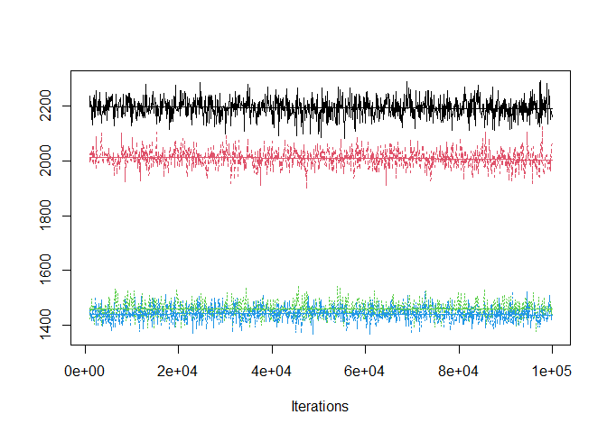

Kinds of hosts across life cycles
================

  - [Host body mass](#host-body-mass)
  - [Trophic level](#trophic-level)
  - [Endothermy](#endothermy)
  - [Summary](#summary)

Worm parasites have different life cycles - some infect more hosts in
succession, others fewer. Lengthening the life cycle (more consecutive
hosts) is costly because it increases the chances of not being
transmitted to the next host and it delays reproduction. Do long cycles
have other advantages? Do they take parasites into particular hosts?
Here we examine the host traits associated with different life stages in
complex life cycle helminths.

First, we import the data table created
[here](../make_stage_level_df.Rmd). It is at the level of parasite
stages and includes various host characteristics. We’ll start by looking
at host mass.

## Host body mass

Bigger animals tend to occupy higher trophic levels, so we might expect
parasites to move into bigger hosts from one stage to the next. That is
the case.

<!-- -->

Let’s model this. We fit mixed models with host body mass as the
response. We account for parasite taxonomy as random effects. We add two
fixed factors to the model: (i) transmission step and (ii) the life
cycle length. We expect host size to increase with more steps in the
cycle, but it might not increase linearly, so we tested whether a
non-linear increase was better than a linear one. Moreover, the change
in host mass with each transmission step might depend on life cycle
length, so we tested the interaction between steps and life cycle
length.

Here is the number of stages and species in the model.

| n\_stages | n\_spp |
| --------: | -----: |
|      1663 |    951 |

We’ll start by comparing model fits. Here is the trace for deviance
(like the model likelihood). Adding host number as a continuous (red) or
factor (green) is a big improvement over intercept-only model (black).
Adding life cycle length (blue) also is an improvement, but the
interaction between life cycle length and host number is not that
important.

<!-- -->

Here are the DIC values for the models.

    ## DIC, int-only: 7826.044

    ## DIC, host number (cont); 6205.105

    ## DIC, host number (cat); 5701.271

    ## DIC, life cycle length (cat); 5418.544

    ## DIC, host number x life cycle length interaction; 5401.64

The comparison of DIC values suggests the host number addition is a big
improvement.

    ## Delta DIC, int-only vs host number (categorical): 2124.773 (higher is better)

The addition of life cycle length as a categorical variable is then a
further improvement.

    ## Delta DIC, host number (categorical) vs +life cycle length (categorical): 282.7261 (higher is better)

The addition of the host number by life cycle length interaction is only
a slight improvement.

    ## Delta DIC, main effects vs +host number x life cycle length interaction: 16.90476 (higher is better)

The next plot demonstrates the main effects. Overall, hosts are larger
the more steps in the life cycles. But after the same number of steps,
worms with shorter life cycles tend to be in bigger hosts. This is
particularly clear for the first host stage.

<!-- -->

Here are the model parameters and credible intervals for the life cycle
lenth (cont) model…

| param       |        lwr |        fit |        upr | sig |
| :---------- | ---------: | ---------: | ---------: | :-- |
| (Intercept) | \-5.338103 | \-3.836931 | \-2.073487 | sig |
| Host.no     |   2.847347 |   2.963298 |   3.082275 | sig |

…the model treating life cycle length as a category…

| param          |        lwr |        fit |       upr | sig |
| :------------- | ---------: | ---------: | --------: | :-- |
| (Intercept)    | \-4.171555 | \-1.387533 | 0.6925751 | ns  |
| Host\_no\_fac2 |   4.105379 |   4.240812 | 4.3948278 | sig |
| Host\_no\_fac3 |   5.423050 |   5.641965 | 5.8768208 | sig |
| Host\_no\_fac4 |   6.271513 |   6.736207 | 7.2339636 | sig |

…the model adding life cycle length…

| param           |        lwr |        fit |        upr | sig |
| :-------------- | ---------: | ---------: | ---------: | :-- |
| (Intercept)     |   1.847591 |   2.503188 |   3.058606 | sig |
| Host\_no\_fac2  |   4.247037 |   4.375358 |   4.514348 | sig |
| Host\_no\_fac3  |   6.044013 |   6.267281 |   6.497705 | sig |
| Host\_no\_fac4  |   6.746381 |   7.217310 |   7.674116 | sig |
| lcl\_max\_fac2  | \-4.551736 | \-4.087456 | \-3.672930 | sig |
| lcl\_max\_fac3  | \-5.836524 | \-5.360679 | \-4.912090 | sig |
| lcl\_max\_fac3+ | \-6.213488 | \-5.585865 | \-4.997546 | sig |

…and the most complex model with all stages.

| param             |         lwr |         fit |         upr | sig |
| :---------------- | ----------: | ----------: | ----------: | :-- |
| (Intercept)       |   1.7815728 |   2.5244902 |   3.1616957 | sig |
| stage\_lcllc2\_1  | \-4.4430234 | \-4.0190871 | \-3.5486927 | sig |
| stage\_lcllc2\_2  | \-0.2018202 |   0.2238510 |   0.6809801 | ns  |
| stage\_lcllc3\_1  | \-6.0598655 | \-5.5687643 | \-5.0349110 | sig |
| stage\_lcllc3\_2  | \-1.3898344 | \-0.9178766 | \-0.4010562 | sig |
| stage\_lcllc3\_3  |   0.4577207 |   0.9476956 |   1.4497712 | sig |
| stage\_lcllc3+\_1 | \-7.1763832 | \-6.3249250 | \-5.5012123 | sig |
| stage\_lcllc3+\_2 | \-1.2797007 | \-0.5431105 |   0.1499965 | ns  |
| stage\_lcllc3+\_3 | \-0.1727958 |   0.5076643 |   1.1578988 | ns  |
| stage\_lcllc3+\_4 |   0.9354047 |   1.6539293 |   2.3315148 | sig |

Here’s the R2 table for the host mass models. Life cycle step
and life cycle length account for over 60% of the variation in host
mass. Taxonomy still has an effect too - related parasites infect bigger
or smaller hosts than expected given their life cycle.

| model                 | r2m                   | r2c                   |
| :-------------------- | :-------------------- | :-------------------- |
| int-only and taxonomy | 0 \[0-0\]             | 0.143 \[0.093-0.295\] |
| steps in cycle, cont  | 0.46 \[0.185-0.518\]  | 0.801 \[0.767-0.918\] |
| steps, categorical    | 0.472 \[0.128-0.544\] | 0.861 \[0.834-0.964\] |
| life cycle length     | 0.664 \[0.565-0.698\] | 0.812 \[0.794-0.841\] |
| step x lcl            | 0.668 \[0.561-0.702\] | 0.815 \[0.797-0.843\] |

Let’s look at how the taxonomic effect breaks down. Once we account for
stage effects, we see that parasite families and orders tend to infect
consistently bigger (or smaller) hosts.

<!-- -->

But our main interest in life stages, so let’s put the model predictions
onto the boxplot of the observed data. The taxonomic effect is visible
for one-host parasites - since they are related, their expected mean
‘shrinks’ towards the overall mean.

<!-- -->

So with each step in the life cycle parasites reach larger hosts, but in
longer life cycles worms start in smaller hosts. Consequently, they do
not reach substantially larger final hosts than parasites with shorter
cycles.

## Trophic level

The next host trait we examined is trophic level. In a previous
[study](https://royalsocietypublishing.org/doi/full/10.1098/rspb.2014.1462),
we showed that long life cycles bring nematodes into high trophic level
predators. Let’s examine this in two other helminth groups, acanths and
cestodes. And, let’s examine whether certain life cycles are associated
with bigger or smaller trophic steps.

As expected, host trophic level increases with life cycle progression.

<!-- -->

Let’s model it the same way as host body mass.

Here is the number of stages and species in the model.

| n\_stages | n\_spp |
| --------: | -----: |
|      1632 |    942 |

Let’s look at overall model fits. Here is the trace for deviance (like
the model likelihood). Adding host number as a continuous (red) or
factor (green) is a big improvement over intercept-only model (black).
Adding life cycle length is not a clear improvement (blue).

<!-- -->

Here are the DIC values for the models.

    ## DIC, int-only: 2567.79

    ## DIC, host number (cont); 1845.506

    ## DIC, host number (cat); 1715.342

    ## DIC, life cycle length (cat); 1668.578

    ## DIC, host number x life cycle length interaction; 1673.526

The comparison of DIC values suggests the adding transmission step is a
big improvement.

    ## Delta DIC, int-only vs host number (categorical): 852.4483 (higher is better)

The addition of life cycle length is small improvement…

    ## Delta DIC, host number (categorical) vs +life cycle length (categorical): 46.76406 (higher is better)

…and the addition of the host number by life cycle length interaction is
not an improvement.

    ## Delta DIC, main effects vs +host number x life cycle length interaction: -4.947901 (higher is better)

Here are the model parameters and credible intervals for the life cycle
lenth (cont) model…

| param       |       lwr |       fit |       upr | sig |
| :---------- | --------: | --------: | --------: | :-- |
| (Intercept) | 1.7224879 | 1.9535625 | 2.2424642 | sig |
| Host.no     | 0.4473182 | 0.4777395 | 0.5097833 | sig |

…the model treating life cycle length as a category…

| param          |       lwr |       fit |       upr | sig |
| :------------- | --------: | --------: | --------: | :-- |
| (Intercept)    | 2.0458090 | 2.3643050 | 2.6487728 | sig |
| Host\_no\_fac2 | 0.5811324 | 0.6228049 | 0.6662194 | sig |
| Host\_no\_fac3 | 0.9473833 | 1.0106104 | 1.0789183 | sig |
| Host\_no\_fac4 | 0.7241709 | 0.8618425 | 1.0064723 | sig |

…the model adding life cycle length…

| param           |         lwr |         fit |         upr | sig |
| :-------------- | ----------: | ----------: | ----------: | :-- |
| (Intercept)     |   2.1381426 |   2.4404876 |   2.7430599 | sig |
| Host\_no\_fac2  |   0.5814611 |   0.6294400 |   0.6729682 | sig |
| Host\_no\_fac3  |   1.0097638 |   1.0907205 |   1.1641244 | sig |
| Host\_no\_fac4  |   0.6797720 |   0.8377548 |   0.9828757 | sig |
| lcl\_max\_fac2  | \-0.2194688 | \-0.0468402 |   0.0979750 | ns  |
| lcl\_max\_fac3  | \-0.4236650 | \-0.2421848 | \-0.0831145 | sig |
| lcl\_max\_fac3+ | \-0.2344966 | \-0.0044609 |   0.2331748 | ns  |

…and the most complex model with all stages.

| param             |         lwr |         fit |         upr | sig |
| :---------------- | ----------: | ----------: | ----------: | :-- |
| (Intercept)       |   2.1270155 |   2.4411150 |   2.7336613 | sig |
| stage\_lcllc2\_1  | \-0.1976101 | \-0.0414776 |   0.1167271 | ns  |
| stage\_lcllc2\_2  |   0.4272742 |   0.5819224 |   0.7329023 | sig |
| stage\_lcllc3\_1  | \-0.4207500 | \-0.2409118 | \-0.0645318 | sig |
| stage\_lcllc3\_2  |   0.2169706 |   0.3820664 |   0.5486443 | sig |
| stage\_lcllc3\_3  |   0.6763612 |   0.8537583 |   1.0226543 | sig |
| stage\_lcllc3+\_1 | \-0.3912882 | \-0.0813630 |   0.2084519 | ns  |
| stage\_lcllc3+\_2 |   0.4428768 |   0.6875471 |   0.9144830 | sig |
| stage\_lcllc3+\_3 |   0.8351471 |   1.0736150 |   1.2993651 | sig |
| stage\_lcllc3+\_4 |   0.5923437 |   0.8362321 |   1.0705773 | sig |

Here’s the R2 table for the host TL models. Step in the life
cycle accounts for \~30% of the variation, while life cycle length
hardly accounts for anything. Taxonomy has a large effect - related
parasites infect hosts at similar trophic levels more than expected,
given their stage.

| model                 | r2m                   | r2c                   |
| :-------------------- | :-------------------- | :-------------------- |
| int-only and taxonomy | 0 \[0-0\]             | 0.482 \[0.364-0.829\] |
| steps in cycle, cont  | 0.306 \[0.143-0.356\] | 0.619 \[0.565-0.814\] |
| steps, categorical    | 0.331 \[0.167-0.377\] | 0.644 \[0.597-0.824\] |
| life cycle length     | 0.311 \[0.152-0.37\]  | 0.662 \[0.615-0.834\] |
| step x lcl            | 0.313 \[0.165-0.368\] | 0.66 \[0.613-0.825\]  |

Let’s look at how the taxonomic effect breaks down. Once we account for
stage effects, we see that parasite genera and families tend to infect
consistently higher (or lower) trophic level hosts.

<!-- -->

Now, let’s put the model predictions onto the boxplot. The taxonomic
effect is visible for one-host parasites - since they are related, their
expected mean ‘shrinks’ towards the overall mean.

<!-- -->

So additional life steps take parasites to higher TL hosts, and this
increase is similar for parasites with different life cycle lengths.

## Endothermy

Endotherms have higher metabolism than ectotherms, so they need more
energy. In which stages are worms likely to encounter endotherms? They
are more common in latter life stages.

<!-- -->

Here’s the same plot, but expressed as a proportion. Endotherms are
surprisingly common for simple cycle worms.

<!-- -->

It was challenging to model endothermy. Specifically, there were huge
values for the random effects, indicating complete separation among
taxa, i.e. some taxa infected either endotherms or ectotherms but not
both. Because of complete separation, particularly among parasite taxa,
the more complex models explain essentially all the variation in
endothermy.

One way to avoid complete separation, at least in the fixed effects, is
to re-fit the models with continuous instead of categorical variables.
This acknowledges that endothermy scales linearly with the predictors.
We’ll also only include parasite class and phylum as random effects,
because below those levels, complete separation is the rule rather than
the exception. This led to more reasonable model parameters and fits.

Here is the number of stages and species in the model.

| n\_stages | n\_spp |
| --------: | -----: |
|      1965 |    967 |

The comparison of deviances suggests that adding host number (red) is a
mild improvement while adding life cycle length is a clear improvement
(green). The host number by life cycle length does not clearly improve
the model (blue).

<!-- -->

Here are the DIC values for the models.

    ## DIC, int-only: 2526.434

    ## DIC, host number (cont); 2310.256

    ## DIC, life cycle length (cat); 1669.988

    ## DIC, host number x life cycle length interaction; 1649.113

The comparison of DIC values suggests the host number addition is a
clear improvement.

    ## Delta DIC, int-only vs host number (cont): 216.1783 (higher is better)

The addition of life cycle length as a continuous variable is a further
improvement.

    ## Delta DIC, host number (cont) vs +life cycle length (cont): 640.2678 (higher is better)

The addition of the host number by life cycle length interaction is only
a slight improvement.

    ## Delta DIC, main effects vs +host number x life cycle length interaction: 20.87513 (higher is better)

Here are the model parameters and credible intervals for the life cycle
lenth (cont) model…

| param       |        lwr |        fit |         upr | sig |
| :---------- | ---------: | ---------: | ----------: | :-- |
| (Intercept) | \-5.940761 | \-3.148125 | \-0.5811482 | sig |
| Host.no     |   1.002267 |   1.163265 |   1.3329955 | sig |

…the model adding life cycle length…

| param       |        lwr |         fit |        upr | sig |
| :---------- | ---------: | ----------: | ---------: | :-- |
| (Intercept) | \-3.996593 |   0.8487296 |   3.758958 | ns  |
| Host.no     |   3.197053 |   3.4709448 |   3.770307 | sig |
| lcl\_max    | \-4.097663 | \-3.7592935 | \-3.421497 | sig |

…and the most complex model with the host number by life cycle length
interaction.

| param            |         lwr |         fit |         upr | sig |
| :--------------- | ----------: | ----------: | ----------: | :-- |
| (Intercept)      |   1.0902471 |   4.3424179 |   7.3324808 | sig |
| Host.no          |   1.3521961 |   1.9758328 |   2.6290217 | sig |
| Host.no:lcl\_max |   0.3743693 |   0.6237893 |   0.8715429 | sig |
| lcl\_max         | \-6.0132738 | \-5.2404469 | \-4.5043160 | sig |

Here’s the R2 table for the endothermy. The combination of
life cycle length and host number explains the variation in endothermy.
Even with only two taxonomic levels (class and phylum), there is still a
taxonomic effect, suggesting that classes or phyla are particular stages
infect endotherms or ectotherms.

| model                   | r2m                   | r2c                   |
| :---------------------- | :-------------------- | :-------------------- |
| int-only and taxonomy   | 0 \[0-0\]             | 0.436 \[0.114-0.914\] |
| steps in cycle, cont    | 0.086 \[0.015-0.141\] | 0.515 \[0.239-0.915\] |
| life cycle length, cont | 0.385 \[0.059-0.543\] | 0.739 \[0.632-0.96\]  |
| step x lcl              | 0.445 \[0.105-0.604\] | 0.75 \[0.659-0.938\]  |

Here are the model predictions overlaid on the boxplot. The means look
realistic, but we can still how separation inflates the CIs.

<!-- -->

The CI inflation is clear if we compare these model predictions to ones
without parasite taxonomy, i.e. a standard logistic regression. The CIs
are much smaller. They are probably overconfident.

<!-- -->

These analyses suggest that the probability of infecting an endotherm
increases with transmission steps and decreases with life cycle length.
Putting confidence intervals around the probability of infecting an
endotherm is difficult, because the random effect (taxonomy) explains
essentially all of the remaining variation. In other words, at a given
life stage, parasite taxa (such as families or orders) tend to infect
either ectotherms or endotherms, but not both. So, if we ignore taxonomy
(standard logistic regression), then the CIs are overconfident. But if
we include taxonomy (GLMM), then CIs are inflated, because the taxonomic
variance components cannot be estimated due to separation problems.
Therefore, I will leave CIs off of the figure.

<!-- -->

## Summary

Each transmission step brings worms into hosts that are larger, at a
higher TL, and more likely an endotherm. But these patterns are not
identical in short vs long life cycles. In long life cycles, first hosts
are smaller, final hosts are at a higher trophic level, and it takes
more steps to reach an endotherm. I’ve tried to summarize these patterns
in the following figure.

<!-- -->

For long life cycles to be beneficial (or just to compensate for the
risk associated with extra transmission steps), we would expect
parasites to grow more/faster in larger hosts, higher trophic level
hosts, and endotherms.
