Adult worm traits
================

  - [Exploratory plots](#exploratory-plots)
  - [Analyses](#analyses)
      - [Final size](#final-size)
      - [Propagule size](#propagule-size)
      - [Cumulative devo time - days](#cumulative-devo-time---days)
  - [Multivariate approach to growth
    rate](#multivariate-approach-to-growth-rate)
  - [Taxonomic and residual
    correlations](#taxonomic-and-residual-correlations)

Here I focus on the relationship between life cycle length and adult
characteristics. Intuitively, longer life cycles involve more risks; at
each step, worms risk not being transmitted to the next host. Are there
advantages that compensate for this. Particularly, do worms with longer
cycles reach a larger reproductive size in their final host? If so, how
do they do it, e.g. faster growth, longer growth, etc?

For this analysis, we only look at adult worm stages. Here are the
variables with the most missing data. Prepatent periods are typically
missing.

# Exploratory plots

First a few plots. Here is how adult size varies with life cycle length.
Worms with longer cycles reach larger reproductive sizes.

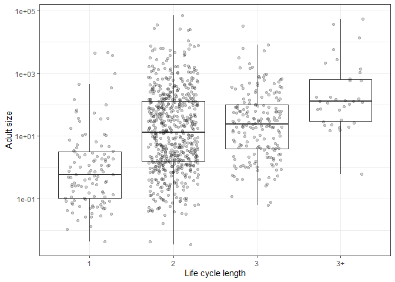<!-- -->

The pattern is not clearly affected by imputation - it looks the same
for species with adult size and those where is adult size was imputed.

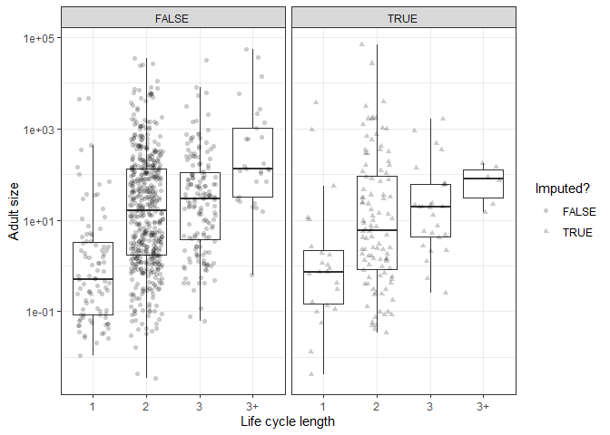<!-- -->

The increase with life cycle length is is mainly for nematodes, not
acanths or cestodes.

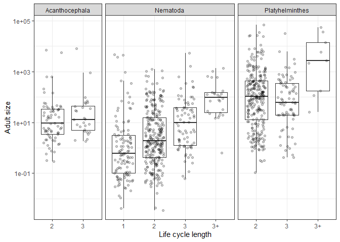<!-- -->

Propagule size was larger in direct life cycles, but varied little among
complex life cycles.

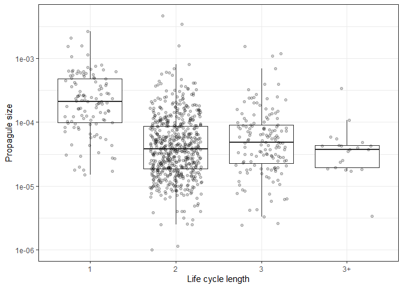<!-- -->

Partly this might be attributed to imputation.

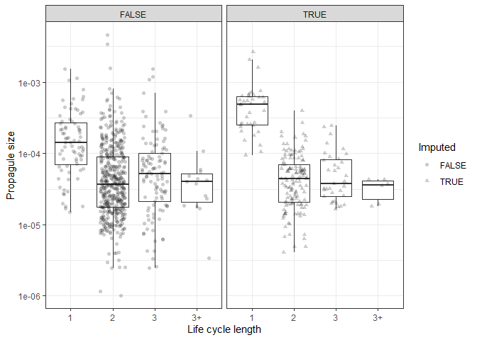<!-- -->

This trend was again mainly seen in nematodes.

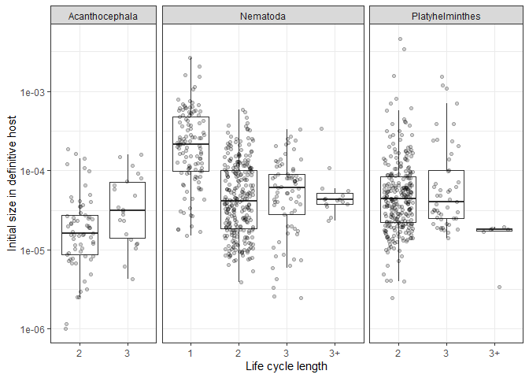<!-- -->

Here is total growth, the difference between final and propagule size.
Total growth increases with life cycle length, driven by end sizes.

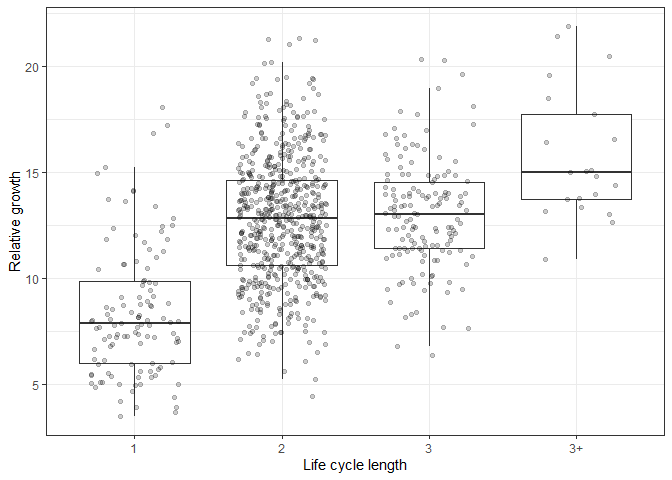<!-- -->

Cumulative developmental time tended to increase with life cycle length.

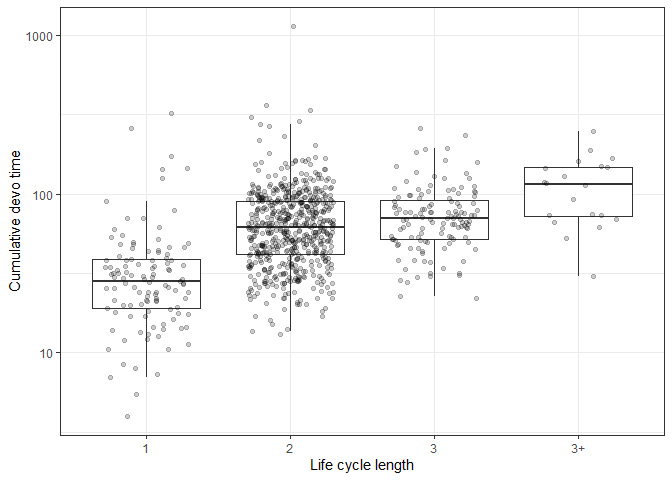<!-- -->

And this trend was not obviously due to imputed values.

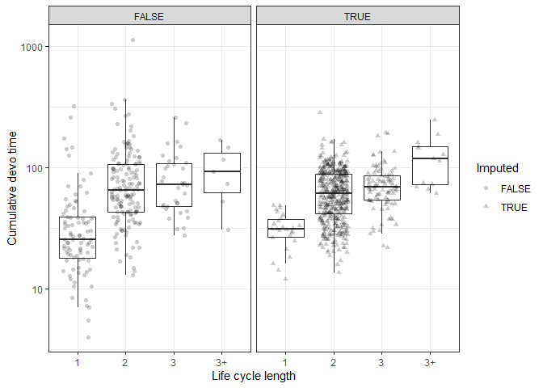<!-- -->

Again, nematodes seem to drive the pattern.

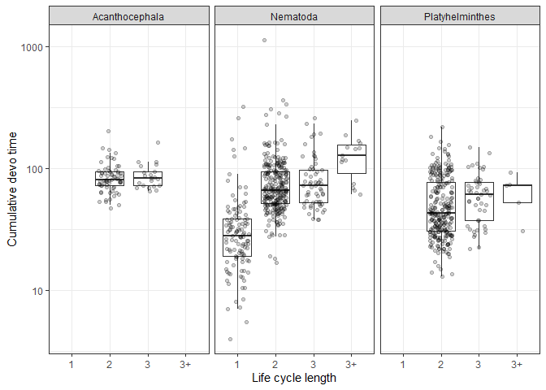<!-- -->

Here is the lifetime growth rate. It might be a little faster in simple
life cycles.

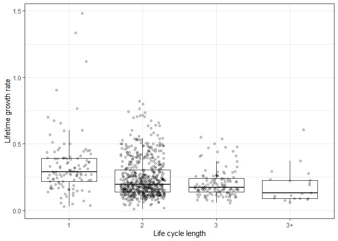<!-- -->

Imputed values are not obviously different than complete ones.

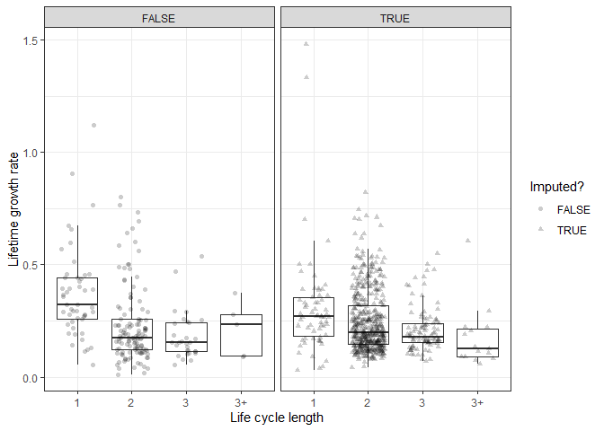<!-- -->

Again the nematodes show the clearest pattern.

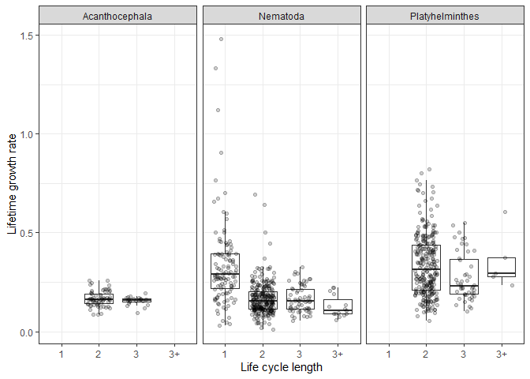<!-- -->

Here is the lifetime growth trajectories for species with different life
cycle lengths.

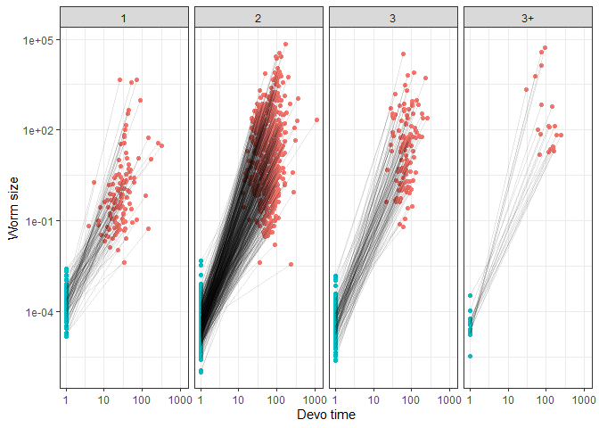<!-- -->

Here is a similar growth trajectory plot, but now with median values for
propagule size, final size, and age at maturity. Also, the x-axis is not
log-transformed. Long life cycles are associated with slower relative
growth rates.

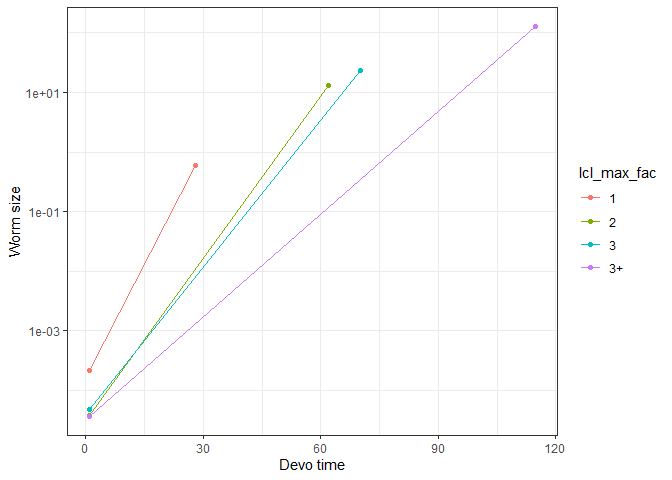<!-- -->

This is partially due to temperature effects, in that worms with long
cycles spend more time at lower temps. The lines look more parallel when
we use degree days as our measure of development time.

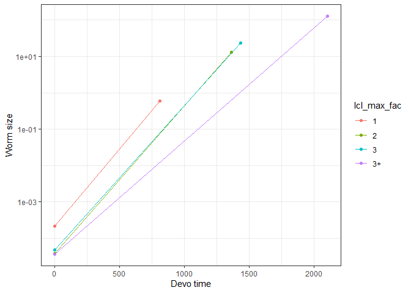<!-- -->

# Analyses

First, I fit standard `lmer` models to three traits: final size,
propagule size, and cumulative development time. These are the
components of lifetime growth rate. I test the hypothesis that life
cycle length as a factor is better than as a lcl as a continuous
variable

## Final size

Final size increases with life cycle length linearly and weakly.

|             | npar |      AIC |      BIC |     logLik | deviance |     Chisq | Df | Pr(\>Chisq) |
| :---------- | ---: | -------: | -------: | ---------: | -------: | --------: | -: | ----------: |
| mod0mer\_fs |    7 | 3603.550 | 3637.448 | \-1794.775 | 3589.550 |        NA | NA |          NA |
| mod1mer\_fs |    8 | 3589.342 | 3628.084 | \-1786.671 | 3573.342 | 16.207215 |  1 |   0.0000568 |
| mod2mer\_fs |   10 | 3591.495 | 3639.922 | \-1785.747 | 3571.495 |  1.847537 |  2 |   0.3970201 |

The model suggests that with each new host, final adult size increases
by 64% on average. Put another way, adult size increases 1.64 fold with
each additional host.

The R2 table indicates that very little variation in
reproductive size is explained by life cycle length, but a lot is
explained by taxonomy.

| step              | df\_used | marg\_r2 | cond\_r2 | sp\_var\_explained | tax\_var\_explained |
| :---------------- | -------: | -------: | -------: | -----------------: | ------------------: |
| taxonomy          |       NA |    0.000 |    0.866 |                  0 |               0.866 |
| life cycle length |        1 |    0.012 |    0.855 |                  0 |               0.843 |
| lcl, categorical  |        2 |    0.020 |    0.850 |                  0 |               0.830 |

## Propagule size

What about propagule size? Do parasites with different life cycle
lengths enter the environment at different sizes? Maybe. The model with
lcl as a factor was an improvement.

|             | npar |      AIC |      BIC |     logLik | deviance |     Chisq | Df | Pr(\>Chisq) |
| :---------- | ---: | -------: | -------: | ---------: | -------: | --------: | -: | ----------: |
| mod0mer\_is |    7 | 1976.900 | 2010.320 | \-981.4501 | 1962.900 |        NA | NA |          NA |
| mod1mer\_is |    8 | 1976.367 | 2014.560 | \-980.1833 | 1960.367 |  2.533539 |  1 |   0.1114500 |
| mod2mer\_is |   10 | 1969.842 | 2017.584 | \-974.9210 | 1949.842 | 10.524692 |  2 |   0.0051831 |

With each additional intermediate host, propagule size decreased
non-signficantly by -9%. The change in propagule size with life cycle
length was not linear, given the significant effect of the categorical
factor. Nonetheless, the effect is weak, explaining less that 2% of the
variation.

| step              | df\_used | marg\_r2 | cond\_r2 | sp\_var\_explained | tax\_var\_explained |
| :---------------- | -------: | -------: | -------: | -----------------: | ------------------: |
| taxonomy          |       NA |    0.000 |    0.869 |                  0 |               0.869 |
| life cycle length |        1 |    0.002 |    0.866 |                  0 |               0.864 |
| lcl, categorical  |        2 |    0.016 |    0.861 |                  0 |               0.845 |

## Cumulative devo time - days

Age at maturity increased fairly linearly with life cycle length.

|             | npar |      AIC |      BIC |     logLik | deviance |    Chisq | Df | Pr(\>Chisq) |
| :---------- | ---: | -------: | -------: | ---------: | -------: | -------: | -: | ----------: |
| mod0mer\_dt |    7 | 638.0722 | 671.3462 | \-312.0361 | 624.0722 |       NA | NA |          NA |
| mod1mer\_dt |    8 | 610.8922 | 648.9197 | \-297.4461 | 594.8922 | 29.17996 |  1 |   0.0000001 |
| mod2mer\_dt |   10 | 602.2316 | 649.7660 | \-291.1158 | 582.2316 | 12.66056 |  2 |   0.0017815 |

Cumulative devo time increased by 16% with each additional host.
However, this should not be overinterpreted, because the model with life
cycle length as a factor explained another 2% of the variation in
cumulative devo time.

| step              | df\_used | marg\_r2 | cond\_r2 | sp\_var\_explained | tax\_var\_explained |
| :---------------- | -------: | -------: | -------: | -----------------: | ------------------: |
| taxonomy          |       NA |    0.000 |    0.875 |                  0 |               0.875 |
| life cycle length |        1 |    0.023 |    0.867 |                  0 |               0.844 |
| lcl, categorical  |        2 |    0.056 |    0.857 |                  0 |               0.801 |

# Multivariate approach to growth rate

Growth rate has 3 component parts (start size, end size, and time) that
we can put into a multivariate model.
[Elsewhere](adult_worm_traits_vs_lcl.Rmd), I compare univariate and
multivariate models using the non-imputed data - they return similar
results. Since we are using imputed data, dealing with missingness is
not a benefit of the multivariate model. However, it still has two
advantages. First, we can estimate the covariances between traits.
Second, we can examine growth rate taking into account variation in all
variables simultaneously.

We fit the models with `MCMCglmm`. To our data, we added some ‘empty’
new data to get predicted values and credible intervals exactly where we
want for plotting.

Here is the number of species included in the model:

| n\_dt | n\_end\_size | n\_ini\_size |
| ----: | -----------: | -----------: |
|   857 |          937 |          875 |

We created 100 imputed datasets. To fit a model that reasonably accounts
for the variation due to missingness, let’s loop over the imputed
datasets, run the model, save it in a list, and then use the model
output as starting values for model fitting in the next iteration. For
each imputed dataset, we fit the same three models described above:
intercept-only, life cycle length as continuous variable, and life cycle
length as categorical variable. In all, taxonomy is included as nested
random effects.

    ## [1] "iteration 1 finished"
    ## [1] "iteration 2 finished"
    ## [1] "iteration 3 finished"
    ## [1] "iteration 4 finished"
    ## [1] "iteration 5 finished"
    ## [1] "iteration 6 finished"
    ## [1] "iteration 7 finished"
    ## [1] "iteration 8 finished"
    ## [1] "iteration 9 finished"
    ## [1] "iteration 10 finished"
    ## [1] "iteration 11 finished"
    ## [1] "iteration 12 finished"
    ## [1] "iteration 13 finished"
    ## [1] "iteration 14 finished"
    ## [1] "iteration 15 finished"
    ## [1] "iteration 16 finished"
    ## [1] "iteration 17 finished"
    ## [1] "iteration 18 finished"
    ## [1] "iteration 19 finished"
    ## [1] "iteration 20 finished"
    ## [1] "iteration 21 finished"
    ## [1] "iteration 22 finished"
    ## [1] "iteration 23 finished"
    ## [1] "iteration 24 finished"
    ## [1] "iteration 25 finished"
    ## [1] "iteration 26 finished"
    ## [1] "iteration 27 finished"
    ## [1] "iteration 28 finished"
    ## [1] "iteration 29 finished"
    ## [1] "iteration 30 finished"
    ## [1] "iteration 31 finished"
    ## [1] "iteration 32 finished"
    ## [1] "iteration 33 finished"
    ## [1] "iteration 34 finished"
    ## [1] "iteration 35 finished"
    ## [1] "iteration 36 finished"
    ## [1] "iteration 37 finished"
    ## [1] "iteration 38 finished"
    ## [1] "iteration 39 finished"
    ## [1] "iteration 40 finished"
    ## [1] "iteration 41 finished"
    ## [1] "iteration 42 finished"
    ## [1] "iteration 43 finished"
    ## [1] "iteration 44 finished"
    ## [1] "iteration 45 finished"
    ## [1] "iteration 46 finished"
    ## [1] "iteration 47 finished"
    ## [1] "iteration 48 finished"
    ## [1] "iteration 49 finished"
    ## [1] "iteration 50 finished"
    ## [1] "iteration 51 finished"
    ## [1] "iteration 52 finished"
    ## [1] "iteration 53 finished"
    ## [1] "iteration 54 finished"
    ## [1] "iteration 55 finished"
    ## [1] "iteration 56 finished"
    ## [1] "iteration 57 finished"
    ## [1] "iteration 58 finished"
    ## [1] "iteration 59 finished"
    ## [1] "iteration 60 finished"
    ## [1] "iteration 61 finished"
    ## [1] "iteration 62 finished"
    ## [1] "iteration 63 finished"
    ## [1] "iteration 64 finished"
    ## [1] "iteration 65 finished"
    ## [1] "iteration 66 finished"
    ## [1] "iteration 67 finished"
    ## [1] "iteration 68 finished"
    ## [1] "iteration 69 finished"
    ## [1] "iteration 70 finished"
    ## [1] "iteration 71 finished"
    ## [1] "iteration 72 finished"
    ## [1] "iteration 73 finished"
    ## [1] "iteration 74 finished"
    ## [1] "iteration 75 finished"
    ## [1] "iteration 76 finished"
    ## [1] "iteration 77 finished"
    ## [1] "iteration 78 finished"
    ## [1] "iteration 79 finished"
    ## [1] "iteration 80 finished"
    ## [1] "iteration 81 finished"
    ## [1] "iteration 82 finished"
    ## [1] "iteration 83 finished"
    ## [1] "iteration 84 finished"
    ## [1] "iteration 85 finished"
    ## [1] "iteration 86 finished"
    ## [1] "iteration 87 finished"
    ## [1] "iteration 88 finished"
    ## [1] "iteration 89 finished"
    ## [1] "iteration 90 finished"
    ## [1] "iteration 91 finished"
    ## [1] "iteration 92 finished"
    ## [1] "iteration 93 finished"
    ## [1] "iteration 94 finished"
    ## [1] "iteration 95 finished"
    ## [1] "iteration 96 finished"
    ## [1] "iteration 97 finished"
    ## [1] "iteration 98 finished"
    ## [1] "iteration 99 finished"
    ## [1] "iteration 100 finished"

We’ll start by looking at overall model fit. Here is the trace for
deviance (like the model likelihood) for the three models. The colored
lines are those including life cycle length. They are not much better
than the intercept-only model.

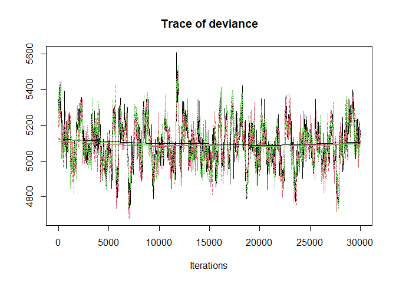<!-- -->

Here is the DIC values of the three models:

    ## Int-only: 5938.297

    ## Life cycle length (cont): 5925.951

    ## Life cycle length (cat): 5930.013

The comparison of DIC values suggests the life cycle length addition is
a clear improvement.

    ## Delta DIC, int-only vs life cycle length cont: 12.34561 (higher is better)

The addition of life cycle length as a categorical variable is also an
improvement, but not as clear.

    ## Delta DIC, life cycle length cont vs categorical: -4.062111 (higher is better)

Now we can combine the chains for the fixed parameters and variance
componenets.

Here is the predicted increase in reproductive size with life cycle
length.

    ## 
    ## Iterations = 1:29971
    ## Thinning interval = 30 
    ## Number of chains = 1 
    ## Sample size per chain = 1000 
    ## 
    ## 1. Empirical mean and standard deviation for each variable,
    ##    plus standard error of the mean:
    ## 
    ##           Mean             SD       Naive SE Time-series SE 
    ##       0.730423       0.228186       0.007216       0.010994 
    ## 
    ## 2. Quantiles for each variable:
    ## 
    ##   2.5%    25%    50%    75%  97.5% 
    ## 0.3388 0.5775 0.7214 0.8677 1.2115

Here is the predicted decrease in propagule size with each life cycle
step. It is small.

    ## 
    ## Iterations = 1:29971
    ## Thinning interval = 30 
    ## Number of chains = 1 
    ## Sample size per chain = 1000 
    ## 
    ## 1. Empirical mean and standard deviation for each variable,
    ##    plus standard error of the mean:
    ## 
    ##           Mean             SD       Naive SE Time-series SE 
    ##      -0.091230       0.083456       0.002639       0.005967 
    ## 
    ## 2. Quantiles for each variable:
    ## 
    ##     2.5%      25%      50%      75%    97.5% 
    ## -0.24325 -0.14806 -0.09591 -0.03640  0.08779

The age at maturity increases with life cycle length.

    ## 
    ## Iterations = 1:29971
    ## Thinning interval = 30 
    ## Number of chains = 1 
    ## Sample size per chain = 1000 
    ## 
    ## 1. Empirical mean and standard deviation for each variable,
    ##    plus standard error of the mean:
    ## 
    ##           Mean             SD       Naive SE Time-series SE 
    ##       0.181969       0.062149       0.001965       0.004575 
    ## 
    ## 2. Quantiles for each variable:
    ## 
    ##    2.5%     25%     50%     75%   97.5% 
    ## 0.06712 0.13680 0.18160 0.22206 0.30673

A linear relationship between life cycle length and parasite traits
might be oversimplified, given that the model treating life cycle length
as a categorical variables was a slight improvement. Here are the
credible intervals for the parameters from the model treating life cycle
length as a category. Some are non-zero.

| param                               |          lwr |         fit |         upr | sig |
| :---------------------------------- | -----------: | ----------: | ----------: | :-- |
| traitlog\_cumdt                     |    3.0548838 |   3.8608212 |   4.5585457 | sig |
| traitlog\_cumdt:lcl\_max\_fac2      |    0.1760464 |   0.4190362 |   0.6800789 | sig |
| traitlog\_cumdt:lcl\_max\_fac3      |    0.2822452 |   0.5359100 |   0.8032011 | sig |
| traitlog\_cumdt:lcl\_max\_fac3+     |    0.0999530 |   0.5527140 |   0.9995194 | sig |
| traitlog\_end                       |  \-0.1881159 |   1.3650714 |   2.9213618 | ns  |
| traitlog\_end:lcl\_max\_fac2        |    0.4045370 |   1.1036037 |   1.7812705 | sig |
| traitlog\_end:lcl\_max\_fac3        |    0.7813727 |   1.4931362 |   2.2401219 | sig |
| traitlog\_end:lcl\_max\_fac3+       |    1.0214672 |   2.0999863 |   3.2146420 | sig |
| traitlog\_propagule                 | \-10.7166975 | \-9.6394040 | \-8.6627678 | sig |
| traitlog\_propagule:lcl\_max\_fac2  |  \-1.0120764 | \-0.4967100 |   0.0043796 | ns  |
| traitlog\_propagule:lcl\_max\_fac3  |  \-1.0222396 | \-0.4656993 |   0.0616000 | ns  |
| traitlog\_propagule:lcl\_max\_fac3+ |  \-1.6609425 | \-0.8154080 |   0.1846530 | ns  |

For completeness, here are the credible intervals for the parameters
from the intercept model…

| param               |         lwr |         fit |        upr | sig |
| :------------------ | ----------: | ----------: | ---------: | :-- |
| traitlog\_cumdt     |    3.447950 |    4.231706 |   5.020078 | sig |
| traitlog\_end       |    0.803293 |    2.357632 |   3.965182 | sig |
| traitlog\_propagule | \-11.046209 | \-10.091110 | \-9.135825 | sig |

…and the life cycle length model.

| param                        |          lwr |         fit |         upr | sig |
| :--------------------------- | -----------: | ----------: | ----------: | :-- |
| traitlog\_cumdt              |    3.1542141 |   3.9045529 |   4.6525056 | sig |
| traitlog\_cumdt:lcl\_max     |    0.0649653 |   0.1668697 |   0.2675245 | sig |
| traitlog\_end                |  \-0.3308716 |   1.2384973 |   3.0271243 | ns  |
| traitlog\_end:lcl\_max       |    0.2917927 |   0.5431455 |   0.7936673 | sig |
| traitlog\_propagule          | \-10.9547806 | \-9.8567499 | \-8.8260085 | sig |
| traitlog\_propagule:lcl\_max |  \-0.2787259 | \-0.1008241 |   0.0841503 | ns  |

Perhaps the best way to gauge model fit is by looking at the R2 table.

| model           | trait       | r2m                   | r2c                   |
| :-------------- | :---------- | :-------------------- | :-------------------- |
| int-only        | dt          | 0 \[0-0\]             | 0.895 \[0.838-0.954\] |
| lcl continuous  | dt          | 0.014 \[0.002-0.043\] | 0.889 \[0.829-0.957\] |
| lcl categorical | dt          | 0.031 \[0.008-0.074\] | 0.888 \[0.825-0.957\] |
| int-only        | end\_size   | 0 \[0-0\]             | 0.836 \[0.782-0.907\] |
| lcl continuous  | end\_size   | 0.016 \[0.004-0.035\] | 0.826 \[0.777-0.904\] |
| lcl categorical | end\_size   | 0.027 \[0.008-0.06\]  | 0.824 \[0.767-0.895\] |
| int-only        | start\_size | 0 \[0-0\]             | 0.836 \[0.768-0.914\] |
| lcl continuous  | start\_size | 0.002 \[0-0.013\]     | 0.834 \[0.765-0.909\] |
| lcl categorical | start\_size | 0.014 \[0.001-0.048\] | 0.832 \[0.763-0.907\] |

Since there are clear taxonomic effects, we should look at where these
come from. Do genera differ or phyla? Here is the pattern for propagule
size…

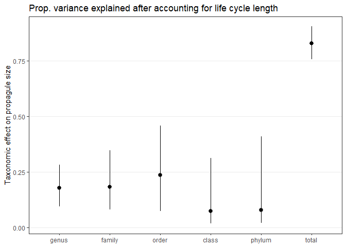<!-- -->

…final size…

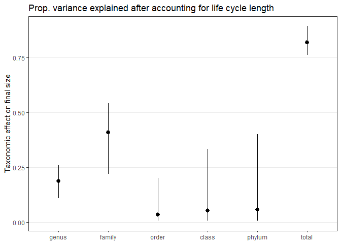<!-- -->

…and age at maturity.

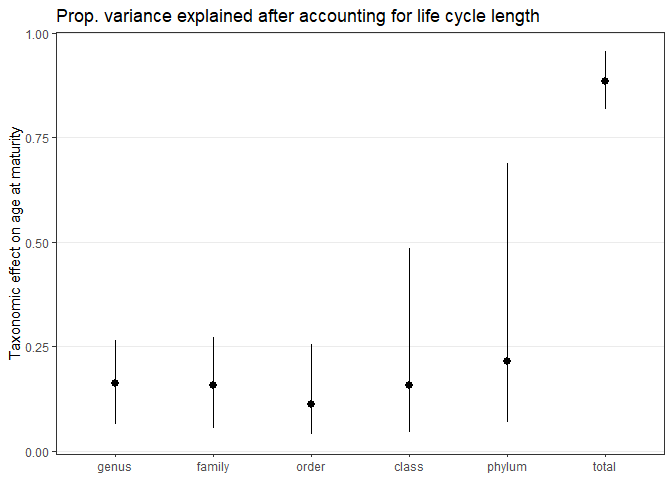<!-- -->

For size, lower taxonomic levels like family and genus appear important.
For development time, higher taxonomic levels like class and phylum are
more important. However, the taxonomic effect is probably inflated for
devo time due to imputation - more values were imputed on the basis of
taxonomy for development.

Finally, let’s plot the data. For that, we need to predict all three
traits at each life cycle length, along with the credible intervals.

Here is the plot of adult size.

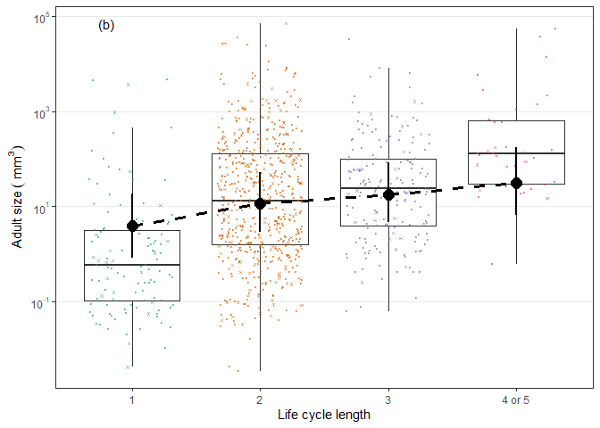<!-- -->

Here is a table with the mean adult sizes for each life cycle length and
the fold change with each added host.

| lcl\_max\_fac | log\_end\_p.lwr | log\_end\_p.fit | log\_end\_p.upr | fold\_change | perc\_increase |
| :------------ | --------------: | --------------: | --------------: | -----------: | -------------: |
| 1             |     \-0.1881159 |        1.365071 |        2.921362 |           NA |             NA |
| 2             |       1.0576244 |        2.469163 |        3.940159 |     3.016483 |      201.64829 |
| 3             |       1.5231889 |        2.867545 |        4.415115 |     1.489414 |       48.94136 |
| 3+            |       1.8753792 |        3.458097 |        5.168665 |     1.804984 |       80.49842 |

We can also look at whether CIs overlap the means, i.e. whether
differences are significant. Worm size in the longest life cycles is
larger than in direct life cycles.

| lcl\_max\_fac | log\_end\_p.lwr | log\_end\_p.fit | log\_end\_p.upr | sig\_1host | sig\_2host | sig\_3host | sig\_4host |
| :------------ | --------------: | --------------: | --------------: | :--------- | :--------- | :--------- | :--------- |
| 1             |     \-0.1881159 |        1.365071 |        2.921362 | ns         | ns         | sig        | sig        |
| 2             |       1.0576244 |        2.469163 |        3.940159 | ns         | ns         | ns         | ns         |
| 3             |       1.5231889 |        2.867545 |        4.415115 | ns         | ns         | ns         | ns         |
| 3+            |       1.8753792 |        3.458097 |        5.168665 | sig        | ns         | ns         | ns         |

Now, we look at propagule size. We are not really interested in
propagule size, but we look at it to understand how it might affect
lifetime growth rate.

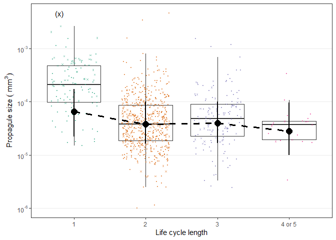<!-- -->

Here are mean propagule sizes for each life cycle length and the fold
change with each added host.

| lcl\_max\_fac | log\_prop.lwr | log\_prop.fit | log\_prop.upr | fold\_change | perc\_decrease |
| :------------ | ------------: | ------------: | ------------: | -----------: | -------------: |
| 1             |    \-10.71670 |    \-9.639404 |    \-8.662768 |           NA |             NA |
| 2             |    \-11.02110 |   \-10.163665 |    \-9.198367 |    1.6892094 |      68.920936 |
| 3             |    \-10.98582 |   \-10.122231 |    \-9.196085 |    0.9594127 |     \-4.058725 |
| 3+            |    \-11.51616 |   \-10.473623 |    \-9.245402 |    1.4210446 |      42.104462 |

We can also look at whether CIs overlap the means, i.e. whether
differences are significant. Direct life cycle worms have larger
propagules than the other groups.

| lcl\_max\_fac | log\_prop.lwr | log\_prop.fit | log\_prop.upr | sig\_1host | sig\_2host | sig\_3host | sig\_4host |
| :------------ | ------------: | ------------: | ------------: | :--------- | :--------- | :--------- | :--------- |
| 1             |    \-10.71670 |    \-9.639404 |    \-8.662768 | ns         | ns         | ns         | ns         |
| 2             |    \-11.02110 |   \-10.163665 |    \-9.198367 | ns         | ns         | ns         | ns         |
| 3             |    \-10.98582 |   \-10.122231 |    \-9.196085 | ns         | ns         | ns         | ns         |
| 3+            |    \-11.51616 |   \-10.473623 |    \-9.245402 | ns         | ns         | ns         | ns         |

Now we look at age at maturity - the total time spent developing across
all hosts.

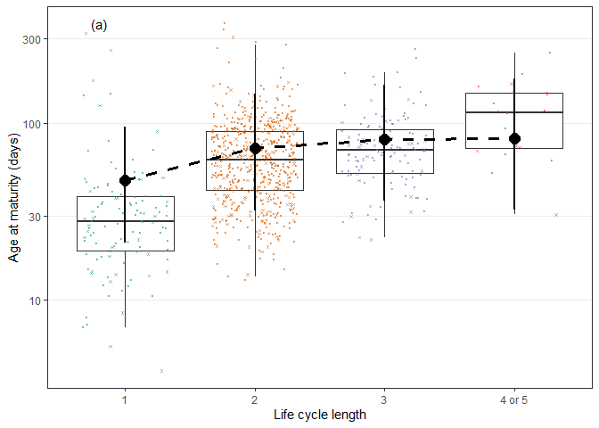<!-- -->

| lcl\_max\_fac | cum\_dt.lwr | cum\_dt.fit | cum\_dt.upr | fold\_change | perc\_increase |
| :------------ | ----------: | ----------: | ----------: | -----------: | -------------: |
| 1             |        21.2 |        47.5 |        95.4 |           NA |             NA |
| 2             |        32.2 |        72.1 |       146.9 |     1.517107 |      51.710721 |
| 3             |        36.4 |        80.7 |       163.8 |     1.119660 |      11.965988 |
| 3+            |        32.6 |        82.4 |       179.0 |     1.020856 |       2.085614 |

We can also look at whether CIs overlap the means, i.e. whether
differences are significant.

| lcl\_max\_fac | cum\_dt.lwr | cum\_dt.fit | cum\_dt.upr | sig\_1host | sig\_2host | sig\_3host | sig\_4host |
| :------------ | ----------: | ----------: | ----------: | :--------- | :--------- | :--------- | :--------- |
| 1             |    3.054884 |    3.860821 |    4.558546 | ns         | ns         | ns         | ns         |
| 2             |    3.472147 |    4.277627 |    4.990089 | ns         | ns         | ns         | ns         |
| 3             |    3.595059 |    4.390651 |    5.098552 | ns         | ns         | ns         | ns         |
| 3+            |    3.483503 |    4.411293 |    5.187254 | ns         | ns         | ns         | ns         |

Finally, we can put the three composite traits together and look at
lifetime growth rate. It does not vary much.

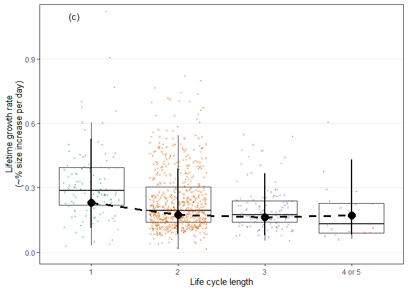<!-- -->

It does not vary much at all.

| lcl\_max\_fac |   rgr.lwr |   rgr.fit |   rgr.upr | fold\_change | perc\_increase |
| :------------ | --------: | --------: | --------: | -----------: | -------------: |
| 1             | 0.1125011 | 0.2309301 | 0.5283811 |           NA |             NA |
| 2             | 0.0838400 | 0.1746790 | 0.3899933 |    0.9453018 |    \-5.4698243 |
| 3             | 0.0786831 | 0.1611424 | 0.3667539 |    0.9865546 |    \-1.3445360 |
| 3+            | 0.0798537 | 0.1696414 | 0.4313879 |    1.0085352 |      0.8535203 |

And there are no differences among groups.

| lcl\_max\_fac |   rgr.lwr |   rgr.fit |   rgr.upr | sig\_1host | sig\_2host | sig\_3host | sig\_4host |
| :------------ | --------: | --------: | --------: | :--------- | :--------- | :--------- | :--------- |
| 1             | 0.1125011 | 0.2309301 | 0.5283811 | ns         | ns         | ns         | ns         |
| 2             | 0.0838400 | 0.1746790 | 0.3899933 | ns         | ns         | ns         | ns         |
| 3             | 0.0786831 | 0.1611424 | 0.3667539 | ns         | ns         | ns         | ns         |
| 3+            | 0.0798537 | 0.1696414 | 0.4313879 | ns         | ns         | ns         | ns         |

# Taxonomic and residual correlations

Because we fit multivariate models, we can look at correlations in the
residuals. Here is the residual correlation matrix. The off-diagonals
are all positive. Species with larger adult sizes have larger propagules
and longer developmental times.

    ##       [,1]  [,2]  [,3]
    ## [1,] 1.000 0.065 0.110
    ## [2,] 0.065 1.000 0.286
    ## [3,] 0.110 0.286 1.000

Here are the credible intervals for the correlations. The correlations
between propagule and adult size is not significant. But the correlation
between total developmental time and adult size is.

    ##            lower     upper
    ## var1  1.00000000 1.0000000
    ## var2 -0.03895328 0.1741804
    ## var3 -0.03911937 0.1886302
    ## var4 -0.03895328 0.1741804
    ## var5  1.00000000 1.0000000
    ## var6  0.13858600 0.3701579
    ## var7 -0.03911937 0.1886302
    ## var8  0.13858600 0.3701579
    ## var9  1.00000000 1.0000000
    ## attr(,"Probability")
    ## [1] 0.95

We can also explore taxonomic correlations among stages. We’ll refit the
model, but allowing an unstructured covariance structure fore the
taxonomic random effects.

Judged simply on DIC, this is a rather clear improvement, indicating
there are taxon-level correlations among the three traits. This is not
surprising, given their strong phylogenetic signals.

    ## DIC, trait covariance among taxonomic groups: 4928.243 
    ##  DIC, no covariance among taxonomic groups: 4964.299

Let’s plot these effects, first by looking at what correlations were
considered significant.

Taxonomic correlations for higher levels like order and class have wide
credible intervals, suggesting these traits are not constrained at these
levels or that power is quite low to detect such relationships (probably
both). The correlations at family and taxonomic levels go in opposite
directions in two cases. Specifically, genera that enter definitive
hosts large have shorter development times and smaller final sizes. But
families that enter the definitive host large have longer devo times and
larger final sizes. For both genera and families long devo times are
associated with large sizes.

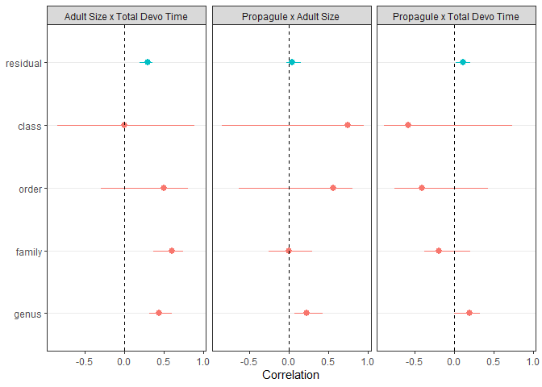<!-- -->
