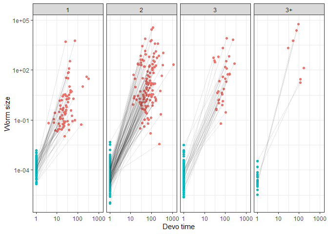

Adult worm traits
================

  - [Exploratory plots](#exploratory-plots)
  - [Analyses](#analyses)
      - [Final size](#final-size)
      - [Propagule size](#propagule-size)
      - [Cumulative devo time - days](#cumulative-devo-time---days)
  - [Multivariate approach to growth
    rate](#multivariate-approach-to-growth-rate)
  - [Taxonomic and residual
    correlations](#taxonomic-and-residual-correlations)

Here I focus on the relationship between life cycle length and adult
characteristics. Intuitively, longer life cycles involve more risks; at
each step, worms risk not being transmitted to the next host. Are there
advantages that compensate for this. Particularly, do worms with longer
cycles reach a larger reproductive size in their final host? If so, how
do they do it, e.g. faster growth, longer growth, etc?

For this analysis, we only look at adult worm stages. Here are the
variables with the most missing data. Prepatent periods are typically
missing.

# Exploratory plots

First a few plots. Here is how adult size varies with life cycle length.
Worms with longer cycles reach larger reproductive sizes.

<!-- -->

The increase with life cycle length is is mainly for nematodes, not
acanths or cestodes.

<!-- -->

Propagule size was larger in direct life cycles, but varied little among
complex life cycles.

<!-- -->

This trend was again mainly seen in nematodes.

<!-- -->

Here is total growth, the difference between final and propagule size.
Total growth increases with life cycle length, driven by end sizes.

<!-- -->

Cumulative developmental time tended to increase with life cycle length.

<!-- -->

Again, nematodes seem to drive the pattern.

<!-- -->

Here is the lifetime growth rate. It might be a little faster in simple
life cycles.

<!-- -->

Again the nematodes show the clearest pattern.

<!-- -->

Here is the lifetime growth trajectories for species with different life
cycle lengths.

<!-- -->

Here is a similar growth trajectory plot, but now with median values for
propagule size, final size, and age at maturity. Also, the x-axis is not
log-transformed. Long life cycles are associated with slower relative
growth rates.

<!-- -->

# Analyses

First, I fit standard `lmer` models to three traits: final size,
propagule size, and cumulative development time. These are the
components of lifetime growth rate. I test the hypothesis that life
cycle length as a factor is better than as a lcl as a continuous
variable

## Final size

Final size increases with life cycle length linearly and weakly.

|             | npar |      AIC |      BIC |     logLik | deviance |      Chisq | Df | Pr(\>Chisq) |
| :---------- | ---: | -------: | -------: | ---------: | -------: | ---------: | -: | ----------: |
| mod0mer\_fs |    7 | 3064.194 | 3096.782 | \-1525.097 | 3050.194 |         NA | NA |          NA |
| mod1mer\_fs |    8 | 3055.480 | 3092.723 | \-1519.740 | 3039.480 | 10.7145673 |  1 |   0.0010630 |
| mod2mer\_fs |   10 | 3059.123 | 3105.678 | \-1519.562 | 3039.123 |  0.3564987 |  2 |   0.8367338 |

The model suggests that with each new host, final adult size increases
by 59% on average. Put another way, adult size increases 1.59 fold with
each additional host.

The R2 table indicates that very little variation in
reproductive size is explained by life cycle length, but a lot is
explained by taxonomy.

| step              | df\_used | marg\_r2 | cond\_r2 | sp\_var\_explained | tax\_var\_explained |
| :---------------- | -------: | -------: | -------: | -----------------: | ------------------: |
| taxonomy          |       NA |    0.000 |    0.867 |                  0 |               0.867 |
| life cycle length |        1 |    0.010 |    0.856 |                  0 |               0.846 |
| lcl, categorical  |        2 |    0.013 |    0.852 |                  0 |               0.839 |

## Propagule size

What about propagule size? Do parasites with different life cycle
lengths enter the environment at different sizes? No, propagule size did
not improve the model.

|             | npar |      AIC |      BIC |     logLik | deviance |    Chisq | Df | Pr(\>Chisq) |
| :---------- | ---: | -------: | -------: | ---------: | -------: | -------: | -: | ----------: |
| mod0mer\_is |    7 | 1782.580 | 1814.377 | \-884.2900 | 1768.580 |       NA | NA |          NA |
| mod1mer\_is |    8 | 1783.295 | 1819.635 | \-883.6476 | 1767.295 | 1.284862 |  1 |   0.2569970 |
| mod2mer\_is |   10 | 1783.298 | 1828.723 | \-881.6492 | 1763.298 | 3.996779 |  2 |   0.1355534 |

With each additional intermediate host, propagule size decreased
non-signficantly by -8%. The change in propagule size with life cycle
length was not linear, given the significant effect of the categorical
factor. Nonetheless, the effect is weak, explaining less that 2% of the
variation.

| step              | df\_used | marg\_r2 | cond\_r2 | sp\_var\_explained | tax\_var\_explained |
| :---------------- | -------: | -------: | -------: | -----------------: | ------------------: |
| taxonomy          |       NA |    0.000 |    0.818 |                  0 |               0.818 |
| life cycle length |        1 |    0.001 |    0.814 |                  0 |               0.813 |
| lcl, categorical  |        2 |    0.010 |    0.807 |                  0 |               0.797 |

## Cumulative devo time - days

Age at maturity increased fairly linearly with life cycle length.

|             | npar |      AIC |      BIC |     logLik | deviance |    Chisq | Df | Pr(\>Chisq) |
| :---------- | ---: | -------: | -------: | ---------: | -------: | -------: | -: | ----------: |
| mod0mer\_dt |    7 | 493.7730 | 519.1664 | \-239.8865 | 479.7730 |       NA | NA |          NA |
| mod1mer\_dt |    8 | 486.7003 | 515.7213 | \-235.3501 | 470.7003 | 9.072750 |  1 |   0.0025945 |
| mod2mer\_dt |   10 | 487.3947 | 523.6709 | \-233.6974 | 467.3947 | 3.305583 |  2 |   0.1915146 |

Cumulative devo time increased by 23% with each additional host.
However, this should not be overinterpreted, because the model with life
cycle length as a factor explained another 2% of the variation in
cumulative devo time.

| step              | df\_used | marg\_r2 | cond\_r2 | sp\_var\_explained | tax\_var\_explained |
| :---------------- | -------: | -------: | -------: | -----------------: | ------------------: |
| taxonomy          |       NA |    0.000 |    0.835 |                  0 |               0.835 |
| life cycle length |        1 |    0.035 |    0.816 |                  0 |               0.781 |
| lcl, categorical  |        2 |    0.074 |    0.798 |                  0 |               0.724 |

# Multivariate approach to growth rate

Growth rate has 3 component parts (start size, end size, and time) that
we can put into a multivariate model.
[Elsewhere](adult_worm_traits_vs_lcl.Rmd), I compare univariate and
multivariate models using the non-imputed data - they return similar
results. Since we are using imputed data, dealing with missingness is
not a benefit of the multivariate model. However, it still has two
advantages. First, we can estimate the covariances between traits.
Second, we can examine growth rate taking into account variation in all
variables simultaneously.

We fit the models with `MCMCglmm`. To our data, we added some ‘empty’
new data to get predicted values and credible intervals exactly where we
want for plotting.

Here is the number of species included in the model:

| n\_dt | n\_end\_size | n\_ini\_size |
| ----: | -----------: | -----------: |
|   278 |          777 |          694 |

We fit the same three models described above: intercept-only, life cycle
length as continuous variable, and life cycle length as categorical
variable. In all, taxonomy is included as nested random effects.

We’ll start by looking at overall model fit. Here is the trace for
deviance (like the model likelihood) for the three models. The colored
lines are those including life cycle length. They are not much better
than the intercept-only model.

<!-- -->

Here are the DIC values for the models.

    ## DIC, int-only: 4506.965

    ## DIC, life cycle length (cont); 4513.639

    ## DIC, life cycle length (cat); 4529.228

Here is the delta DIC for adding life cycle length (continuous)…

    ## Delta DIC, int-only vs life cycle length (cont): -6.6745 (higher is better)

…and adding life cycle length (continuous).

    ## Delta DIC, life cycle length (cont) vs lcl (categorical): -15.58889 (higher is better)

Here is the predicted increase in reproductive size with life cycle
length.

    ## 
    ## Iterations = 501:30471
    ## Thinning interval = 30 
    ## Number of chains = 1 
    ## Sample size per chain = 1000 
    ## 
    ## 1. Empirical mean and standard deviation for each variable,
    ##    plus standard error of the mean:
    ## 
    ##           Mean             SD       Naive SE Time-series SE 
    ##       0.665371       0.233416       0.007381       0.007381 
    ## 
    ## 2. Quantiles for each variable:
    ## 
    ##   2.5%    25%    50%    75%  97.5% 
    ## 0.2431 0.5041 0.6576 0.8138 1.1515

Here is the predicted decrease in propagule size with each life cycle
step. It is small.

    ## 
    ## Iterations = 501:30471
    ## Thinning interval = 30 
    ## Number of chains = 1 
    ## Sample size per chain = 1000 
    ## 
    ## 1. Empirical mean and standard deviation for each variable,
    ##    plus standard error of the mean:
    ## 
    ##           Mean             SD       Naive SE Time-series SE 
    ##      -0.064353       0.070597       0.002232       0.002340 
    ## 
    ## 2. Quantiles for each variable:
    ## 
    ##     2.5%      25%      50%      75%    97.5% 
    ## -0.19225 -0.11500 -0.06672 -0.02057  0.08605

The age at maturity increases with life cycle length.

    ## 
    ## Iterations = 501:30471
    ## Thinning interval = 30 
    ## Number of chains = 1 
    ## Sample size per chain = 1000 
    ## 
    ## 1. Empirical mean and standard deviation for each variable,
    ##    plus standard error of the mean:
    ## 
    ##           Mean             SD       Naive SE Time-series SE 
    ##       0.225393       0.083023       0.002625       0.003999 
    ## 
    ## 2. Quantiles for each variable:
    ## 
    ##    2.5%     25%     50%     75%   97.5% 
    ## 0.07466 0.16790 0.22288 0.27569 0.39407

A linear relationship between life cycle length and parasite traits
might be oversimplified, given that the model treating life cycle length
as a categorical variables was a slight improvement. Here are the
credible intervals for the parameters from the model treating life cycle
length as a category. Some are non-zero.

| param                               |          lwr |         fit |         upr | sig |
| :---------------------------------- | -----------: | ----------: | ----------: | :-- |
| traitlog\_cumdt                     |    3.1878620 |   3.9407310 |   4.7228336 | sig |
| traitlog\_cumdt:lcl\_max\_fac2      |    0.1487561 |   0.4304782 |   0.7088561 | sig |
| traitlog\_cumdt:lcl\_max\_fac3      |    0.2042848 |   0.5246957 |   0.8406155 | sig |
| traitlog\_cumdt:lcl\_max\_fac3+     |  \-0.0705559 |   0.5164551 |   1.1582418 | ns  |
| traitlog\_end                       |    0.0557106 |   1.5418198 |   3.1225170 | sig |
| traitlog\_end:lcl\_max\_fac2        |    0.0732356 |   0.8790171 |   1.6208453 | sig |
| traitlog\_end:lcl\_max\_fac3        |    0.4464711 |   1.3116485 |   2.1089559 | sig |
| traitlog\_end:lcl\_max\_fac3+       |    0.5337492 |   1.7360804 |   2.8810209 | sig |
| traitlog\_propagule                 | \-10.7592143 | \-9.7919615 | \-8.7907765 | sig |
| traitlog\_propagule:lcl\_max\_fac2  |  \-0.7760439 | \-0.3664848 |   0.0194284 | ns  |
| traitlog\_propagule:lcl\_max\_fac3  |  \-0.7639779 | \-0.3515148 |   0.0835296 | ns  |
| traitlog\_propagule:lcl\_max\_fac3+ |  \-1.0996503 | \-0.4685197 |   0.1749258 | ns  |

For completeness, here are the credible intervals for the parameters
from the intercept model…

| param               |          lwr |         fit |        upr | sig |
| :------------------ | -----------: | ----------: | ---------: | :-- |
| traitlog\_cumdt     |    3.5658550 |    4.327236 |   5.098029 | sig |
| traitlog\_end       |    0.8507178 |    2.434665 |   4.268737 | sig |
| traitlog\_propagule | \-11.0422318 | \-10.106017 | \-9.222688 | sig |

…and the life cycle length model.

| param                        |          lwr |         fit |         upr | sig |
| :--------------------------- | -----------: | ----------: | ----------: | :-- |
| traitlog\_cumdt              |    3.1034965 |   3.8722503 |   4.6848797 | sig |
| traitlog\_cumdt:lcl\_max     |    0.0720021 |   0.2012050 |   0.3322280 | sig |
| traitlog\_end                |  \-0.1149528 |   1.3998526 |   2.8975741 | ns  |
| traitlog\_end:lcl\_max       |    0.2175746 |   0.5053474 |   0.7661643 | sig |
| traitlog\_propagule          | \-11.0599271 | \-9.9987085 | \-8.9586988 | sig |
| traitlog\_propagule:lcl\_max |  \-0.2134974 | \-0.0690547 |   0.0825514 | ns  |

Perhaps the best way to gauge model fit is by looking at the R2 table.

| model           | trait       | r2m                   | r2c                   |
| :-------------- | :---------- | :-------------------- | :-------------------- |
| int-only        | dt          | 0 \[0-0\]             | 0.868 \[0.794-0.941\] |
| lcl continuous  | dt          | 0.018 \[0.002-0.054\] | 0.861 \[0.776-0.937\] |
| lcl categorical | dt          | 0.029 \[0.006-0.076\] | 0.85 \[0.76-0.935\]   |
| int-only        | end\_size   | 0 \[0-0\]             | 0.846 \[0.794-0.918\] |
| lcl continuous  | end\_size   | 0.013 \[0.002-0.033\] | 0.834 \[0.783-0.897\] |
| lcl categorical | end\_size   | 0.02 \[0.004-0.054\]  | 0.83 \[0.782-0.902\]  |
| int-only        | start\_size | 0 \[0-0\]             | 0.837 \[0.776-0.911\] |
| lcl continuous  | start\_size | 0.001 \[0-0.009\]     | 0.835 \[0.766-0.908\] |
| lcl categorical | start\_size | 0.008 \[0.001-0.03\]  | 0.831 \[0.761-0.908\] |

Since there are clear taxonomic effects, we should look at where these
come from. Do genera differ or phyla? Here is the pattern for propagule
size…

<!-- -->

…final size…

<!-- -->

…and age at maturity.

<!-- -->

For size, lower taxonomic levels like family and genus appear important.
For development time, higher taxonomic levels like class and phylum are
more important. However, the taxonomic effect is probably inflated for
devo time due to imputation - more values were imputed on the basis of
taxonomy for development.

Finally, let’s plot the data. For that, we need to predict all three
traits at each life cycle length, along with the credible intervals.

Here is the plot of adult size.

<!-- -->

Here is a table with the mean adult sizes for each life cycle length and
the fold change with each added host.

| lcl\_max\_fac | log\_end\_p.lwr | log\_end\_p.fit | log\_end\_p.upr | fold\_change | perc\_increase |
| :------------ | --------------: | --------------: | --------------: | -----------: | -------------: |
| 1             |       0.0557106 |        1.541820 |        3.122517 |           NA |             NA |
| 2             |       0.8685926 |        2.435576 |        3.922879 |     2.444294 |      144.42944 |
| 3             |       1.2577365 |        2.843017 |        4.418067 |     1.502966 |       50.29657 |
| 3+            |       1.5430767 |        3.288309 |        4.850315 |     1.560946 |       56.09464 |

We can also look at whether CIs overlap the means, i.e. whether
differences are significant. Worm size in the longest life cycles is
larger than in direct life cycles.

| lcl\_max\_fac | log\_end\_p.lwr | log\_end\_p.fit | log\_end\_p.upr | sig\_1host | sig\_2host | sig\_3host | sig\_4host |
| :------------ | --------------: | --------------: | --------------: | :--------- | :--------- | :--------- | :--------- |
| 1             |       0.0557106 |        1.541820 |        3.122517 | ns         | ns         | ns         | sig        |
| 2             |       0.8685926 |        2.435576 |        3.922879 | ns         | ns         | ns         | ns         |
| 3             |       1.2577365 |        2.843017 |        4.418067 | ns         | ns         | ns         | ns         |
| 3+            |       1.5430767 |        3.288309 |        4.850315 | sig        | ns         | ns         | ns         |

Now, we look at propagule size. We are not really interested in
propagule size, but we look at it to understand how it might affect
lifetime growth rate.

<!-- -->

Here are mean propagule sizes for each life cycle length and the fold
change with each added host.

| lcl\_max\_fac | log\_prop.lwr | log\_prop.fit | log\_prop.upr | fold\_change | perc\_decrease |
| :------------ | ------------: | ------------: | ------------: | -----------: | -------------: |
| 1             |    \-10.75921 |    \-9.791961 |    \-8.790776 |           NA |             NA |
| 2             |    \-11.11481 |   \-10.161742 |    \-9.208314 |    1.4474174 |      44.741745 |
| 3             |    \-11.13956 |   \-10.139309 |    \-9.171132 |    0.9778162 |     \-2.218377 |
| 3+            |    \-11.34370 |   \-10.246280 |    \-9.296570 |    1.1129027 |      11.290267 |

We can also look at whether CIs overlap the means, i.e. whether
differences are significant. Direct life cycle worms have larger
propagules than the other groups.

| lcl\_max\_fac | log\_prop.lwr | log\_prop.fit | log\_prop.upr | sig\_1host | sig\_2host | sig\_3host | sig\_4host |
| :------------ | ------------: | ------------: | ------------: | :--------- | :--------- | :--------- | :--------- |
| 1             |    \-10.75921 |    \-9.791961 |    \-8.790776 | ns         | ns         | ns         | ns         |
| 2             |    \-11.11481 |   \-10.161742 |    \-9.208314 | ns         | ns         | ns         | ns         |
| 3             |    \-11.13956 |   \-10.139309 |    \-9.171132 | ns         | ns         | ns         | ns         |
| 3+            |    \-11.34370 |   \-10.246280 |    \-9.296570 | ns         | ns         | ns         | ns         |

Now we look at age at maturity - the total time spent developing across
all hosts.

<!-- -->

| lcl\_max\_fac | cum\_dt.lwr | cum\_dt.fit | cum\_dt.upr | fold\_change | perc\_increase |
| :------------ | ----------: | ----------: | ----------: | -----------: | -------------: |
| 1             |        24.2 |        51.5 |       112.5 |           NA |             NA |
| 2             |        36.8 |        80.4 |       167.6 |     1.562990 |      56.298983 |
| 3             |        40.0 |        86.5 |       180.3 |     1.075793 |       7.579269 |
| 3+            |        35.6 |        85.5 |       213.8 |     0.988623 |     \-1.137698 |

We can also look at whether CIs overlap the means, i.e. whether
differences are significant.

| lcl\_max\_fac | cum\_dt.lwr | cum\_dt.fit | cum\_dt.upr | sig\_1host | sig\_2host | sig\_3host | sig\_4host |
| :------------ | ----------: | ----------: | ----------: | :--------- | :--------- | :--------- | :--------- |
| 1             |    3.187862 |    3.940731 |    4.722834 | ns         | ns         | ns         | ns         |
| 2             |    3.606410 |    4.387332 |    5.121677 | ns         | ns         | ns         | ns         |
| 3             |    3.687787 |    4.460389 |    5.194370 | ns         | ns         | ns         | ns         |
| 3+            |    3.571103 |    4.448947 |    5.364945 | ns         | ns         | ns         | ns         |

Finally, we can put the three composite traits together and look at
lifetime growth rate. It does not vary much.

<!-- -->

It does not vary much at all.

| lcl\_max\_fac |   rgr.lwr |   rgr.fit |   rgr.upr | fold\_change | perc\_increase |
| :------------ | --------: | --------: | --------: | -----------: | -------------: |
| 1             | 0.1015591 | 0.2206938 | 0.4729630 |           NA |             NA |
| 2             | 0.0750042 | 0.1574106 | 0.3440936 |    0.9386777 |    \-6.1322326 |
| 3             | 0.0700867 | 0.1505503 | 0.3358815 |    0.9931631 |    \-0.6836886 |
| 3+            | 0.0643667 | 0.1580948 | 0.3807634 |    1.0075731 |      0.7573110 |

And there are no differences among groups.

| lcl\_max\_fac |   rgr.lwr |   rgr.fit |   rgr.upr | sig\_1host | sig\_2host | sig\_3host | sig\_4host |
| :------------ | --------: | --------: | --------: | :--------- | :--------- | :--------- | :--------- |
| 1             | 0.1015591 | 0.2206938 | 0.4729630 | ns         | ns         | ns         | ns         |
| 2             | 0.0750042 | 0.1574106 | 0.3440936 | ns         | ns         | ns         | ns         |
| 3             | 0.0700867 | 0.1505503 | 0.3358815 | ns         | ns         | ns         | ns         |
| 3+            | 0.0643667 | 0.1580948 | 0.3807634 | ns         | ns         | ns         | ns         |

# Taxonomic and residual correlations

Because we fit multivariate models, we can look at correlations in the
residuals. Here is the residual correlation matrix. The off-diagonals
are all positive. Species with larger adult sizes have larger propagules
and longer developmental times.

    ##       [,1]  [,2]  [,3]
    ## [1,] 1.000 0.059 0.267
    ## [2,] 0.059 1.000 0.392
    ## [3,] 0.267 0.392 1.000

Here are the credible intervals for the correlations. The correlations
between propagule and adult size is not significant. But the correlation
between total developmental time and adult size is.

    ##            lower     upper
    ## var1  1.00000000 1.0000000
    ## var2 -0.01427809 0.2102309
    ## var3  0.04004710 0.4866988
    ## var4 -0.01427809 0.2102309
    ## var5  1.00000000 1.0000000
    ## var6  0.14107653 0.4957527
    ## var7  0.04004710 0.4866988
    ## var8  0.14107653 0.4957527
    ## var9  1.00000000 1.0000000
    ## attr(,"Probability")
    ## [1] 0.95

We can also explore taxonomic correlations among stages. We’ll refit the
model, but allowing an unstructured covariance structure fore the
taxonomic random effects.

Judged simply on DIC, this is a rather clear improvement, indicating
there are taxon-level correlations among the three traits. This is not
surprising, given their strong phylogenetic signals.

    ## DIC, trait covariance among taxonomic groups: 4498.465 
    ##  DIC, no covariance among taxonomic groups: 4511.846

Let’s plot these effects, first by looking at what correlations were
considered significant.

Taxonomic correlations for higher levels like order and class have wide
credible intervals, suggesting these traits are not constrained at these
levels or that power is quite low to detect such relationships (probably
both). The correlations at family and taxonomic levels go in opposite
directions in two cases. Specifically, genera that enter definitive
hosts large have shorter development times and smaller final sizes. But
families that enter the definitive host large have longer devo times and
larger final sizes. For both genera and families long devo times are
associated with large sizes.

<!-- -->
