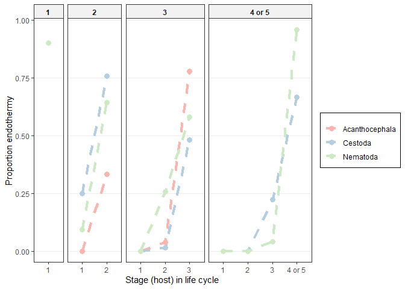

Taxonomic effects
================

  - [Host traits](#host-traits)
      - [Host mass](#host-mass)
          - [First host size decreases with life cycle
            length?](#first-host-size-decreases-with-life-cycle-length)
          - [Final host size increases with life cycle
            length?](#final-host-size-increases-with-life-cycle-length)
      - [Host trophic level](#host-trophic-level)
          - [First host tl decreases with life cycle
            length?](#first-host-tl-decreases-with-life-cycle-length)
          - [Final host TL increases with life cycle
            length?](#final-host-tl-increases-with-life-cycle-length)
      - [Endothermy](#endothermy)
      - [Host mass ratios](#host-mass-ratios)
  - [Parasite traits, stage level](#parasite-traits-stage-level)
      - [Final size](#final-size)
      - [Initial size](#initial-size)
      - [Growth](#growth)
      - [Development time](#development-time)
      - [Growth rate](#growth-rate)
  - [Growth slows with size and age?](#growth-slows-with-size-and-age)
  - [Parasite traits, species level](#parasite-traits-species-level)
      - [Propagule size](#propagule-size)
      - [Age at maturity](#age-at-maturity)
      - [Lifetime growth rate](#lifetime-growth-rate)

Our analysis includes three distinct groups of parasites: acanths,
cestodes, and nematodes. In this notebook, we look at whether the main
results from the manuscript differ among these groups. Our strategy is
to add parasite group to the mixed models used in the main analysis.
Moreover, we allow it to interact with the predictor variables.

# Host traits

We begin by examining host traits.

## Host mass

Starting with host mass, we take parasite phylum out of the random
effecs and add a parasite phylum x stage interaction to the model fixed
effects.

This is a better model, suggesting that phyla infect hosts of different
masses at a given stage.

    ## Delta DIC, stage vs stage x phylum: 45.23089 (higher is better)

However, when we look at r2, we see that the phylum x stage
interaction did not increase the total variance explained very much.

| model          | r2m                   | r2c                   |
| :------------- | :-------------------- | :-------------------- |
| stage          | 0.669 \[0.556-0.701\] | 0.814 \[0.797-0.846\] |
| stage x phylum | 0.686 \[0.612-0.718\] | 0.821 \[0.804-0.852\] |

Let’s check each of the main ‘mass’ results for each worm group.

### First host size decreases with life cycle length?

Here are the predicted first host sizes with different life cycle
lengths. First host size does not decrease in acanths.

|        | parasite\_phylum | Host.no | lcl\_max\_fac | host\_bm.lwr | host\_bm.fit | host\_bm.upr |
| :----- | :--------------- | ------: | :------------ | -----------: | -----------: | -----------: |
| 1673.1 | Acanthocephala   |       1 | 2             |   \-3.453081 |   \-2.675562 |  \-1.8287270 |
| 1681.1 | Acanthocephala   |       1 | 3             |   \-3.183979 |   \-2.045042 |  \-0.7430185 |

It does decrease in cestodes.

|        | parasite\_phylum | Host.no | lcl\_max\_fac | host\_bm.lwr | host\_bm.fit | host\_bm.upr |
| :----- | :--------------- | ------: | :------------ | -----------: | -----------: | -----------: |
| 1669.1 | Platyhelminthes  |       1 | 2             |   \-2.115390 |   \-1.451066 |  \-0.7708711 |
| 1671.1 | Platyhelminthes  |       1 | 3             |   \-4.641044 |   \-3.854011 |  \-3.0819178 |
| 1687.1 | Platyhelminthes  |       1 | 3+            |   \-6.102367 |   \-4.629607 |  \-3.2967585 |

And it decreases in nematodes too.

|        | parasite\_phylum | Host.no | lcl\_max\_fac | host\_bm.lwr | host\_bm.fit | host\_bm.upr |
| :----- | :--------------- | ------: | :------------ | -----------: | -----------: | -----------: |
| 1675.1 | Nematoda         |       1 | 1             |     2.035150 |     2.702019 |    3.4389929 |
| 1664.1 | Nematoda         |       1 | 2             |   \-1.817959 |   \-1.148439 |  \-0.5482138 |
| 1666.1 | Nematoda         |       1 | 3             |   \-3.029710 |   \-2.332895 |  \-1.5659522 |
| 1680.1 | Nematoda         |       1 | 3+            |   \-4.343968 |   \-3.333872 |  \-2.4144079 |

### Final host size increases with life cycle length?

Here are the predicted final host sizes with different life cycle
lengths. Acanths with longer cycles infect bigger definitive hosts.

|        | parasite\_phylum | Host.no | lcl\_max\_fac | host\_bm.lwr | host\_bm.fit | host\_bm.upr |
| :----- | :--------------- | ------: | :------------ | -----------: | -----------: | -----------: |
| 1674.1 | Acanthocephala   |       2 | 2             |     1.592113 |     2.300023 |     3.105576 |
| 1682.1 | Acanthocephala   |       3 | 3             |     2.496043 |     3.278081 |     4.206539 |

Same for cestodes, but the trend is weak.

|        | parasite\_phylum | Host.no | lcl\_max\_fac | host\_bm.lwr | host\_bm.fit | host\_bm.upr |
| :----- | :--------------- | ------: | :------------ | -----------: | -----------: | -----------: |
| 1670.1 | Platyhelminthes  |       2 | 2             |     2.191936 |     2.926320 |     3.544091 |
| 1672.1 | Platyhelminthes  |       3 | 3             |     2.846782 |     3.626639 |     4.414798 |
| 1686.1 | Platyhelminthes  |       4 | 3+            |     2.827181 |     4.036687 |     5.226589 |

The trend in nematodes is also weak.

|        | parasite\_phylum | Host.no | lcl\_max\_fac | host\_bm.lwr | host\_bm.fit | host\_bm.upr |
| :----- | :--------------- | ------: | :------------ | -----------: | -----------: | -----------: |
| 1675.1 | Nematoda         |       1 | 1             |     2.035150 |     2.702019 |     3.438993 |
| 1665.1 | Nematoda         |       2 | 2             |     2.203795 |     2.831797 |     3.472003 |
| 1668.1 | Nematoda         |       3 | 3             |     2.722872 |     3.451807 |     4.168535 |
| 1679.1 | Nematoda         |       4 | 3+            |     3.439848 |     4.325103 |     5.269956 |

Now let’s plot the differences among worm groups. Here is host mass
facetted by life cycle length and helminth group. Comparisons across
helminth groups are tough in this figure.

<!-- --> It
is easier to compare groups if we put them side-by-side. This is
analogous to fig 1a, but with groups separated by taxon.

<!-- -->

## Host trophic level

The next host trait we looked at is trophic level. We take the same
approach. We added a stage by phylum interaction to the model’s fixed
effects and took out the phylum random effect.

This improved the model as judged by DIC.

    ## Delta DIC, stage vs stage x phylum: 103.9223 (higher is better)

However, the overall variance explained did not increase much.

| model          | r2m                   | r2c                   |
| :------------- | :-------------------- | :-------------------- |
| stage          | 0.314 \[0.135-0.367\] | 0.661 \[0.612-0.847\] |
| stage x phylum | 0.349 \[0.297-0.412\] | 0.66 \[0.616-0.718\]  |

Let’s compare the main results for each group.

### First host tl decreases with life cycle length?

Does the first host TL vary with life cycle length? It does not in
acanths.

|        | parasite\_phylum | Host.no | lcl\_max\_fac | host\_tl.lwr | host\_tl.fit | host\_tl.upr |
| :----- | :--------------- | ------: | :------------ | -----------: | -----------: | -----------: |
| 1673.1 | Acanthocephala   |       1 | 2             |     1.763952 |     2.052177 |     2.303648 |
| 1681.1 | Acanthocephala   |       1 | 3             |     1.725691 |     2.120992 |     2.574216 |

Nor in cestodes.

|        | parasite\_phylum | Host.no | lcl\_max\_fac | host\_tl.lwr | host\_tl.fit | host\_tl.upr |
| :----- | :--------------- | ------: | :------------ | -----------: | -----------: | -----------: |
| 1669.1 | Platyhelminthes  |       1 | 2             |     2.465729 |     2.625004 |     2.835048 |
| 1671.1 | Platyhelminthes  |       1 | 3             |     2.091416 |     2.345673 |     2.563010 |
| 1687.1 | Platyhelminthes  |       1 | 3+            |     1.848748 |     2.367679 |     2.795364 |

Nor in nematodes.

|        | parasite\_phylum | Host.no | lcl\_max\_fac | host\_tl.lwr | host\_tl.fit | host\_tl.upr |
| :----- | :--------------- | ------: | :------------ | -----------: | -----------: | -----------: |
| 1675.1 | Nematoda         |       1 | 1             |     2.229486 |     2.395398 |     2.572450 |
| 1664.1 | Nematoda         |       1 | 2             |     2.250544 |     2.402553 |     2.542373 |
| 1666.1 | Nematoda         |       1 | 3             |     2.001630 |     2.189391 |     2.384391 |
| 1680.1 | Nematoda         |       1 | 3+            |     1.940315 |     2.285713 |     2.644708 |

Thus, each group starts their life cycle at about the same host TL.

### Final host TL increases with life cycle length?

Does final host TL increase with life cycle length (i.e. the trophic
vacuum relationship). Yes for acanths.

|        | parasite\_phylum | Host.no | lcl\_max\_fac | host\_tl.lwr | host\_tl.fit | host\_tl.upr |
| :----- | :--------------- | ------: | :------------ | -----------: | -----------: | -----------: |
| 1674.1 | Acanthocephala   |       2 | 2             |     2.688698 |     2.914585 |     3.132504 |
| 1682.1 | Acanthocephala   |       3 | 3             |     3.038832 |     3.331096 |     3.591538 |

Not much for cestodes.

|        | parasite\_phylum | Host.no | lcl\_max\_fac | host\_tl.lwr | host\_tl.fit | host\_tl.upr |
| :----- | :--------------- | ------: | :------------ | -----------: | -----------: | -----------: |
| 1670.1 | Platyhelminthes  |       2 | 2             |     3.084679 |     3.226762 |     3.440522 |
| 1672.1 | Platyhelminthes  |       3 | 3             |     3.278707 |     3.452615 |     3.649713 |
| 1686.1 | Platyhelminthes  |       4 | 3+            |     2.945146 |     3.306896 |     3.659610 |

Yes for nematodes

|        | parasite\_phylum | Host.no | lcl\_max\_fac | host\_tl.lwr | host\_tl.fit | host\_tl.upr |
| :----- | :--------------- | ------: | :------------ | -----------: | -----------: | -----------: |
| 1675.1 | Nematoda         |       1 | 1             |     2.229486 |     2.395398 |     2.572450 |
| 1665.1 | Nematoda         |       2 | 2             |     2.797185 |     2.937487 |     3.092750 |
| 1668.1 | Nematoda         |       3 | 3             |     3.015965 |     3.182013 |     3.358403 |
| 1679.1 | Nematoda         |       4 | 3+            |     2.900105 |     3.201096 |     3.418319 |

This relationship between final host TL and life cycle length was looked
at more explicitly in this
[notebook](../transmission_pp_ratio/trophic_vacuum_noimp.Rmd).

Now we plot the trends. Here is trophic level facetted by life cycle
length and helminth group.

<!-- -->

Here is the same plot as in Figure 1b, but separated by helminth group.

<!-- -->

## Endothermy

Endothermy was hard to model, because at a given stage, taxonomic groups
infected either endotherms or ectotherms, i.e. complete separation. This
results in unrealistic parameter estimates with wide CIs. We can,
though, still compare the variance explained by a model with and without
parasite group.

Adding parasite group alone does not improve the model, but adding a
group x life stage interaction is an improvement.

|      | npar |      AIC |      BIC |     logLik | deviance |     Chisq | Df | Pr(\>Chisq) |
| :--- | ---: | -------: | -------: | ---------: | -------: | --------: | -: | ----------: |
| mod0 |    5 | 1613.238 | 1640.320 | \-801.6190 | 1603.238 |        NA | NA |          NA |
| mod1 |    6 | 1614.123 | 1646.621 | \-801.0616 | 1602.123 |  1.114753 |  1 |    0.291051 |
| mod2 |   10 | 1576.348 | 1630.511 | \-778.1738 | 1556.348 | 45.775638 |  4 |    0.000000 |

Here is the r2 for the model with phylum as a random effect.

    ##                   R2m       R2c
    ## theoretical 0.3833176 0.6527446
    ## delta       0.3500594 0.5961097

And here is the r2 for the model with a stage x phylum
interaction. It accounts for some variation.

    ##                   R2m       R2c
    ## theoretical 0.4106984 0.7449065
    ## delta       0.3839027 0.6963056

So, let’s plot endothermy separate for the 3 parasite groups. In all
cases, endothermy increased rather abruptly at the definitive host
stage, though magnitudes vary.

<!-- -->

## Host mass ratios

Another host trait we considered was the change in host mass from one
host to the next. We compared host mass ratios to predator-prey mass
ratios. We take the same model fitting approach.

The model DIC was a little higher after allowing a stage x phylum
interaction.

    ## Delta DIC, stage vs stage x phylum: 17.49395 (higher is better)

But this variable only explained a few percentage points more of the
total variance.

| model          | r2m                   | r2c                   |
| :------------- | :-------------------- | :-------------------- |
| stage          | 0.327 \[0.275-0.371\] | 0.366 \[0.32-0.419\]  |
| stage x phylum | 0.353 \[0.3-0.397\]   | 0.393 \[0.347-0.452\] |

Now we recreate figure 2 in the ms, but for each group separately.

Here is figure 2a. It looks relatively comparable, though there are some
differences among groups.

<!-- --> Here
is figure 2b, separated by phyla. However, comparisons among phyla are
difficult.

<!-- -->
Therefore, we put them on the same plot.

The size differences between hosts tend to decrease in longer life
cycles in each group.
<!-- --> It
is a little hard to see this, though, because there can be considerable
variation from one stage to the next. Therefore, we also fit a model
with just life cycle length and phylum (not host number). Here are the
estimated means for each taxon. Next host mass, relative to current host
mass, decreases with life cycle length in every group.

|        | parasite\_phylum | lcl\_max\_fac | res\_ma.lwr | res\_ma.fit | res\_ma.upr |
| :----- | :--------------- | :------------ | ----------: | ----------: | ----------: |
| 1251.1 | Acanthocephala   | 2             |   4.0219782 |    5.459797 |    6.873336 |
| 1259.1 | Acanthocephala   | 3             |   1.1659621 |    2.822317 |    4.281992 |
| 1253.1 | Nematoda         | 1             |  14.3950782 |   15.650817 |   16.884933 |
| 1242.1 | Nematoda         | 2             |   5.1590125 |    5.986760 |    6.733018 |
| 1244.1 | Nematoda         | 3             |   2.5237449 |    3.441768 |    4.421713 |
| 1255.1 | Nematoda         | 3+            |   0.8972310 |    2.152097 |    3.627266 |
| 1247.1 | Platyhelminthes  | 2             |   5.2583917 |    6.282141 |    7.301353 |
| 1249.1 | Platyhelminthes  | 3             |   1.3225244 |    2.491519 |    3.509650 |
| 1262.1 | Platyhelminthes  | 3+            |   0.5338714 |    2.235036 |    4.549063 |

We combine the results from the different host traits into a single
figure.

# Parasite traits, stage level

We now move onto to parasite traits. We examined parasite growth and
development at the stage level. We explored growth with a trivariate
model that incorporated the components of growth: initial size, final
size, and developmental time.

We examined which host traits (body mass, trophic level, and endothermy)
impact parasite growth. Now we check whether the effects dependent on
taxonomic group. To test this, we take parasite phylum out of the random
effects and add it as a fixed effect. We fit two versions of the model.
Either we allowed all second-order interactions or we allowed parasite
phylum to interact with all existing terms (i.e. second and third-order
interactions).

Adding parasite phylum and its second-order interactions was an
improvement.

    ## Delta DIC, host traits vs host traits x phylum: 284.5594 (higher is better)

Adding further complex 3-way interactions was also an improvement, but a
smaller one.

    ## Delta DIC, host traits x phylum (2nd order) vs host traits x phylum (3rd order): 63.57919 (higher is better)

To understand why the models improved, we examine each of the three
traits in turn.

## Final size

How much does r2 go up by letting parasite phylum interact
with host traits? For worm final size, moving parasite phylum to the
fixed effects increased marginal R2 but not conditional R2. Thus, the
total variance explained is not increased much by allowing different
host mass, host tl, and endothermy relationships for each parasite
group.

| model                                    | r2m                   | r2c                   |
| :--------------------------------------- | :-------------------- | :-------------------- |
| host traits, 2nd-order interactions      | 0.516 \[0.347-0.578\] | 0.778 \[0.743-0.855\] |
| host traits x parasite phylum            | 0.642 \[0.565-0.703\] | 0.795 \[0.757-0.842\] |
| host traits x parasite phylum, all 2-way | 0.636 \[0.558-0.695\] | 0.793 \[0.759-0.831\] |
| host traits x parasite phylum, all 3-way | 0.633 \[0.541-0.696\] | 0.792 \[0.756-0.836\] |

We can fit the same models with `lmer` to double check. Moving parasite
phylum to the fixed effects looks like an improvement, but allowing it
to have more complex three-way interaction is not an improvement.

|      | npar |      AIC |      BIC |     logLik | deviance |     Chisq | Df | Pr(\>Chisq) |
| :--- | ---: | -------: | -------: | ---------: | -------: | --------: | -: | ----------: |
| l1   |   14 | 5339.186 | 5409.851 | \-2655.593 | 5311.186 |        NA | NA |          NA |
| l2   |   21 | 5259.178 | 5365.175 | \-2608.589 | 5217.178 | 94.008390 |  7 |   0.0000000 |
| l2.1 |   28 | 5263.530 | 5404.861 | \-2603.765 | 5207.530 |  9.647279 |  7 |   0.2094584 |

One of the clearest host trait effects was for worms to get bigger in
bigger hosts. Is this trend observed in all groups? Here is the %
increase in final worm size with a doubling of host mass in
acanthocephalans…

    ## 
    ## Iterations = 501:30471
    ## Thinning interval = 30 
    ## Number of chains = 1 
    ## Sample size per chain = 1000 
    ## 
    ## 1. Empirical mean and standard deviation for each variable,
    ##    plus standard error of the mean:
    ## 
    ##           Mean             SD       Naive SE Time-series SE 
    ##       0.283831       0.058477       0.001849       0.002075 
    ## 
    ## 2. Quantiles for each variable:
    ## 
    ##   2.5%    25%    50%    75%  97.5% 
    ## 0.1756 0.2430 0.2836 0.3239 0.3976

… in cestodes, …

    ## 
    ## Iterations = 501:30471
    ## Thinning interval = 30 
    ## Number of chains = 1 
    ## Sample size per chain = 1000 
    ## 
    ## 1. Empirical mean and standard deviation for each variable,
    ##    plus standard error of the mean:
    ## 
    ##           Mean             SD       Naive SE Time-series SE 
    ##      0.4142712      0.0259886      0.0008218      0.0007781 
    ## 
    ## 2. Quantiles for each variable:
    ## 
    ##   2.5%    25%    50%    75%  97.5% 
    ## 0.3637 0.3976 0.4135 0.4328 0.4649

…and in nematodes.

    ## 
    ## Iterations = 501:30471
    ## Thinning interval = 30 
    ## Number of chains = 1 
    ## Sample size per chain = 1000 
    ## 
    ## 1. Empirical mean and standard deviation for each variable,
    ##    plus standard error of the mean:
    ## 
    ##           Mean             SD       Naive SE Time-series SE 
    ##      0.3053462      0.0254295      0.0008042      0.0008042 
    ## 
    ## 2. Quantiles for each variable:
    ## 
    ##   2.5%    25%    50%    75%  97.5% 
    ## 0.2575 0.2879 0.3060 0.3223 0.3541

The trend is significant for all groups, though it is a bit steeper for
cestodes than acanths and nematodes.

Here are the model predictions plotted. These are equivalent to figure
3a and b, but separated by helminth group. The relationship between host
mass and end worm size is rather consistent across groups.

<!-- --> The
relationship between trophic level and end worm size is more variable
across groups, though it tends to be weak overall.
<!-- --> In
the main manuscript, we also tested whether adding stage to the host
traits model was an improvement. So, we added stage to the host traits x
phylum model. Adding stage alone is a clear improvement.

    ## Delta DIC, host traits x phylum vs +stage: 1070.794 (higher is better)

But adding a phylum by stage interaction is not nearly as important.

    ## Delta DIC, host traits x phylum vs +stage: 196.6395 (higher is better)

Stage explains about another 7% of the variation in final worm size, but
the stage effect did not seem to depend on parasite group, since this
did not explain any additional variation. So, the stages where worms are
larger (or smaller) than expected tend to be consistent across groups.

| model                                    | r2m                   | r2c                   |
| :--------------------------------------- | :-------------------- | :-------------------- |
| host traits x parasite phylum, all 3-way | 0.633 \[0.541-0.696\] | 0.792 \[0.756-0.836\] |
| add life stage                           | 0.643 \[0.54-0.714\]  | 0.867 \[0.842-0.898\] |
| add life stage x phylum interaction      | 0.662 \[0.564-0.723\] | 0.867 \[0.843-0.896\] |

We can confirm this by plotting the residuals from the model that
accounts for host traits and their variable relationship within phyla.
Some stages should have consistently high (or low) residuals if they
grow more or less than expected given the stage/phyla. This is similar
to Fig. 4a in main text, except the residuals are plotted instead of the
real values. In all groups, size in second intermediate hosts was lower
than expected.

<!-- -->

## Initial size

The next parasite trait was initial size. Unlike for final size, adding
phylum x host trait interactions explained some additional variation in
initial size.

| model                                    | r2m                   | r2c                   |
| :--------------------------------------- | :-------------------- | :-------------------- |
| host traits, 2nd-order interactions      | 0.386 \[0.27-0.453\]  | 0.647 \[0.586-0.754\] |
| host traits x parasite phylum            | 0.516 \[0.403-0.588\] | 0.679 \[0.623-0.752\] |
| host traits x parasite phylum, all 2-way | 0.535 \[0.444-0.608\] | 0.686 \[0.633-0.759\] |
| host traits x parasite phylum, all 3-way | 0.53 \[0.424-0.607\]  | 0.709 \[0.651-0.778\] |

We can fit the same models with `lmer` to double check. Moving parasite
phylum to the fixed effects looks like an improvement, as does allowing
it to have more complex three-way interaction.

|      | npar |      AIC |      BIC |     logLik | deviance |    Chisq | Df | Pr(\>Chisq) |
| :--- | ---: | -------: | -------: | ---------: | -------: | -------: | -: | ----------: |
| l1   |   14 | 5050.959 | 5120.257 | \-2511.479 | 5022.959 |       NA | NA |          NA |
| l2   |   21 | 5008.409 | 5112.356 | \-2483.205 | 4966.409 | 56.54925 |  7 |           0 |
| l2.1 |   28 | 4951.047 | 5089.643 | \-2447.523 | 4895.047 | 71.36268 |  7 |           0 |

One overall trend was for worms to enter bigger hosts as bigger larvae.
Is that consistent across groups? Here is the % increase in initial worm
size with a doubling of host mass in acanthocephalans…

    ## 
    ## Iterations = 501:30471
    ## Thinning interval = 30 
    ## Number of chains = 1 
    ## Sample size per chain = 1000 
    ## 
    ## 1. Empirical mean and standard deviation for each variable,
    ##    plus standard error of the mean:
    ## 
    ##           Mean             SD       Naive SE Time-series SE 
    ##       0.463640       0.079178       0.002504       0.002504 
    ## 
    ## 2. Quantiles for each variable:
    ## 
    ##   2.5%    25%    50%    75%  97.5% 
    ## 0.3186 0.4097 0.4588 0.5157 0.6237

… in cestodes, …

    ## 
    ## Iterations = 501:30471
    ## Thinning interval = 30 
    ## Number of chains = 1 
    ## Sample size per chain = 1000 
    ## 
    ## 1. Empirical mean and standard deviation for each variable,
    ##    plus standard error of the mean:
    ## 
    ##           Mean             SD       Naive SE Time-series SE 
    ##      0.1849180      0.0257244      0.0008135      0.0008135 
    ## 
    ## 2. Quantiles for each variable:
    ## 
    ##   2.5%    25%    50%    75%  97.5% 
    ## 0.1319 0.1667 0.1857 0.2018 0.2369

…and in nematodes.

    ## 
    ## Iterations = 501:30471
    ## Thinning interval = 30 
    ## Number of chains = 1 
    ## Sample size per chain = 1000 
    ## 
    ## 1. Empirical mean and standard deviation for each variable,
    ##    plus standard error of the mean:
    ## 
    ##           Mean             SD       Naive SE Time-series SE 
    ##      0.1716629      0.0241266      0.0007629      0.0008530 
    ## 
    ## 2. Quantiles for each variable:
    ## 
    ##   2.5%    25%    50%    75%  97.5% 
    ## 0.1247 0.1548 0.1714 0.1884 0.2188

The relationship is steeper in acanthocephalans than in the other two
groups.

<!-- -->
There was also a tendency for initial size to increase with host trophic
level in all groups.
<!-- -->

What about adding stage? It is a big improvement. Adding a stage x
phylum interaction is not as important, but it is non-negligble. So, it
seems like some stages start larger (or smaller) than expected just in
certain helminths.

| model                                    | r2m                   | r2c                   |
| :--------------------------------------- | :-------------------- | :-------------------- |
| host traits x parasite phylum, all 3-way | 0.53 \[0.424-0.607\]  | 0.709 \[0.651-0.778\] |
| add life stage                           | 0.654 \[0.534-0.713\] | 0.858 \[0.832-0.891\] |
| add life stage x phylum interaction      | 0.689 \[0.574-0.739\] | 0.894 \[0.877-0.917\] |

Here are the residuals for starting size, after correcting for host
trait x phyla effects. Cestodes are have particularly small propagules
in two- and four-host cycles. In general, though, the phylum x stage
interaction does not look very pronounced.

<!-- -->

## Growth

Instead of plotting final and initial size separately, we could plot
relative growth, i.e. the difference between final and initial size. It
increases with host mass for nematodes and cestodes, but not for
acanthocephalans. In all groups, relative growth is a bit larger in
endotherms than comparable ectotherms.

<!-- -->

In all groups, growth tends to decrease with trophic level, suggesting
less growth is conducted in later hosts after more transmission events.
This is mainly because worms enter top predators as larger larvae.

<!-- --> Here
is growth in the median sized ectothermic host for each worm group
(median host mass and trophic level). It tended to be higher in cestodes
than nematodes and acanths, but the differences are not clear, given
that the CIs overlapped.

| parasite\_phylum | host\_bm | host\_tl |       rg |  rg\_upr |  rg\_lwr | fold\_change | fold\_change\_lwr | fold\_change\_upr | host\_bm\_g |
| :--------------- | -------: | -------: | -------: | -------: | -------: | -----------: | ----------------: | ----------------: | ----------: |
| Acanthocephala   | 5.613568 | 2.804482 | 4.367592 | 6.713191 | 1.841313 |     78.85351 |          6.304814 |          823.1931 |    274.1206 |
| Platyhelminthes  | 5.369595 | 2.804482 | 6.119975 | 8.232689 | 3.693794 |    454.85321 |         40.197059 |         3761.9347 |    214.7758 |
| Nematoda         | 5.695528 | 2.804482 | 5.084258 | 7.162490 | 2.906882 |    161.46005 |         18.299657 |         1290.1193 |    297.5339 |

Here is growth in a 1 mg ectotherm host. Largest in acanths and lowest
in nematodes, though CIs are wide.

| parasite\_phylum |   host\_bm | host\_tl |       rg |  rg\_upr |  rg\_lwr | fold\_change | fold\_change\_lwr | fold\_change\_upr | host\_bm\_mg |
| :--------------- | ---------: | -------: | -------: | -------: | -------: | -----------: | ----------------: | ----------------: | -----------: |
| Acanthocephala   | \-6.935035 | 2.804482 | 5.695302 | 8.893266 | 2.623058 |    297.46664 |         13.777790 |          7282.767 |    0.9730885 |
| Platyhelminthes  | \-6.670949 | 2.804482 | 4.051897 | 6.250838 | 1.622225 |     57.50645 |          5.064348 |           518.447 |    1.2671955 |
| Nematoda         | \-6.857156 | 2.804482 | 3.866607 | 6.094799 | 1.473444 |     47.78001 |          4.364239 |           443.545 |    1.0519018 |

Compare that to growth in a host three orders of magnitude larger (1 g).
Growth is comparable across groups.

| parasite\_phylum |    host\_bm | host\_tl |       rg |  rg\_upr |  rg\_lwr | fold\_change | fold\_change\_lwr | fold\_change\_upr | host\_bm\_g |
| :--------------- | ----------: | -------: | -------: | -------: | -------: | -----------: | ----------------: | ----------------: | ----------: |
| Acanthocephala   |   0.1235540 | 2.804482 | 4.976076 | 7.539304 | 2.519436 |    144.90467 |          12.42160 |         1880.5201 |   1.1315111 |
| Platyhelminthes  |   0.1345756 | 2.804482 | 5.222286 | 7.267920 | 2.778446 |    185.35741 |          16.09399 |         1433.5657 |   1.1440512 |
| Nematoda         | \-0.0980181 | 2.804482 | 4.537504 | 6.638228 | 2.321700 |     93.45722 |          10.19299 |          763.7402 |   0.9066325 |

Finally compare growth in a host three more orders of magnitude larger
(1 kg). It was highest in cestodes and lowest in acanths.

| parasite\_phylum | host\_bm | host\_tl |       rg |  rg\_upr |  rg\_lwr | fold\_change | fold\_change\_lwr | fold\_change\_upr | host\_bm\_kg |
| :--------------- | -------: | -------: | -------: | -------: | -------: | -----------: | ----------------: | ----------------: | -----------: |
| Acanthocephala   | 6.790000 | 2.804482 | 4.238330 | 6.689885 | 1.607513 |     69.29201 |          4.990385 |          804.2294 |    0.8889132 |
| Platyhelminthes  | 6.940100 | 2.804482 | 6.415601 | 8.500518 | 3.941656 |    611.30818 |         51.503842 |         4917.3157 |    1.0328738 |
| Nematoda         | 7.143915 | 2.804482 | 5.216655 | 7.350895 | 3.067539 |    184.31654 |         21.488951 |         1557.5900 |    1.2663764 |

We can fit `lmer` models to confirm that growth x host trait
relationships differed among taxa. Adding parasite phyla and its 3-way
interactions both improved the model.

|      | npar |      AIC |      BIC |     logLik | deviance |     Chisq | Df | Pr(\>Chisq) |
| :--- | ---: | -------: | -------: | ---------: | -------: | --------: | -: | ----------: |
| l1   |   14 | 4429.479 | 4495.596 | \-2200.739 | 4401.479 |        NA | NA |          NA |
| l2   |   21 | 4342.794 | 4441.969 | \-2150.397 | 4300.794 | 100.68479 |  7 |       0e+00 |
| l2.1 |   28 | 4312.258 | 4444.491 | \-2128.129 | 4256.258 |  44.53652 |  7 |       2e-07 |

Here are the r2 values for adding phylum to the host traits
model.

    ##            R2m       R2c
    ## [1,] 0.2758399 0.4322243

    ##            R2m       R2c
    ## [1,] 0.3807204 0.5151027

    ##            R2m       R2c
    ## [1,] 0.3838638 0.5160341

What about endothermy? Do worms grow more in endotherms? This is
relative growth in an average-sized host for each group. It is
consistently higher in endotherms, though not quite significantly for
acanths.

| parasite\_phylum | endo\_ecto | host\_bm | host\_tl |  rg\_lwr |       rg |   rg\_upr | host\_bm\_g |
| :--------------- | :--------- | -------: | -------: | -------: | -------: | --------: | ----------: |
| Acanthocephala   | ecto       | 5.613568 | 2.804482 | 1.841313 | 4.367592 |  6.713191 |    274.1206 |
| Acanthocephala   | endo       | 5.464795 | 2.804482 | 3.254641 | 5.801939 |  8.426223 |    236.2274 |
| Platyhelminthes  | ecto       | 5.369595 | 2.804482 | 3.693794 | 6.119975 |  8.232689 |    214.7758 |
| Platyhelminthes  | endo       | 5.620189 | 2.804482 | 7.000816 | 9.334574 | 11.556763 |    275.9415 |
| Nematoda         | ecto       | 5.695528 | 2.804482 | 2.906882 | 5.084258 |  7.162490 |    297.5339 |
| Nematoda         | endo       | 5.414853 | 2.804482 | 5.396432 | 7.495402 |  9.604753 |    224.7194 |

When we explicitly add endothermy to a model for relative growth that
already includes other host trait and phyla effects, it is an
improvement. An endothermy by phyla interaction is not important
suggesting the effect of endothermy on relative growth is fairly
constant.

|     | npar |      AIC |      BIC |     logLik | deviance |    Chisq | Df | Pr(\>Chisq) |
| :-- | ---: | -------: | -------: | ---------: | -------: | -------: | -: | ----------: |
| lx  |   17 | 1888.564 | 1955.457 | \-927.2818 | 1854.564 |       NA | NA |          NA |
| le  |   18 | 1881.380 | 1952.208 | \-922.6902 | 1845.380 | 9.183280 |  1 |   0.0024424 |
| le2 |   20 | 1883.904 | 1962.602 | \-921.9520 | 1843.904 | 1.476361 |  2 |   0.4779829 |

Endothermy increases the variance in growth explained by host traits
from 38 to 41%.

    ##            R2m       R2c
    ## [1,] 0.3824105 0.6100736

    ##            R2m       R2c
    ## [1,] 0.4121724 0.6212526

## Development time

Moving onto development time, adding parasite group and its interactions
with host traits explains som additional variation, but not much.

| model                                    | r2m                   | r2c                   |
| :--------------------------------------- | :-------------------- | :-------------------- |
| host traits, 2nd-order interactions      | 0.239 \[0.119-0.34\]  | 0.721 \[0.636-0.851\] |
| host traits x parasite phylum            | 0.322 \[0.201-0.541\] | 0.732 \[0.641-0.856\] |
| host traits x parasite phylum, all 2-way | 0.387 \[0.248-0.583\] | 0.763 \[0.691-0.871\] |
| host traits x parasite phylum, all 3-way | 0.419 \[0.26-0.569\]  | 0.779 \[0.707-0.867\] |

We can fit the same models with `lmer` to double check. Moving parasite
phylum to the fixed effects looks like an improvement, but adding the
most complex interactions are not very important.

|      | npar |      AIC |      BIC |     logLik | deviance |    Chisq | Df | Pr(\>Chisq) |
| :--- | ---: | -------: | -------: | ---------: | -------: | -------: | -: | ----------: |
| l1   |   14 | 1192.609 | 1253.546 | \-582.3045 | 1164.609 |       NA | NA |          NA |
| l2   |   21 | 1107.235 | 1198.640 | \-532.6173 | 1065.235 | 99.37446 |  7 |   0.0000000 |
| l2.1 |   28 | 1107.480 | 1229.353 | \-525.7399 | 1051.480 | 13.75475 |  7 |   0.0557193 |

The solid and dashed lines represent trends including or excluding short
devo times (\< 1 week). They are quite consistent (different with
imputed data). All groups tended to spend more time developing in larger
ectotherms and less time developing in endotherms.

<!-- -->
Here is the developmental time in a 1 mg ectotherm. It is a bit shorter
in nematodes and longer in acanths.

| parasite\_phylum |   host\_bm | host\_tl | days\_dt | days\_dt\_lwr | days\_dt\_upr | host\_bm\_g |
| :--------------- | ---------: | -------: | -------: | ------------: | ------------: | ----------: |
| Acanthocephala   | \-6.935035 | 2.804482 | 33.00078 |      14.18874 |      82.37738 |   0.0009731 |
| Platyhelminthes  | \-6.670949 | 2.804482 | 24.01178 |      10.30157 |      72.41213 |   0.0012672 |
| Nematoda         | \-6.857156 | 2.804482 | 12.80091 |       6.44924 |      24.78710 |   0.0010519 |

Here are developmental times in a 1 kg ectotherm. It is longer in larger
hosts, but particularly for nematodes and less so for cestodes.

| parasite\_phylum | host\_bm | host\_tl | days\_dt | days\_dt\_lwr | days\_dt\_upr | host\_bm\_g |
| :--------------- | -------: | -------: | -------: | ------------: | ------------: | ----------: |
| Acanthocephala   | 6.790000 | 2.804482 | 57.63293 |      24.99192 |      117.7441 |    888.9132 |
| Platyhelminthes  | 6.940100 | 2.804482 | 38.36454 |      16.72271 |      107.1232 |   1032.8738 |
| Nematoda         | 7.143915 | 2.804482 | 63.14422 |      31.07308 |      121.5875 |   1266.3764 |

When we plot the relationship with trophic level, the difference between
endo and ectotherms is clearer.

<!-- -->

Here is the difference in developmental times between endo and
ectotherms (average sized host) for each parasite group. The difference
is relatively consistent (\~20 days).

| parasite\_phylum | endo\_ecto | host\_bm | host\_tl | days\_dt | days\_dt\_lwr | days\_dt\_upr | host\_bm\_g |
| :--------------- | :--------- | -------: | -------: | -------: | ------------: | ------------: | ----------: |
| Acanthocephala   | ecto       | 5.613568 | 2.804482 | 55.27614 |     24.549039 |     108.68302 |    274.1206 |
| Acanthocephala   | endo       | 5.464795 | 2.804482 | 31.72819 |     15.439720 |      69.46358 |    236.2274 |
| Platyhelminthes  | ecto       | 5.369595 | 2.804482 | 36.21569 |     15.779523 |     101.61667 |    214.7758 |
| Platyhelminthes  | endo       | 5.620189 | 2.804482 | 14.53216 |      6.276938 |      42.74095 |    275.9415 |
| Nematoda         | ecto       | 5.695528 | 2.804482 | 53.69321 |     26.659911 |     101.35880 |    297.5339 |
| Nematoda         | endo       | 5.414853 | 2.804482 | 32.65182 |     16.503853 |      60.57284 |    224.7194 |

Notably, this difference was larger than in the model without
distinguishing the parasite groups.

| endo\_ecto | host\_bm | host\_tl | days\_dt | days\_dt\_lwr | days\_dt\_upr | host\_bm\_g |
| :--------- | -------: | -------: | -------: | ------------: | ------------: | ----------: |
| ecto       | 5.369595 | 2.804482 | 40.66332 |      20.59994 |      87.19114 |    214.7758 |
| endo       | 5.414853 | 2.804482 | 26.31863 |      13.05323 |      54.96619 |    224.7194 |

What about adding stage? It is an improvement and adding a stage x
phylum interaction is a slight further improvement. So, it seems like
some stages develop longer (or shorter) than expected just in certain
helminths.

| model                                    | r2m                   | r2c                   |
| :--------------------------------------- | :-------------------- | :-------------------- |
| host traits x parasite phylum, all 3-way | 0.419 \[0.26-0.569\]  | 0.779 \[0.707-0.867\] |
| add life stage                           | 0.483 \[0.334-0.626\] | 0.82 \[0.757-0.896\]  |
| add life stage x phylum interaction      | 0.518 \[0.374-0.631\] | 0.829 \[0.772-0.896\] |

The plot suggests that less development is happening than expected in
cestodes with long life cycles. But overall, there is not a clear trend.
<!-- -->

## Growth rate

For relative growth rate, adding parasite phylum to a model with host
traits was an improvement, though comcomplex 3-way interactions do not
seem important.

|      | npar |        AIC |        BIC |    logLik |   deviance |     Chisq | Df | Pr(\>Chisq) |
| :--- | ---: | ---------: | ---------: | --------: | ---------: | --------: | -: | ----------: |
| l1   |   14 | \-121.1247 | \-66.03615 |  74.56234 | \-149.1247 |        NA | NA |          NA |
| l2   |   21 | \-174.4621 | \-91.82932 | 108.23105 | \-216.4621 | 67.337428 |  7 |    0.000000 |
| l2.1 |   28 | \-169.9395 | \-59.76244 | 112.96974 | \-225.9395 |  9.477373 |  7 |    0.220174 |

Differences phyla x host trait relationships explain an additional 10%
of the variation. Looking at model parameters (not shown) suggests this
is because tapeworms have accelerated growth.

    ##            R2m       R2c
    ## [1,] 0.1343865 0.4261883

    ##            R2m       R2c
    ## [1,] 0.2820926 0.5549086

    ##            R2m       R2c
    ## [1,] 0.2939081 0.5733597

We can see this in the plot. Growth rate is only plotted for stages that
spent at least 1 week developing. Growth rate decreased with host size
in acanths and nematodes but not cestodes. The rapid growth in cestodes,
though, may be driven by outliers.

<!-- -->

Here is the relative growth rate in a 1 mg ectotherm (left side of
plot)…

| parasite\_phylum |   host\_bm | host\_tl |       rgr |  rgr\_lwr |  rgr\_upr | host\_bm\_g |
| :--------------- | ---------: | -------: | --------: | --------: | --------: | ----------: |
| Acanthocephala   | \-6.935035 | 2.804482 | 0.1787671 | 0.0566299 | 0.4715869 |   0.0009731 |
| Platyhelminthes  | \-6.670949 | 2.804482 | 0.1942899 | 0.0625602 | 0.4864404 |   0.0012672 |
| Nematoda         | \-6.857156 | 2.804482 | 0.2930219 | 0.1006128 | 0.7071743 |   0.0010519 |

…and a 1 kg ectotherm (right side of plot). Growth rates decrease for
acanths and nematodes but not cestodes.

| parasite\_phylum | host\_bm | host\_tl |       rgr |  rgr\_lwr |  rgr\_upr | host\_bm\_g |
| :--------------- | -------: | -------: | --------: | --------: | --------: | ----------: |
| Acanthocephala   | 6.790000 | 2.804482 | 0.0841867 | 0.0266781 | 0.1998996 |    888.9132 |
| Platyhelminthes  | 6.940100 | 2.804482 | 0.2314553 | 0.0931801 | 0.5604829 |   1032.8738 |
| Nematoda         | 7.143915 | 2.804482 | 0.0965161 | 0.0467446 | 0.2052711 |   1266.3764 |

Growth weakly decreased with trophic level, presumably because worms
enter higher trophic level hosts as larger larvae.

<!-- -->

Here is the difference in relative growth rate between endo and
ectotherms in each group. Growth is consistenly faster in endotherms,
but the differences in each group are not clearly significant.

| parasite\_phylum | endo\_ecto | host\_bm | host\_tl |  rgr\_lwr |       rgr |  rgr\_upr | host\_bm\_g |
| :--------------- | :--------- | -------: | -------: | --------: | --------: | --------: | ----------: |
| Acanthocephala   | ecto       | 5.613568 | 2.804482 | 0.0300302 | 0.0905677 | 0.2071214 |    274.1206 |
| Acanthocephala   | endo       | 5.464795 | 2.804482 | 0.0701736 | 0.1785410 | 0.3893096 |    236.2274 |
| Platyhelminthes  | ecto       | 5.369595 | 2.804482 | 0.0933993 | 0.2327086 | 0.5528362 |    214.7758 |
| Platyhelminthes  | endo       | 5.620189 | 2.804482 | 0.1998123 | 0.5181224 | 1.2128262 |    275.9415 |
| Nematoda         | ecto       | 5.695528 | 2.804482 | 0.0526063 | 0.1096025 | 0.2341923 |    297.5339 |
| Nematoda         | endo       | 5.414853 | 2.804482 | 0.1215001 | 0.2296090 | 0.4804682 |    224.7194 |

On the other hand, when we explicitly add endothermy to a model for
relative growth rate than already includes other host trait and phyla
effects, it is an improvement. An endothermy by phyla interaction also
suggests the effect of endothermy differs among groups (it has a bigger
effect on cestodes).

|     | npar |        AIC |        BIC |    logLik |   deviance |    Chisq | Df | Pr(\>Chisq) |
| :-- | ---: | ---------: | ---------: | --------: | ---------: | -------: | -: | ----------: |
| lx  |   17 | \-137.0720 | \-70.17878 |  85.53599 | \-171.0720 |       NA | NA |          NA |
| le  |   18 | \-164.6007 | \-93.77262 | 100.30036 | \-200.6007 | 29.52873 |  1 |   0.0000001 |
| le2 |   20 | \-175.8271 | \-97.12924 | 107.91356 | \-215.8271 | 15.22641 |  2 |   0.0004939 |

Endothermy increases the variance explained by host traits from 12 to
16%. Allowing its effect to vary by parasite group increases this to
21%.

    ##            R2m       R2c
    ## [1,] 0.1167463 0.6851476

    ##            R2m       R2c
    ## [1,] 0.1639265 0.6906336

    ##            R2m       R2c
    ## [1,] 0.2151537 0.6564634

<!-- -->

# Growth slows with size and age?

We found that overall growth rate slowed as worms became larger and
older. Was this true in each helminth group? We asymptotic curves only
using species where full devo data are available.

In each group, the curve is a better fit than a line, as the residual
standard errors are much lower than for a line.

| group           | line\_res\_se | curve\_res\_se |
| :-------------- | ------------: | -------------: |
| Acanthocephala  |      2.569094 |       1.569367 |
| Platyhelminthes |      4.028318 |       2.780233 |
| Nematoda        |      4.118977 |       2.323714 |

We can also see this by plotting the curves. Overall the curves are
similar among groups, though nematodes might plateau at a smaller size,
and cestodes might grow faster to an asymptote.

<!-- -->
Here is the same plot, but separated by life cycle length. The curve
fits all groups similarly. Nematodes in their first hosts, though, tend
to grow faster than other groups.
<!-- -->

# Parasite traits, species level

Finally, we looked at species level parasite traits, like size and age
at maturity. Before loading those data, we save our models.

Then we load the output from analyses at the species level.

We refit the multivariate model. Now we allow the effect of life cycle
length to vary with helminth group.

Here is the number of species included in the model:

| parasite\_phylum | n\_dt | n\_end\_size | n\_ini\_size |
| :--------------- | ----: | -----------: | -----------: |
| Acanthocephala   |    22 |           84 |           86 |
| Nematoda         |   200 |          400 |          385 |
| Platyhelminthes  |    56 |          293 |          223 |

The models were better when we included the phylum interaction,
suggesting life cycle length effects vary by taxon.

    ## Delta DIC, stage vs stage x phylum: 25.05805 (higher is better)

We look at each trait individually to see which effects vary with
helminth group.

## Propagule size

We were not explicitly interested in propagule size, but we modelled it
because it was used in growth calculations. Life cycle length explained
very little variation in propagule size, but phylum seemed to explain
some variation. Overall variance explained did not increase though.

| model           | r2m                   | r2c                  |
| :-------------- | :-------------------- | :------------------- |
| lcl categorical | 0.008 \[0.001-0.031\] | 0.833 \[0.76-0.903\] |
| lcl x phylum    | 0.1 \[0.019-0.371\]   | 0.833 \[0.76-0.915\] |

Here is the plot. Differences among groups are small.

<!-- -->
\#\# Adult size

what about size at maturity? There is a big effect of phylum - different
groups have different adult sizes - but the overall explained variance
does not increase much. This suggests there are not large differences
among the helminth groups in how adult size changes with life cycle
length.

| model           | r2m                  | r2c                   |
| :-------------- | :------------------- | :-------------------- |
| lcl categorical | 0.02 \[0.004-0.055\] | 0.832 \[0.78-0.897\]  |
| lcl x phylum    | 0.215 \[0.05-0.437\] | 0.854 \[0.802-0.911\] |

Let’s check how adult size increased per additional host in the life
cycle for each group separately. Here is the % increase in final worm
size with an additional host for acanthocephalans (between 2- and 3-host
cycles). It was positive, but not significant.

    ## 
    ## Iterations = 501:30471
    ## Thinning interval = 30 
    ## Number of chains = 1 
    ## Sample size per chain = 1000 
    ## 
    ## 1. Empirical mean and standard deviation for each variable,
    ##    plus standard error of the mean:
    ## 
    ##           Mean             SD       Naive SE Time-series SE 
    ##        0.16781        0.56173        0.01776        0.01776 
    ## 
    ## 2. Quantiles for each variable:
    ## 
    ##     2.5%      25%      50%      75%    97.5% 
    ## -0.56713 -0.22930  0.03676  0.42422  1.60760

In cestodes, the increase in adult size with life cycle length is
significant.

    ## 
    ## Iterations = 501:30471
    ## Thinning interval = 30 
    ## Number of chains = 1 
    ## Sample size per chain = 1000 
    ## 
    ## 1. Empirical mean and standard deviation for each variable,
    ##    plus standard error of the mean:
    ## 
    ##           Mean             SD       Naive SE Time-series SE 
    ##        1.42887        0.63580        0.02011        0.02390 
    ## 
    ## 2. Quantiles for each variable:
    ## 
    ##   2.5%    25%    50%    75%  97.5% 
    ## 0.4132 1.0000 1.3499 1.7767 2.8325

In nematodes it is also significant.

    ## 
    ## Iterations = 501:30471
    ## Thinning interval = 30 
    ## Number of chains = 1 
    ## Sample size per chain = 1000 
    ## 
    ## 1. Empirical mean and standard deviation for each variable,
    ##    plus standard error of the mean:
    ## 
    ##           Mean             SD       Naive SE Time-series SE 
    ##       0.510121       0.273942       0.008663       0.008663 
    ## 
    ## 2. Quantiles for each variable:
    ## 
    ##    2.5%     25%     50%     75%   97.5% 
    ## 0.05186 0.31628 0.48445 0.67144 1.18353

Here is the plot. The increase in cestodes and nematodes is clear, but
not in acanths.

<!-- -->

## Age at maturity

Like for size at maturity, age at maturity across phyla (increase in
marginal r2) but life cycle length effects might not vary with phyla (no
increase in conditional r2).

| model           | r2m                  | r2c                   |
| :-------------- | :------------------- | :-------------------- |
| lcl categorical | 0.03 \[0.006-0.079\] | 0.845 \[0.757-0.931\] |
| lcl x phylum    | 0.134 \[0.04-0.4\]   | 0.841 \[0.746-0.926\] |

Let’s check how age at maturity varied with life cycle length. For
acanths, the change was not significant.

    ## 
    ## Iterations = 501:30471
    ## Thinning interval = 30 
    ## Number of chains = 1 
    ## Sample size per chain = 1000 
    ## 
    ## 1. Empirical mean and standard deviation for each variable,
    ##    plus standard error of the mean:
    ## 
    ##           Mean             SD       Naive SE Time-series SE 
    ##      -0.102130       0.271048       0.008571       0.015614 
    ## 
    ## 2. Quantiles for each variable:
    ## 
    ##     2.5%      25%      50%      75%    97.5% 
    ## -0.50957 -0.30380 -0.13202  0.05104  0.53762

Nor was it significant for cestodes.

    ## 
    ## Iterations = 501:30471
    ## Thinning interval = 30 
    ## Number of chains = 1 
    ## Sample size per chain = 1000 
    ## 
    ## 1. Empirical mean and standard deviation for each variable,
    ##    plus standard error of the mean:
    ## 
    ##           Mean             SD       Naive SE Time-series SE 
    ##      -0.182964       0.176406       0.005578       0.012572 
    ## 
    ## 2. Quantiles for each variable:
    ## 
    ##    2.5%     25%     50%     75%   97.5% 
    ## -0.4615 -0.3088 -0.2048 -0.0793  0.2190

But it did increase for nematodes.

    ## 
    ## Iterations = 501:30471
    ## Thinning interval = 30 
    ## Number of chains = 1 
    ## Sample size per chain = 1000 
    ## 
    ## 1. Empirical mean and standard deviation for each variable,
    ##    plus standard error of the mean:
    ## 
    ##           Mean             SD       Naive SE Time-series SE 
    ##       0.294385       0.098940       0.003129       0.004634 
    ## 
    ## 2. Quantiles for each variable:
    ## 
    ##   2.5%    25%    50%    75%  97.5% 
    ## 0.1218 0.2213 0.2893 0.3664 0.4987

Here is the plot. The increase in nematodes is clear, but not in acanths
or cestodes.

<!-- -->

## Lifetime growth rate

<!-- -->
