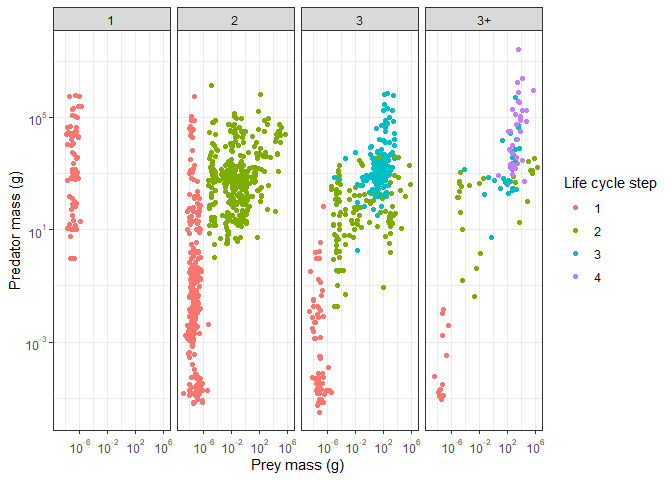

Transmission benefits
================

One presumed advantage of complex life cycles is that they facilitate
transmission. To explore this, we compare the mass ratio of parasites’
current and next hosts with predator and prey mass ratios. These
parasites are trophically transmitted, so if parasites infect predators
that are extremely large (or small) relative to their prey, then we
might expect lower transmission rates.

For the first host stage, propagule size was taken as the prey mass. In
all other parasite stages, prey mass was the size of the current host
and predator mass the size of the next host.

Here is a plot of next host mass vs current host (or propagule) mass.
Clearly, the ratio between first host size and propagule size differs
among life cycle lengths.

<!-- -->

We wish to compare this parasite data to “typical” predator-prey feeding
interactions. For that, we use data from [Brose et
al. 2019](https://www.nature.com/articles/s41559-019-0899-x?proof=true&draft=collection%3Fproof%3Dtrue).

This is the number of unique trophic links in the data.

    ## [1] 87624

Next, we plot parasite trophic links on top of the large set of predator
prey links. Parasites tend fall on the upper part of the plot, i.e. they
infect large predators given the mass of the prey. In other words, next
hosts are large relative to current hosts.

<!-- -->

Let’s quantify this. Since prey and predator mass are estimated with
similar error, major axis regression is appropriate. That is also the
method used by Brose et al.

Here are the results from that model. The MA regression has a higher
intercept and steeper slope than the ordinary least squares regression.

    ## 
    ## Model II regression
    ## 
    ## Call: lmodel2(formula = log(con_g) ~ log(res_g), data = brose)
    ## 
    ## n = 87624   r = 0.5296653   r-square = 0.2805454 
    ## Parametric P-values:   2-tailed = 0    1-tailed = 0 
    ## Angle between the two OLS regression lines = 33.6143 degrees
    ## 
    ## Regression results
    ##   Method Intercept     Slope Angle (degrees) P-perm (1-tailed)
    ## 1    OLS 0.3355998 0.4302926        23.28185                NA
    ## 2     MA 2.3705910 0.6801140        34.22017                NA
    ## 3    SMA 3.4480496 0.8123859        39.08992                NA
    ## 
    ## Confidence intervals
    ##   Method 2.5%-Intercept 97.5%-Intercept 2.5%-Slope 97.5%-Slope
    ## 1    OLS      0.2854252       0.3857745  0.4257300   0.4348552
    ## 2     MA      2.3120428       2.4295332  0.6729264   0.6873499
    ## 3    SMA      3.4109880       3.4853198  0.8078361   0.8169613
    ## 
    ## Eigenvalues: 70.55288 20.04852 
    ## 
    ## H statistic used for computing C.I. of MA: 2.431276e-05

Here is the plot comparing the MA (dashed) and OLS (solid) regressions.
The MA seems better.

<!-- -->

Now we can split that plot by life cycle length to see how worms with
different life cycle compare. Worms with longer life cycles fall closer
to the regression line, suggesting their next host predators are a more
typical size, given their current host.

<!-- -->

Let’s look explicitly at the residual values. For parasitized trophic
links, we calculated the difference between observed and expected
predator mass (i.e. the residuals).

Now we fit taxonomic mixed models to this data, analogous to those on
the other host traits like mass. First we add “step in the life cycle”,
i.e. first host, second host, etc., adding either as a continuous or
categorical variable. Then we added life cycle length to the model.
Finally, we consider parasite stage, i.e. the combination of host number
and life cycle length.

Here is the number of stages and species in the model.

| n\_stages | n\_spp |
| --------: | -----: |
|      1241 |    681 |

We’ll start by comparing model fits. Here is the trace for deviance
(like the model likelihood). Adding host number as a continuous (red) or
factor (green) is not an improvement over the intercept-only model
(black). Adding life cycle length (blue) is a clearer improvement, but
the interaction between life cycle length and host number is not that
important.

<!-- -->

Here are the DIC values for the models.

    ## DIC, int-only: 7336.441

    ## DIC, host number (cont); 7338.757

    ## DIC, host number (cat); 7338.732

    ## DIC, life cycle length (cat); 7175.006

    ## DIC, host number x life cycle length interaction; 7172.942

The comparison of DIC values suggests the host number addition is not an
improvement.

    ## Delta DIC, int-only vs host number (categorical): -2.290822 (higher is better)

The addition of life cycle length as a categorical variable is a clear
improvement.

    ## Delta DIC, host number (categorical) vs +life cycle length (categorical): 163.726 (higher is better)

The addition of the host number by life cycle length interaction is only
a slight improvement.

    ## Delta DIC, main effects vs +host number x life cycle length interaction: 2.064403 (higher is better)

The next plot demonstrates the main effects. Mass ratios get smaller
with life cycle length, but not with stage in the life cycle.

<!-- -->

First, we can look at the overall average (intercept from int-only
model). It suggests parasites infect next host predators that are large
relative to the size of the current host prey.

| param       |      lwr |      fit |      upr | sig | fold\_diff\_from\_exp | fold\_diff\_lwr | fold\_diff\_upr |
| :---------- | -------: | -------: | -------: | :-- | --------------------: | --------------: | --------------: |
| (Intercept) | 1.892556 | 5.501535 | 9.530352 | sig |              245.0678 |        6.636309 |        13771.44 |

Here are the model parameters and credible intervals for the host number
(cont) model…

| param       |         lwr |         fit |        upr | sig |
| :---------- | ----------: | ----------: | ---------: | :-- |
| (Intercept) |   2.6189956 |   6.5317022 |   9.915259 | sig |
| Host.no     | \-0.9320615 | \-0.5310037 | \-0.144922 | sig |

…the model treating host number as a category…

| param          |         lwr |         fit |         upr | sig |
| :------------- | ----------: | ----------: | ----------: | :-- |
| (Intercept)    |   2.2673350 |   5.9012420 |   9.0865885 | sig |
| Host\_no\_fac2 | \-0.9422803 | \-0.2807174 |   0.3323588 | ns  |
| Host\_no\_fac3 | \-2.2747854 | \-1.4303207 | \-0.4817296 | sig |
| Host\_no\_fac4 | \-2.8161167 | \-1.0057558 |   0.6508111 | ns  |

…the model adding life cycle length…

| param           |          lwr |          fit |          upr | sig |
| :-------------- | -----------: | -----------: | -----------: | :-- |
| (Intercept)     |   14.3942896 |   15.5430674 |   16.8219078 | sig |
| Host\_no\_fac2  |  \-0.2183253 |    0.3069476 |    0.8095261 | ns  |
| Host\_no\_fac3  |  \-0.2276980 |    0.6985334 |    1.5822544 | ns  |
| Host\_no\_fac4  |  \-0.7477813 |    0.9853223 |    2.6708149 | ns  |
| lcl\_max\_fac2  | \-10.9241903 |  \-9.7454140 |  \-8.6169234 | sig |
| lcl\_max\_fac3  | \-14.3941070 | \-13.0637076 | \-11.7619574 | sig |
| lcl\_max\_fac3+ | \-15.6743800 | \-14.0660322 | \-12.2592049 | sig |

…and the most complex model with all stages.

| param             |        lwr |         fit |         upr | sig |
| :---------------- | ---------: | ----------: | ----------: | :-- |
| (Intercept)       |   14.26772 |   15.561986 |   16.761623 | sig |
| stage\_lcllc2\_1  | \-10.79481 |  \-9.518918 |  \-8.253932 | sig |
| stage\_lcllc2\_2  | \-10.83107 |  \-9.619389 |  \-8.345935 | sig |
| stage\_lcllc3\_1  | \-15.32708 | \-13.761115 | \-12.192634 | sig |
| stage\_lcllc3\_2  | \-13.80964 | \-12.420336 | \-11.025401 | sig |
| stage\_lcllc3\_3  | \-13.63579 | \-12.277159 | \-10.899941 | sig |
| stage\_lcllc3+\_1 | \-18.28349 | \-15.489095 | \-12.998546 | sig |
| stage\_lcllc3+\_2 | \-14.64597 | \-12.589080 | \-10.515958 | sig |
| stage\_lcllc3+\_3 | \-15.43294 | \-13.639033 | \-11.896516 | sig |
| stage\_lcllc3+\_4 | \-14.91134 | \-13.003856 | \-10.923142 | sig |

Since life cycle length was the main term that impacted next host mass,
we also fit a model with just life cycle length.

| param           |       lwr |       fit |       upr | sig | fold\_change | fold\_change\_lwr | fold\_change\_upr |
| :-------------- | --------: | --------: | --------: | :-- | -----------: | ----------------: | ----------------: |
| lcl\_max\_fac1  | 14.259435 | 15.570303 | 16.794222 | sig |      5782247 |           1558813 |          19662463 |
| lcl\_max\_fac2  |  5.327103 |  6.000318 |  6.606345 | sig |          404 |               206 |               740 |
| lcl\_max\_fac3  |  2.086968 |  2.953751 |  3.695567 | sig |           19 |                 8 |                40 |
| lcl\_max\_fac3+ |  1.003482 |  2.119475 |  3.297491 | sig |            8 |                 3 |                27 |

Here’s the R2 table for the models. Life cycle step explains
almost no variation, while life cycle length accounts \~30% of the
variation in next host mass. Taxonomy still has an effect too - related
parasites infect bigger or smaller hosts than expected given their life
cycle.

| model                 | r2m                   | r2c                   |
| :-------------------- | :-------------------- | :-------------------- |
| int-only and taxonomy | 0 \[0-0\]             | 0.44 \[0.323-0.814\]  |
| steps in cycle, cont  | 0.005 \[0-0.016\]     | 0.418 \[0.299-0.814\] |
| steps, categorical    | 0.008 \[0.001-0.021\] | 0.41 \[0.295-0.805\]  |
| life cycle length     | 0.322 \[0.271-0.364\] | 0.359 \[0.316-0.408\] |
| step x lcl            | 0.326 \[0.275-0.369\] | 0.365 \[0.32-0.418\]  |

Let’s look at how the taxonomic effect breaks down. Once we account for
stage effects, we see that parasite families tend to infect next hosts
that are consistently bigger (or smaller) than expected from their
current hosts.

<!-- -->

But our main interest is in life stages, so let’s put the model
predictions onto the boxplot of the observed data.

The plot shows how the average divergence from expectations shrinks with
life cycle length. Longer life cycle parasites are transmitted along
more “average” trophic links than those with shorter cycles.

<!-- -->
