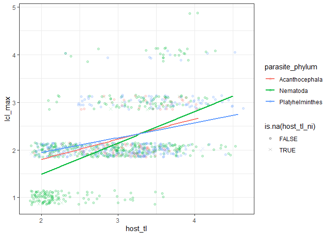
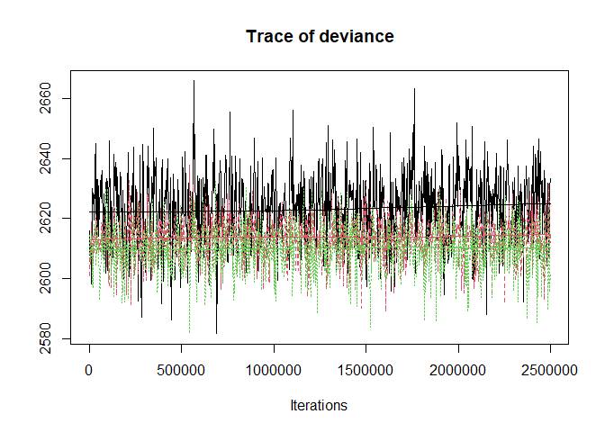
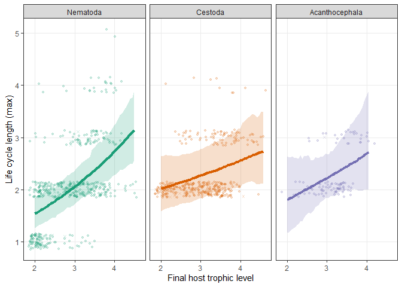
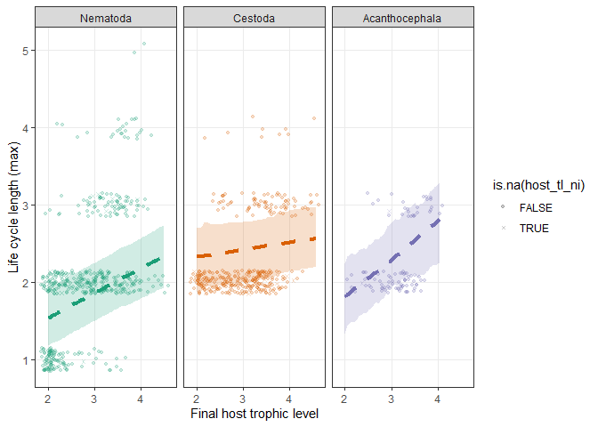

Trophic vacuum
================

  - [Models](#models)

One presumed advantage of complex life cycles is that they facilitate
transmission. We [previously
showed](https://royalsocietypublishing.org/doi/full/10.1098/rspb.2014.1462)
that nematodes with longer life cycles reproduce in higher trophic level
hosts. We test this relationship again using the full dataset and
separately for each helminth group.

We restrict the data to only adults.

With a trophic vacuum, we expect life cycle length to increase with
final host trophic level. The pattern is consistent with life cycles
being longer when definitive hosts have a higher trophic level. The
increase may be steeper for nematodes, which is not unexpected, since
they have a wider range of life cycle lengths (both simple and 4-host).

<!-- -->

# Models

Let’s model this, so we can fit more than just simple regression lines.
We fit taxonomic mixed models. Since life cycle length is a count, we
fit a Poisson GLMM. We also fit a LMM assuming Gaussian errors. We fit
three models: a taxonomy-only model, adding final host trophic level,
and then letting the trophic level effect vary with helminth group.

Here is the number of species in the model.

| parasite\_phylum | n\_spp |
| :--------------- | -----: |
| Acanthocephala   |     97 |
| Nematoda         |    485 |
| Platyhelminthes  |    355 |

We fit the models using `MCMCglmm`. We use weak priors. The GLMM needed
to be run for a long time to get good chain mixing.

    ## [1] "iteration 1 finished"
    ## [1] "iteration 2 finished"
    ## [1] "iteration 3 finished"
    ## [1] "iteration 4 finished"
    ## [1] "iteration 5 finished"
    ## [1] "iteration 6 finished"
    ## [1] "iteration 7 finished"
    ## [1] "iteration 8 finished"
    ## [1] "iteration 9 finished"
    ## [1] "iteration 10 finished"
    ## [1] "iteration 11 finished"
    ## [1] "iteration 12 finished"
    ## [1] "iteration 13 finished"
    ## [1] "iteration 14 finished"
    ## [1] "iteration 15 finished"
    ## [1] "iteration 16 finished"
    ## [1] "iteration 17 finished"
    ## [1] "iteration 18 finished"
    ## [1] "iteration 19 finished"
    ## [1] "iteration 20 finished"
    ## [1] "iteration 21 finished"
    ## [1] "iteration 22 finished"
    ## [1] "iteration 23 finished"
    ## [1] "iteration 24 finished"
    ## [1] "iteration 25 finished"
    ## [1] "iteration 26 finished"
    ## [1] "iteration 27 finished"
    ## [1] "iteration 28 finished"
    ## [1] "iteration 29 finished"
    ## [1] "iteration 30 finished"
    ## [1] "iteration 31 finished"
    ## [1] "iteration 32 finished"
    ## [1] "iteration 33 finished"
    ## [1] "iteration 34 finished"
    ## [1] "iteration 35 finished"
    ## [1] "iteration 36 finished"
    ## [1] "iteration 37 finished"
    ## [1] "iteration 38 finished"
    ## [1] "iteration 39 finished"
    ## [1] "iteration 40 finished"
    ## [1] "iteration 41 finished"
    ## [1] "iteration 42 finished"
    ## [1] "iteration 43 finished"
    ## [1] "iteration 44 finished"
    ## [1] "iteration 45 finished"
    ## [1] "iteration 46 finished"
    ## [1] "iteration 47 finished"
    ## [1] "iteration 48 finished"
    ## [1] "iteration 49 finished"
    ## [1] "iteration 50 finished"
    ## [1] "iteration 51 finished"
    ## [1] "iteration 52 finished"
    ## [1] "iteration 53 finished"
    ## [1] "iteration 54 finished"
    ## [1] "iteration 55 finished"
    ## [1] "iteration 56 finished"
    ## [1] "iteration 57 finished"
    ## [1] "iteration 58 finished"
    ## [1] "iteration 59 finished"
    ## [1] "iteration 60 finished"
    ## [1] "iteration 61 finished"
    ## [1] "iteration 62 finished"
    ## [1] "iteration 63 finished"
    ## [1] "iteration 64 finished"
    ## [1] "iteration 65 finished"
    ## [1] "iteration 66 finished"
    ## [1] "iteration 67 finished"
    ## [1] "iteration 68 finished"
    ## [1] "iteration 69 finished"
    ## [1] "iteration 70 finished"
    ## [1] "iteration 71 finished"
    ## [1] "iteration 72 finished"
    ## [1] "iteration 73 finished"
    ## [1] "iteration 74 finished"
    ## [1] "iteration 75 finished"
    ## [1] "iteration 76 finished"
    ## [1] "iteration 77 finished"
    ## [1] "iteration 78 finished"
    ## [1] "iteration 79 finished"
    ## [1] "iteration 80 finished"
    ## [1] "iteration 81 finished"
    ## [1] "iteration 82 finished"
    ## [1] "iteration 83 finished"
    ## [1] "iteration 84 finished"
    ## [1] "iteration 85 finished"
    ## [1] "iteration 86 finished"
    ## [1] "iteration 87 finished"
    ## [1] "iteration 88 finished"
    ## [1] "iteration 89 finished"
    ## [1] "iteration 90 finished"
    ## [1] "iteration 91 finished"
    ## [1] "iteration 92 finished"
    ## [1] "iteration 93 finished"
    ## [1] "iteration 94 finished"
    ## [1] "iteration 95 finished"
    ## [1] "iteration 96 finished"
    ## [1] "iteration 97 finished"
    ## [1] "iteration 98 finished"
    ## [1] "iteration 99 finished"
    ## [1] "iteration 100 finished"

We’ll start by comparing model fits. Here is the trace for model
deviance. Adding host trophic level is a slight improvement (red) over
the taxonomy-only model (black). Allowing the trophic level effect to
vary with parasite phylum was a smaller improvement.

<!-- -->

Here are the DIC values for the models.

    ## DIC, int-only: 2647.93

    ## DIC, host tl; 2627.863

    ## DIC, host tl x phylum; 2627.801

The comparison of DIC values suggests the host TL addition is an
improvement.

    ## Delta DIC, int-only vs host tl): 20.06706 (higher is better)

But the interaction between host tl and parasite phylum is not.

    ## Delta DIC, host tl vs host tl x phylum: 0.06184714 (higher is better)

Now we can combine the chains for the fixed parameters and variance
componenets.

Here is how much life cycle length increased with host trophic level.

    ## 
    ## Iterations = 1:2497501
    ## Thinning interval = 2500 
    ## Number of chains = 1 
    ## Sample size per chain = 1000 
    ## 
    ## 1. Empirical mean and standard deviation for each variable,
    ##    plus standard error of the mean:
    ## 
    ##           Mean             SD       Naive SE Time-series SE 
    ##       0.256941       0.047271       0.001495       0.001628 
    ## 
    ## 2. Quantiles for each variable:
    ## 
    ##   2.5%    25%    50%    75%  97.5% 
    ## 0.1662 0.2241 0.2562 0.2887 0.3513

Here are the model parameters for the model without phylum…

| param       |         lwr |       fit |       upr | sig |
| :---------- | ----------: | --------: | --------: | :-- |
| (Intercept) | \-0.1525221 | 0.0827606 | 0.3072459 | ns  |
| host\_tl    |   0.1537901 | 0.2280732 | 0.3010810 | sig |

…and the model allowing the lcl by host tl relationship to vary with
phylum.

| param                                    |         lwr |         fit |       upr | sig |
| :--------------------------------------- | ----------: | ----------: | --------: | :-- |
| (Intercept)                              | \-0.7924751 |   0.2072665 | 1.1734523 | ns  |
| host\_tl                                 | \-0.0977276 |   0.1960556 | 0.5130127 | ns  |
| host\_tl:parasite\_phylumNematoda        | \-0.2417987 |   0.0875082 | 0.4173815 | ns  |
| host\_tl:parasite\_phylumPlatyhelminthes | \-0.4164487 | \-0.0743237 | 0.2415079 | ns  |
| parasite\_phylumNematoda                 | \-1.3846976 | \-0.3497008 | 0.7145221 | ns  |
| parasite\_phylumPlatyhelminthes          | \-0.8416465 |   0.2477479 | 1.3747128 | ns  |

Although the parameters for the phylum by trophic level interaction are
not significant, the slopes seem weaker for acanths and cestodes. Let’s
look at those slopes more closely. Here is the slope estimated for
cestodes (this slope and its CI was about the same when the model was
fit to just cestodes):

    ## 
    ## Iterations = 1:2497501
    ## Thinning interval = 2500 
    ## Number of chains = 1 
    ## Sample size per chain = 1000 
    ## 
    ## 1. Empirical mean and standard deviation for each variable,
    ##    plus standard error of the mean:
    ## 
    ##           Mean             SD       Naive SE Time-series SE 
    ##       0.127332       0.067787       0.002144       0.002565 
    ## 
    ## 2. Quantiles for each variable:
    ## 
    ##      2.5%       25%       50%       75%     97.5% 
    ## -0.002883  0.081850  0.127282  0.173875  0.262991

Here is the slope for acanths:

    ## 
    ## Iterations = 1:2497501
    ## Thinning interval = 2500 
    ## Number of chains = 1 
    ## Sample size per chain = 1000 
    ## 
    ## 1. Empirical mean and standard deviation for each variable,
    ##    plus standard error of the mean:
    ## 
    ##           Mean             SD       Naive SE Time-series SE 
    ##       0.234733       0.198889       0.006289       0.007326 
    ## 
    ## 2. Quantiles for each variable:
    ## 
    ##     2.5%      25%      50%      75%    97.5% 
    ## -0.09310  0.09714  0.21659  0.35064  0.67032

And here it is for nematodes:

    ## 
    ## Iterations = 1:2497501
    ## Thinning interval = 2500 
    ## Number of chains = 1 
    ## Sample size per chain = 1000 
    ## 
    ## 1. Empirical mean and standard deviation for each variable,
    ##    plus standard error of the mean:
    ## 
    ##           Mean             SD       Naive SE Time-series SE 
    ##       0.334600       0.068281       0.002159       0.002445 
    ## 
    ## 2. Quantiles for each variable:
    ## 
    ##   2.5%    25%    50%    75%  97.5% 
    ## 0.2066 0.2876 0.3358 0.3797 0.4735

The apparently higher slope for nematodes is somewhat due to having
direct life cycles. Here is the slope for nematodes when we exclude
one-host cycles:

    ## 
    ## Iterations = 1:2497501
    ## Thinning interval = 2500 
    ## Number of chains = 1 
    ## Sample size per chain = 1000 
    ## 
    ## 1. Empirical mean and standard deviation for each variable,
    ##    plus standard error of the mean:
    ## 
    ##           Mean             SD       Naive SE Time-series SE 
    ##       0.156675       0.066155       0.002092       0.002466 
    ## 
    ## 2. Quantiles for each variable:
    ## 
    ##    2.5%     25%     50%     75%   97.5% 
    ## 0.03732 0.10805 0.15379 0.20256 0.29222

The model excluding one-host cycles returned about the same slope for
cestodes…

    ## 
    ## Iterations = 1:2497501
    ## Thinning interval = 2500 
    ## Number of chains = 1 
    ## Sample size per chain = 1000 
    ## 
    ## 1. Empirical mean and standard deviation for each variable,
    ##    plus standard error of the mean:
    ## 
    ##           Mean             SD       Naive SE Time-series SE 
    ##       0.138466       0.068675       0.002172       0.002395 
    ## 
    ## 2. Quantiles for each variable:
    ## 
    ##    2.5%     25%     50%     75%   97.5% 
    ## 0.01099 0.08892 0.13434 0.18249 0.27508

…and acanths as previously.

    ## 
    ## Iterations = 1:2497501
    ## Thinning interval = 2500 
    ## Number of chains = 1 
    ## Sample size per chain = 1000 
    ## 
    ## 1. Empirical mean and standard deviation for each variable,
    ##    plus standard error of the mean:
    ## 
    ##           Mean             SD       Naive SE Time-series SE 
    ##       0.242966       0.202857       0.006415       0.007172 
    ## 
    ## 2. Quantiles for each variable:
    ## 
    ##     2.5%      25%      50%      75%    97.5% 
    ## -0.09507  0.09633  0.22294  0.35908  0.69407

Here are the R2 values for the full analysis.

| model                  | r2m                   | r2c                   |
| :--------------------- | :-------------------- | :-------------------- |
| int-only and taxonomy  | 0 \[0-0\]             | 0.094 \[0.031-0.229\] |
| trophic level          | 0.055 \[0.025-0.093\] | 0.079 \[0.046-0.138\] |
| trophic level x phylum | 0.077 \[0.039-0.146\] | 0.104 \[0.057-0.246\] |

To plot the model output, we calculate the predicted values for each
parasite phylum across trophic levels.

The increase is similar in all groups, though it is perhaps weaker in
cestodes and acanthocephalans.

<!-- -->

Here’s the results from the LMM. The fits are not as good and the
differences among groups are more pronounced.

<!-- -->

Looks ok. Let’s export the figure.
