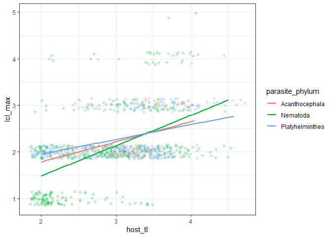
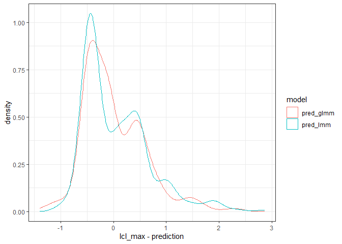

Trophic vacuum
================

  - [Models](#models)

One presumed advantage of complex life cycles is that they facilitate
transmission. We [previously
showed](https://royalsocietypublishing.org/doi/full/10.1098/rspb.2014.1462)
that nematodes with longer life cycles reproduce in higher trophic level
hosts. We test this relationship again using the full dataset and
separately for each helminth group.

We restrict the data to only adults.

With a trophic vacuum, we expect life cycle length to increase with
final host trophic level. The pattern is consistent with life cycles
being longer when definitive hosts have a higher trophic level. The
increase may be steeper for nematodes, which is not unexpected, since
they have a wider range of life cycle lengths (both simple and 4-host).

<!-- -->

# Models

Let’s model this, so we can fit more than just simple regression lines.
We fit taxonomic mixed models. Since life cycle length is a count, we
fit a Poisson GLMM. We also fit a LMM assuming Gaussian errors. We fit
three models: a taxonomy-only model, adding final host trophic level,
and then letting the trophic level effect vary with helminth group.

Here is the number of species in the model.

| parasite\_phylum | n\_spp |
| :--------------- | -----: |
| Acanthocephala   |     95 |
| Nematoda         |    457 |
| Platyhelminthes  |    332 |

We fit the models using `MCMCglmm`. We use weak priors. The GLMM needed
to be run for a long time to get good chain mixing.

Let’s start by comparing Poisson and Gaussian models. From each, we
calculate the predicted values, controlling for taxonomy.

Here are observed vs predicted values. The GLMM gets closer to the 1:1
line, so it seems to give better predictions.

<!-- -->

The residual plot also looks better for the GLMM, though the residuals
are skewed in both cases.

<!-- -->

Here are the residuals as a histogram. Again the GLMM looks better, so
we’ll proceed with those models.

<!-- -->

We’ll start by comparing model fits. Here is the trace for model
deviance. Adding host trophic level is a slight improvement (red) over
the taxonomy-only model (black). Allowing the trophic level effect to
vary with parasite phylum was a smaller improvement.

<!-- -->

Here are the DIC values for the models.

    ## DIC, int-only: 2504.885

    ## DIC, host TL; 2484.402

    ## DIC, host TL x parasite_phylum; 2485.318

The comparison of DIC values suggests the host TL addition is an
improvement.

    ## Delta DIC, int-only vs host TL: 20.48258 (higher is better)

But the interaction between host tl and parasite phylum is not.

    ## Delta DIC, host TL vs host TL x phylum: -0.9160345 (higher is better)

Here is how much life cycle length increased with host trophic level.

    ## 
    ## Iterations = 1001:2498501
    ## Thinning interval = 2500 
    ## Number of chains = 1 
    ## Sample size per chain = 1000 
    ## 
    ## 1. Empirical mean and standard deviation for each variable,
    ##    plus standard error of the mean:
    ## 
    ##           Mean             SD       Naive SE Time-series SE 
    ##       0.257765       0.047861       0.001514       0.002091 
    ## 
    ## 2. Quantiles for each variable:
    ## 
    ##   2.5%    25%    50%    75%  97.5% 
    ## 0.1663 0.2252 0.2571 0.2920 0.3495

Here are the model parameters for the model without phylum…

| param       |         lwr |       fit |       upr | sig |
| :---------- | ----------: | --------: | --------: | :-- |
| (Intercept) | \-0.1610196 | 0.0730864 | 0.3238572 | ns  |
| host\_tl    |   0.1538738 | 0.2288200 | 0.2997436 | sig |

…and with phylum

| param                                    |         lwr |         fit |       upr | sig |
| :--------------------------------------- | ----------: | ----------: | --------: | :-- |
| (Intercept)                              | \-0.7872311 |   0.1477700 | 1.2050890 | ns  |
| host\_tl                                 | \-0.1181604 |   0.2145691 | 0.5056996 | ns  |
| host\_tl:parasite\_phylumNematoda        | \-0.2483634 |   0.0804181 | 0.4195165 | ns  |
| host\_tl:parasite\_phylumPlatyhelminthes | \-0.4111119 | \-0.0829282 | 0.2654875 | ns  |
| parasite\_phylumNematoda                 | \-1.4273650 | \-0.3124738 | 0.6988870 | ns  |
| parasite\_phylumPlatyhelminthes          | \-0.8445576 |   0.2817808 | 1.3831246 | ns  |

Although the parameters for the phylum by trophic level interaction are
not significant, the slopes seem weaker for acanths and cestodes. Let’s
look at those slopes more closely. Here is the slope estimated for
cestodes (this slope and its CI was about the same when the model was
fit to just cestodes):

    ## 
    ## Iterations = 1001:2498501
    ## Thinning interval = 2500 
    ## Number of chains = 1 
    ## Sample size per chain = 1000 
    ## 
    ## 1. Empirical mean and standard deviation for each variable,
    ##    plus standard error of the mean:
    ## 
    ##           Mean             SD       Naive SE Time-series SE 
    ##       0.133636       0.071564       0.002263       0.002516 
    ## 
    ## 2. Quantiles for each variable:
    ## 
    ##      2.5%       25%       50%       75%     97.5% 
    ## -0.002591  0.087058  0.130749  0.176195  0.287927

Here is the slope for acanths:

    ## 
    ## Iterations = 1001:2498501
    ## Thinning interval = 2500 
    ## Number of chains = 1 
    ## Sample size per chain = 1000 
    ## 
    ## 1. Empirical mean and standard deviation for each variable,
    ##    plus standard error of the mean:
    ## 
    ##           Mean             SD       Naive SE Time-series SE 
    ##       0.247181       0.200422       0.006338       0.007305 
    ## 
    ## 2. Quantiles for each variable:
    ## 
    ##    2.5%     25%     50%     75%   97.5% 
    ## -0.1114  0.1077  0.2393  0.3649  0.6581

And here it is for nematodes:

    ## 
    ## Iterations = 1001:2498501
    ## Thinning interval = 2500 
    ## Number of chains = 1 
    ## Sample size per chain = 1000 
    ## 
    ## 1. Empirical mean and standard deviation for each variable,
    ##    plus standard error of the mean:
    ## 
    ##           Mean             SD       Naive SE Time-series SE 
    ##       0.340634       0.071565       0.002263       0.002713 
    ## 
    ## 2. Quantiles for each variable:
    ## 
    ##   2.5%    25%    50%    75%  97.5% 
    ## 0.2001 0.2926 0.3391 0.3869 0.4905

The apparently higher slope for nematodes is somewhat due to having
direct life cycles. Here is the slope for nematodes when we exclude
one-host cycles:

    ## 
    ## Iterations = 1001:23501
    ## Thinning interval = 2500 
    ## Number of chains = 1 
    ## Sample size per chain = 10 
    ## 
    ## 1. Empirical mean and standard deviation for each variable,
    ##    plus standard error of the mean:
    ## 
    ##           Mean             SD       Naive SE Time-series SE 
    ##        0.16186        0.06150        0.01945        0.01945 
    ## 
    ## 2. Quantiles for each variable:
    ## 
    ##   2.5%    25%    50%    75%  97.5% 
    ## 0.1080 0.1211 0.1499 0.1730 0.2897

The model excluding one-host cycles returned about the same slope for
cestodes…

    ## 
    ## Iterations = 1001:23501
    ## Thinning interval = 2500 
    ## Number of chains = 1 
    ## Sample size per chain = 10 
    ## 
    ## 1. Empirical mean and standard deviation for each variable,
    ##    plus standard error of the mean:
    ## 
    ##           Mean             SD       Naive SE Time-series SE 
    ##        0.12877        0.05040        0.01594        0.01594 
    ## 
    ## 2. Quantiles for each variable:
    ## 
    ##    2.5%     25%     50%     75%   97.5% 
    ## 0.04901 0.08798 0.15234 0.16626 0.18133

…and acanths as previously.

    ## 
    ## Iterations = 1001:23501
    ## Thinning interval = 2500 
    ## Number of chains = 1 
    ## Sample size per chain = 10 
    ## 
    ## 1. Empirical mean and standard deviation for each variable,
    ##    plus standard error of the mean:
    ## 
    ##           Mean             SD       Naive SE Time-series SE 
    ##         0.2552         0.1205         0.0381         0.0381 
    ## 
    ## 2. Quantiles for each variable:
    ## 
    ##   2.5%    25%    50%    75%  97.5% 
    ## 0.1007 0.1799 0.2442 0.3330 0.4462

Here are the R2 values for the full analysis.

| model                  | r2m                   | r2c                   |
| :--------------------- | :-------------------- | :-------------------- |
| int-only and taxonomy  | 0 \[0-0\]             | 0.089 \[0.03-0.23\]   |
| trophic level          | 0.056 \[0.026-0.093\] | 0.081 \[0.044-0.137\] |
| trophic level x phylum | 0.083 \[0.041-0.154\] | 0.111 \[0.06-0.258\]  |

To plot the model output, we calculate the predicted values for each
parasite phylum across trophic levels.

The increase is similar in all groups, though it is perhaps weaker in
cestodes and acanthocephalans.

<!-- -->

Here’s the results from the LMM. The fits are not as good and the
differences among groups are more pronounced.

<!-- -->

Looks ok. Let’s export the figure.
